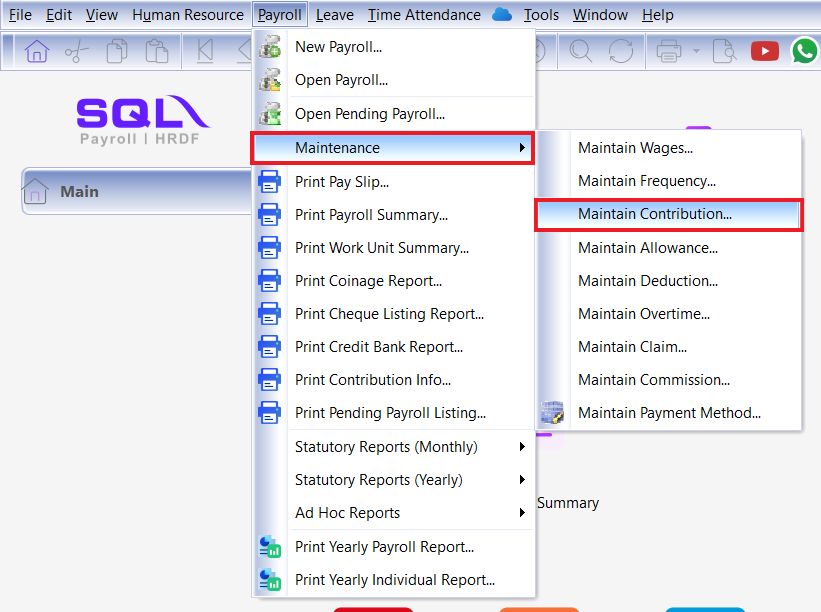
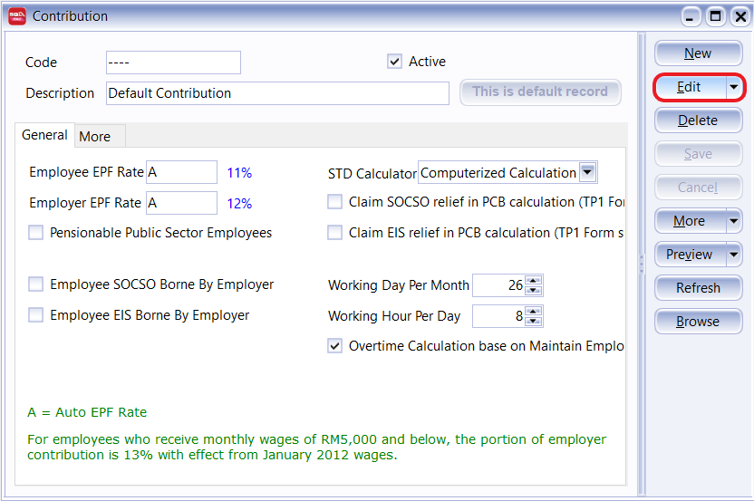
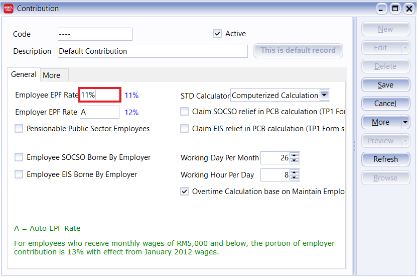

## Setup

### Employee EPF Rate

1. Once you have logged into your SQL Payroll, go to **Payroll** > **Maintenance** > **Maintain Contribution**

    

2. Select your contribution group ( eg. Default contribution group )

    

3. Press EDIT

    

4. Use your mouse and click into the Employee EPF Rate Box. Remove the "A" and key in "11%"

    

5. Press Save

6. Now your Employee Contribution Rate has been set to a fixed 11% rate.

### Employer EPF Rate

1. Step 1 & 2 same as Employee Rate. Then go to Employer EPF rate, Delete the "A" and type out the contribution rate that you want. eg. "12%". Once that is done. Press Save.

    

2. The Employee EPF contribution is set to 11% and the Employer EPF contribution is set to 12%

    

3. Go to **Maintain Employee** and assign the contribution group to your repective employee.

    
