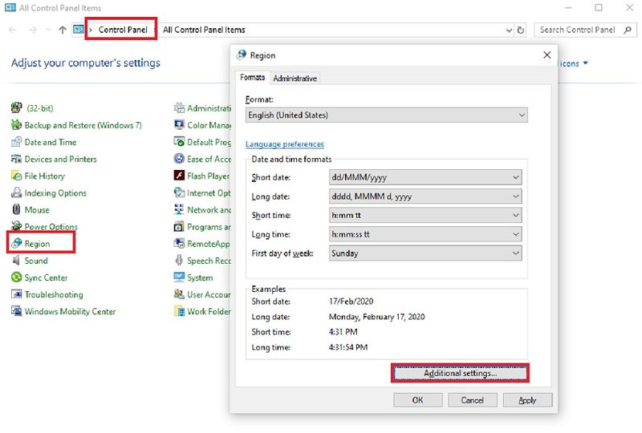
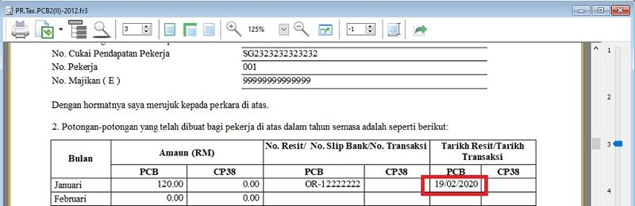

## Issue

What is the faster solution to show the date format correctly?

*Example report: Government Reports | Print Income Tax PCB 2 (II)*

## Solution

1. Go to **Control Panel**.

2. Search for **Region** in Control Panel. 

3. Click on **Additional Settings**...

4. Click to **Date** tab.

5. Change the Short Date Format to **DD/MM/YYYY**

6. Date format has display correctly now.

