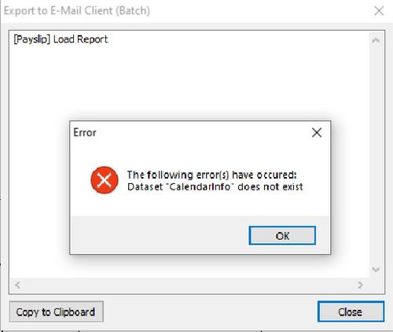
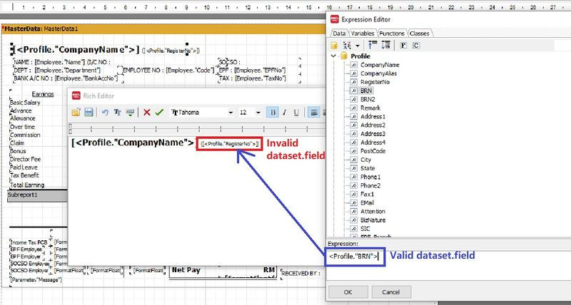

## Issue

Error message prompt when try to **Export to E-Mail Client (Batch)** using **customize payslip format**.

## Solution

At payslip report designer, change the **[\<Profile."RegisterNo">]** to **[\<Profile."BRN">]**

**After correction**, it will be look like the screenshot below.

