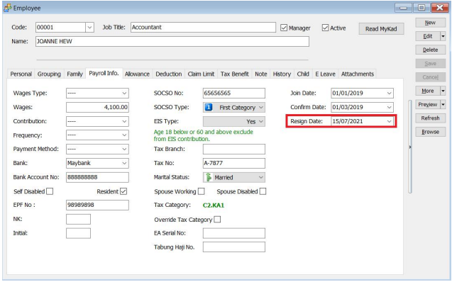

This could happened in a scenario where a staff resigns this month but has pending commissions or claims that will be distributed in the following month, how do we process these transactions?

- For example, the picture below shows that staff has resign on 15/07/2021. There is 1 pending commission transaction for 31/08/2021. How do we process this?

    

    

1. In our August 2021, month end, press the "Other" tab and tick the "show resigned employee" checkbox.

    

2. Choose the "Resign Date From" (when he/she has resigned), select the name of the resigned employee.

3. Press Process.

    

4. The following is the sample result, only pending transactions (eg. Commission) will be processed.

    
