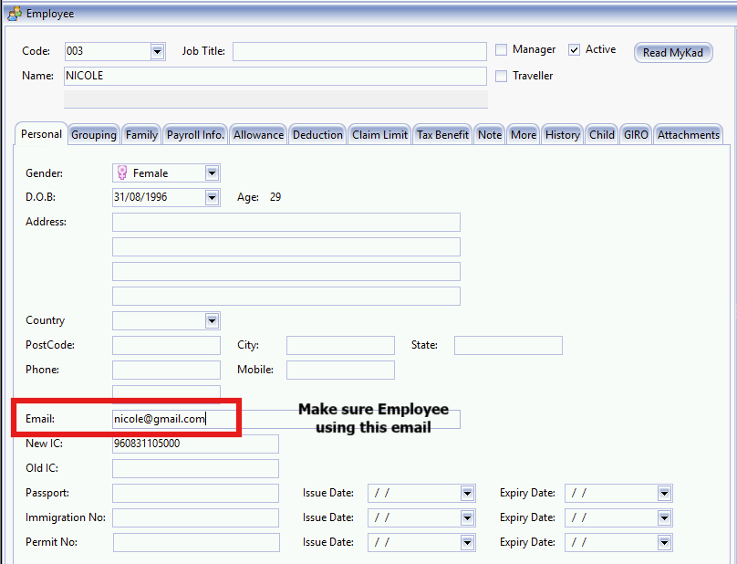
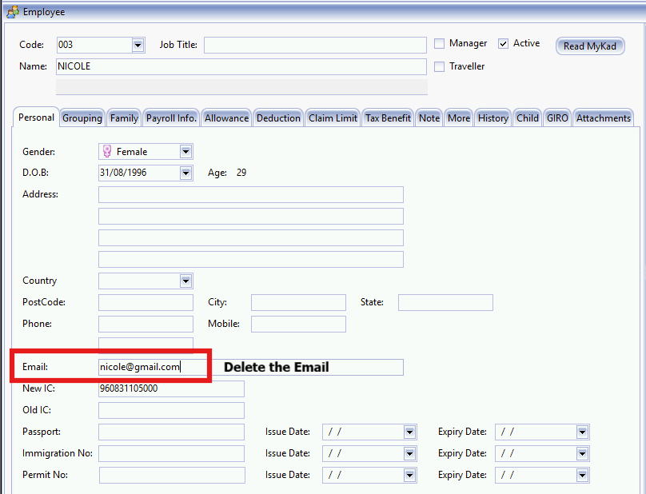

## Register Setup

1. **Update 1 email address** to each employee (staff) in Maintain Employee.

2. Access to menu : **Cloud | Sync Cloud..**

3. Click **Sync Now**.

## Deregister Setup

1. Remove the staff email from Maintain Employee.

2. Access to menu : Cloud | Sync Cloud..

3. Click Sync Now to update.

