## Prerequisites

Process your month end before get started:

### EPF (KWSP)

1. After you processing your month end, navigate to **Payroll** > **Government Reports**.

2. Click the following button (**Print EPF Borang A**):

   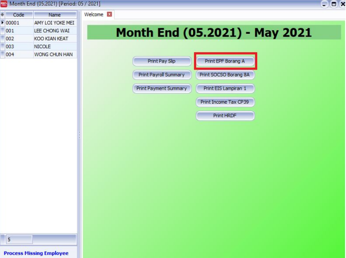

3. Click Submission of KWSP’s Borang A via Magnetic Media.

   

4. Select the KWSP option , Press OK.

   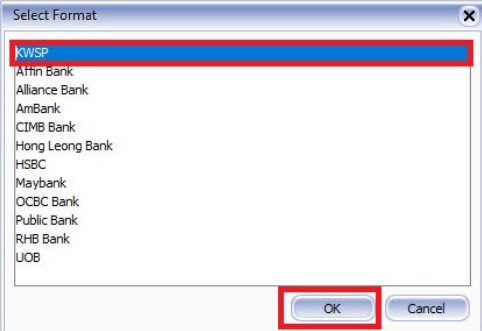

5. Press the **small box with 3 small dots** to select the location that you will be saving this text file into.

   

6. For example, desktop was the selected location. Once you have selected the location, press OK.

   

7. Press Save

   

   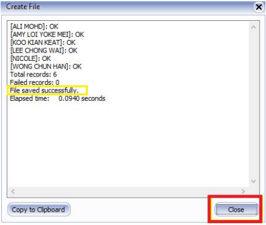

8. Close the pop-up and you will find the text file in your Desktop location.

   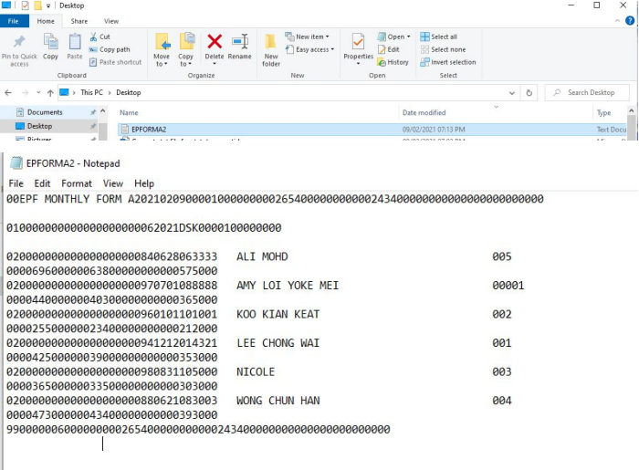

9. The text file is now read for you to submit online at KWSP’s website.

### SOCSO (ASSIST PERKESO)

1. After you processing your month end, Navigate to **Payroll** > **Government Reports**.

2. Click Print SOCSO Borang 8A after processing your month End.

   

3. Click "Submission of SOCSO Borang 8A via Magnetic Media"

   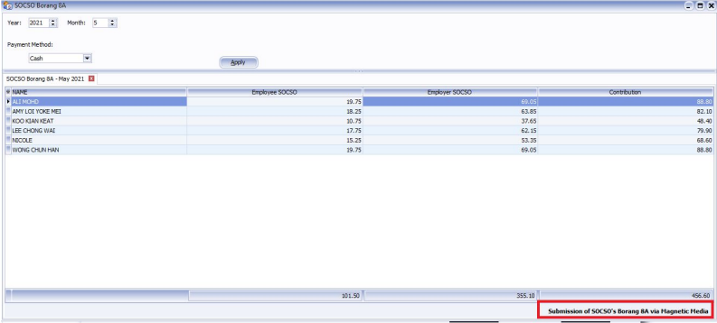

4. Select the SOCSO text file format. Press OK

   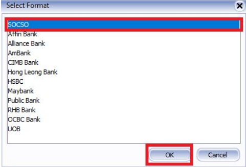

5. Click the small box with 3 dots, select the location which you want to save the text file into. Then press OK. Press Save last.

   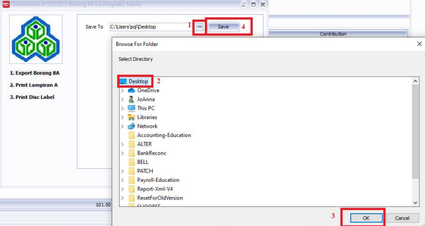

6. Once you have Save, you can see the text file in your Desktop location.

   

7. Submit the text file at the SOCSO website.

   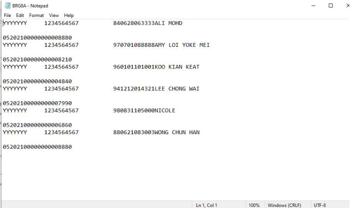

### PCB (LHDN e-Data PCB)

1. After you processing your month end, Navigate to **Payroll** > **Government Reports**.

2. Click Print Income Tax CP39 after processing your month End.

   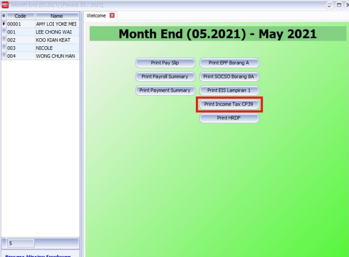

3. Click on “Submission of LHDN Borang CP39 via Magnetic Media”.

   

4. Select the LHDN format and press OK.

   

5. Click the small box with 3 dots, select the location which you want to save the text file into. Then press OK. Press Save last.

   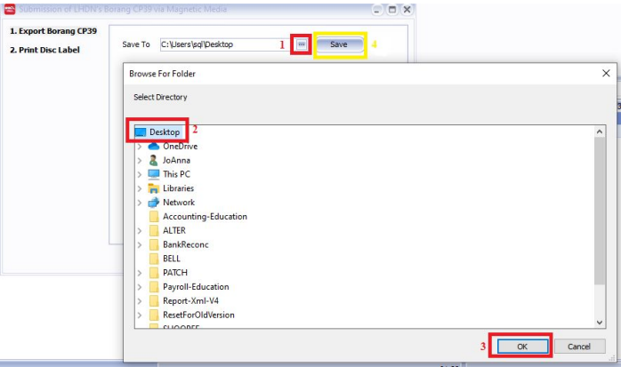

6. You can see the text file has been saved into your Desktop location.

   

7. Your text file is ready to be submitted on the LHDN’s official website.

   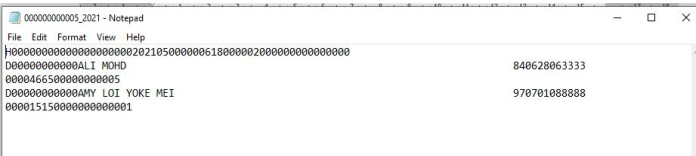

### EIS (ASSIST EIS)

1. After you processing your month end, Navigate to **Payroll** > **Government Reports**.

2. Click Print EIS Lampiran 1 after processing your month End.

   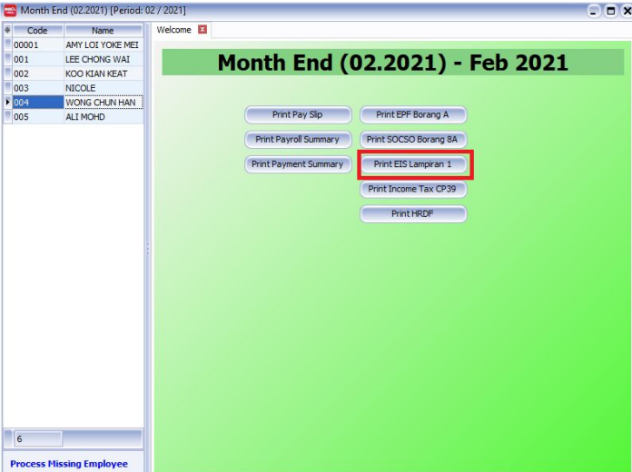

3. Click “Submission of EIS Lampiran 1 via Magnetic Media”

   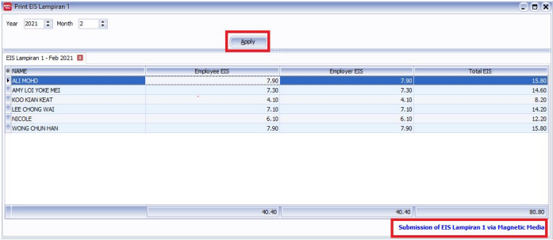

4. Select the SOCSO text file format . Press OK

   

5. Click the small box with 3 dots, select the location which you want to save the text file into. Then press OK. Press Save last.

   

6. Once you have Save, you can see the text file in your Desktop location.

   

7. Submit the text file at the SOCSO website.

   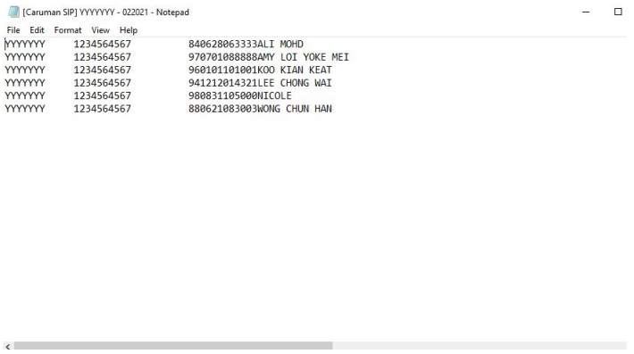
