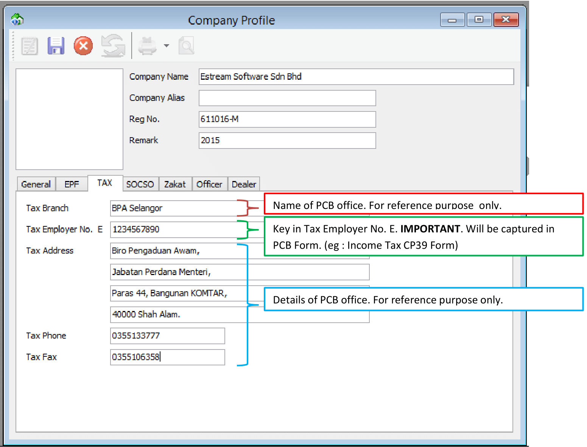
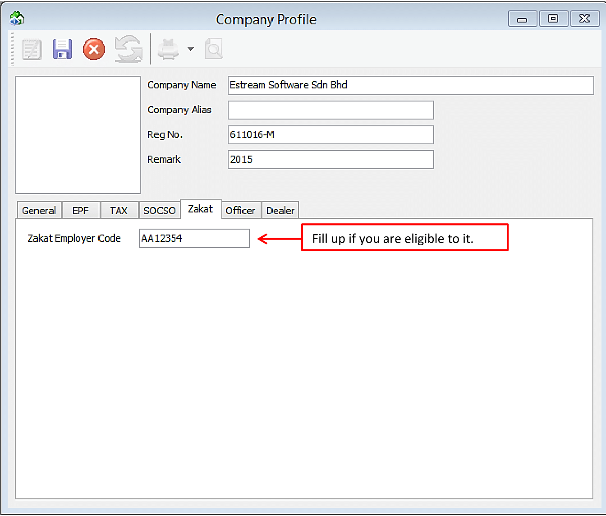
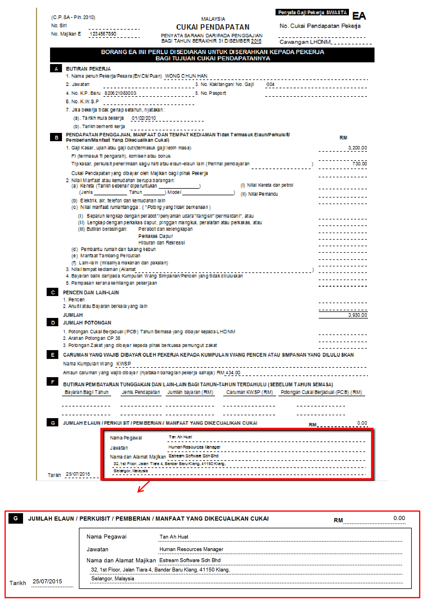

### Steps & Instructions

    1. File -> Company Profile

        

    2. Fill up “General” section

        

    3. Fill up “EPF” Section

        

        

    4. Fill up “Tax” Section

        

        

    5. Fill up “SOCSO” Section

        

        

    6. Fill up “Zakat” Section

        

    7. Fill up “ Officer” Section

        

        

    8. Fill up “Dealer” Section

        
