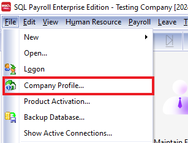
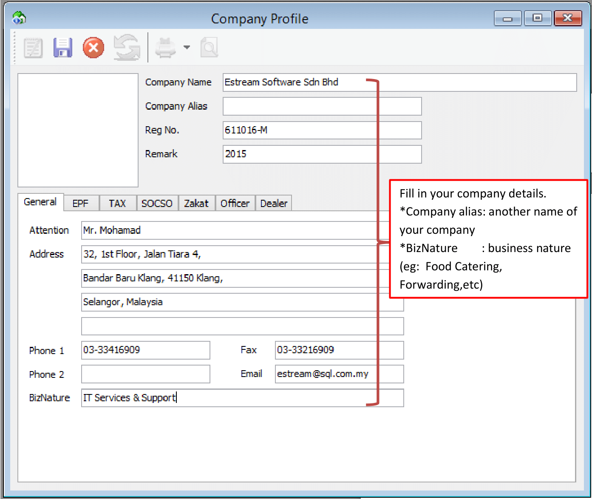
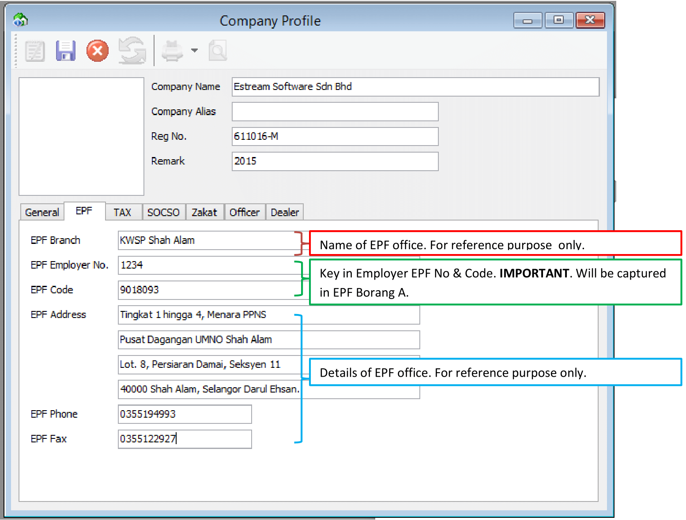
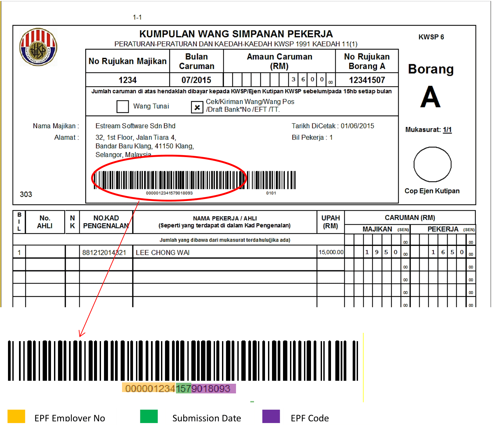
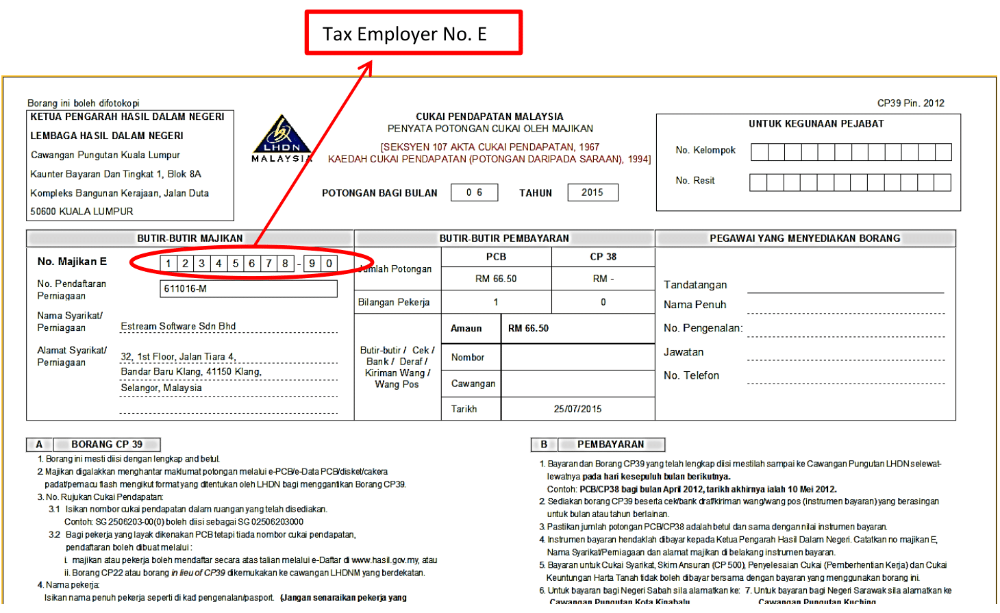
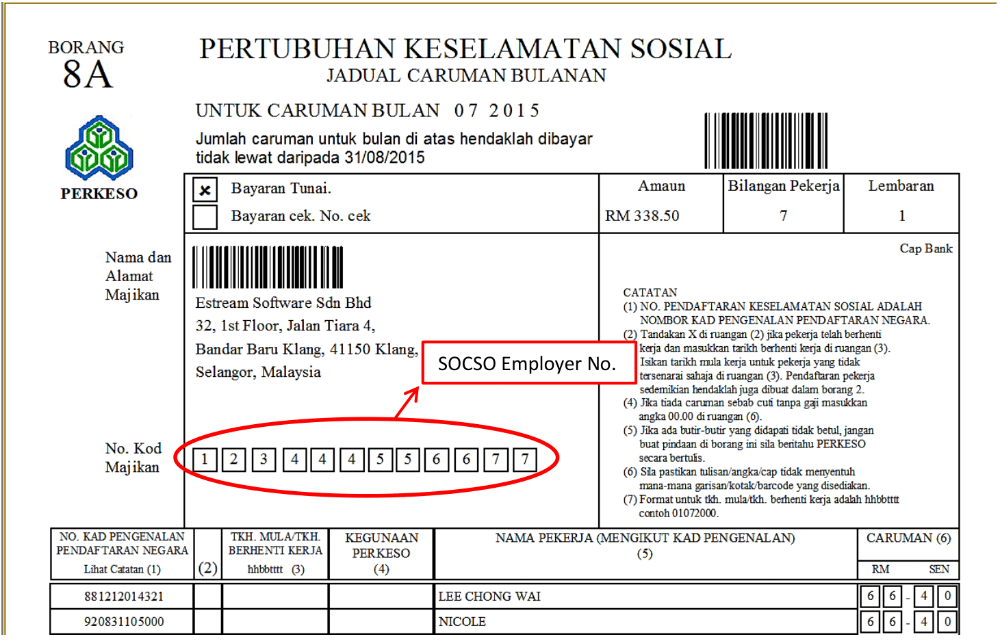

## Setup

1. Navigate to File > Company Profile

   

2. Fill up "General" section

   

3. Fill up "EPF" Section

   

   

4. Fill up "Tax" Section

   

   

5. Fill up "SOCSO" Section

   

   

6. Fill up "Zakat" Section

   

7. Fill up " Officer" Section

   

   

8. Fill up "Dealer" Section

      
