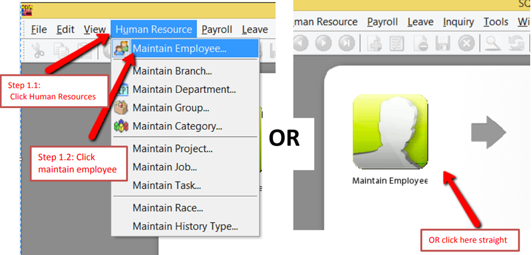
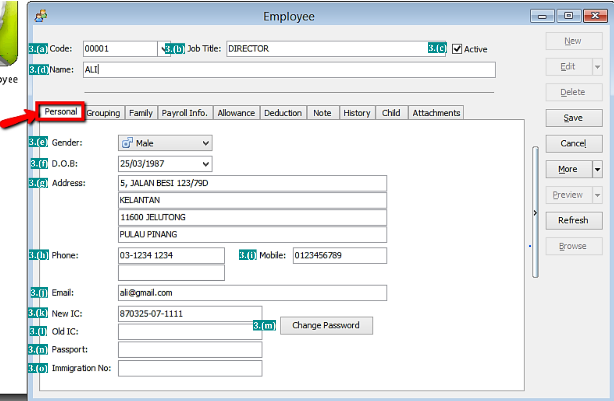
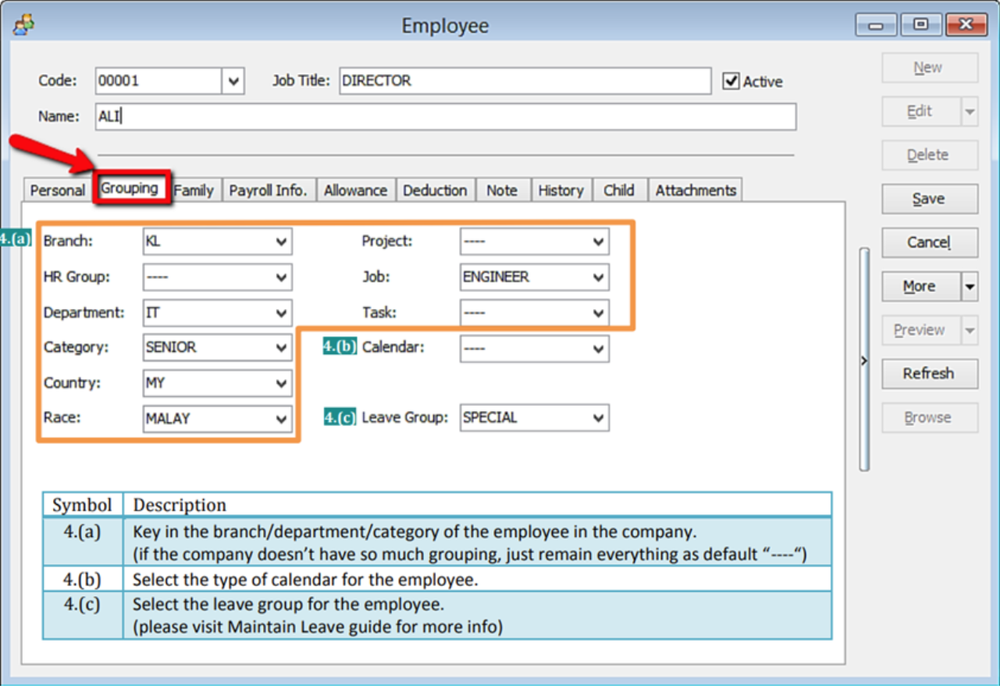
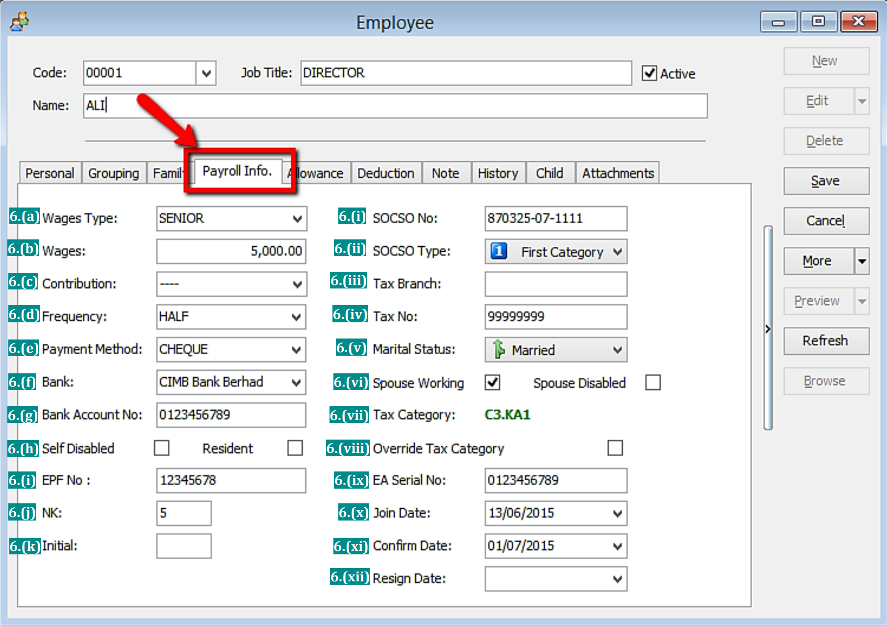
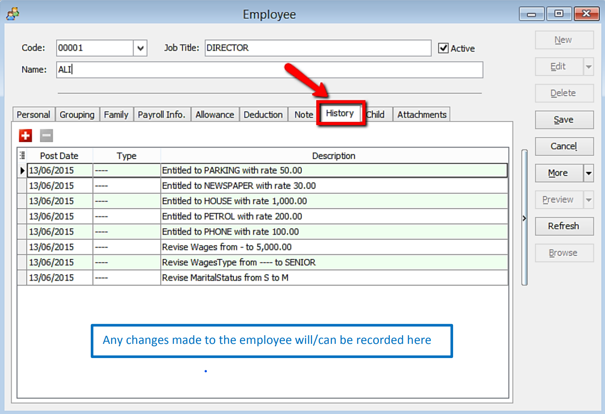

:::tip
Whenever a new staff/worker/person/crew enter the company, Maintain Employee is the place where user needs to key in the details
:::

## Setup

1. Navigate yourself to the Maintain Employee panel

   

2. Click new to create new employee

   

3. Key in the employee’s personal details

   

   | Symbol | Description                                                                                    |
   | ------ | ---------------------------------------------------------------------------------------------- |
   | 3.(a)  | A unique code for the employee, it also act as a username for the employee to login.           |
   | 3.(b)  | The name of the position the employee will hold. (eg: chairman, secretary, auditor)            |
   | 3.(c)  | To be untick when an employee resigns. (if resign date is not set in payroll info.)            |
   | 3.(d)  | The name of the employee.                                                                      |
   | 3.(e)  | The gender/sex of the employee.                                                                |
   | 3.(f)  | The date of birth of the employee (recommended to set so that can capture the age)             |
   | 3.(g)  | The housing address of the employee.                                                           |
   | 3.(h)  | The house number of the employee.                                                              |
   | 3.(i)  | The handphone number of the employee.                                                          |
   | 3.(j)  | The email of the employee.                                                                     |
   | 3.(k)  | The Identification Card number of the employee.                                                |
   | 3.(l)  | The OLD Identification Card number of the employee. (only some very senior people will have)   |
   | 3.(m)  | The password for the employee to login his account. (need to set/change once in order to work) |
   | 3.(n)  | The passport number of the employee (usually only recorded for foreign worker)                 |
   | 3.(o)  | The immigration number of the employee                                                         |

4. Key in the employee’s grouping details

   

   - Create new Branch/HR Group/Department/Category/Country/Race

   

5. Key in the employee’s family details

   

6. Key in the employee’s payroll information

   

   

7. Key in the employee’s monthly fix allowances/deductions

   

   - Create a new allowance/deduction

   

8. Add notes/remark and photo for the employee

   

9. History report of the employee

   

10. Add the employee’s children information (will affect tax category)

    

11. Add any attachment related to the employee

    :::tip
    For Example: resume, curriculum vitae, contract agreement, receipt claims etc
    :::

    
