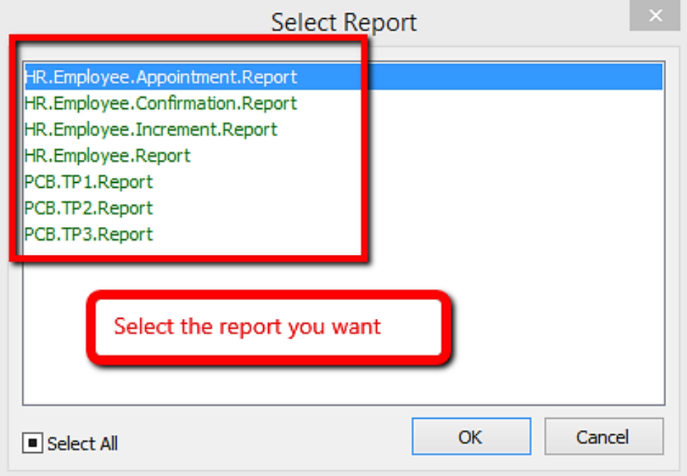

## Introduction

:::info
This guide explains how to print Appointment, Confirmation, Increment letter
:::

## Setup

1. Navigate to the **Maintain Employee** panel

    

2. Select the employee

    

3. Click preview reports

    

4. Select the report you want by double clicking it

    

5. This is the example of the appointment letter

    

### Increment Letter

:::note
For increment letter, make sure increment is set in **history** in order for the report to work
:::

1. Go to the employee details, click on History from the tab view

2. Click on the dropdown 🔽 of the item, select **Increment** as the code

3. Save the employee details

