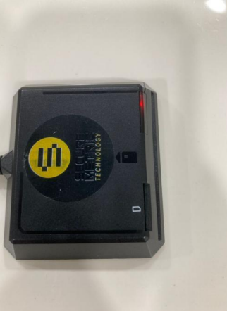

## Setup

1. Link your Smart Card Reader to your computer

2. Reader will turn red light when you success link to your computer

   

3. Put MyKard into reader

4. Reader will show blue light when success read your MyKad

   

5. Open your SQL Payroll New Employee Profile > **Read MyKad**

   

6. Select **Reader Devices** > **Click Read Card**

   

7. Click **Read MyKad**

   

8. Inside System will auto fill up MyKard Detail

   - **(NAME , ADDRESS , ID Number, D.O.B, GENDER)**

   
