# SQL Clock In

Time Attendance QR Code related guidelines

:::info
To setup Time Attendance QR Code, may refer to [Time Attendance Payroll Setup](hrms/e-tms/payroll-setup)
:::

## Scanner Requirements

- Android device (Android 5 and above — higher is better)
- Google Play Store
- Bluetooth 5.0 + BLE
- Internet connection (preferably supports 2.4GHz / 5GHz)
- GPS service
- Front camera ≥ 5MP
- Back camera ≥ 20MP
- RAM 6GB and above (recommended)

## Login

:::info[IMPORTANT]
Only **Managers** are able to log into this app
:::

1. Enter email and click on "Get OTP".

    

2. Enter OTP sent to your email and Login.

    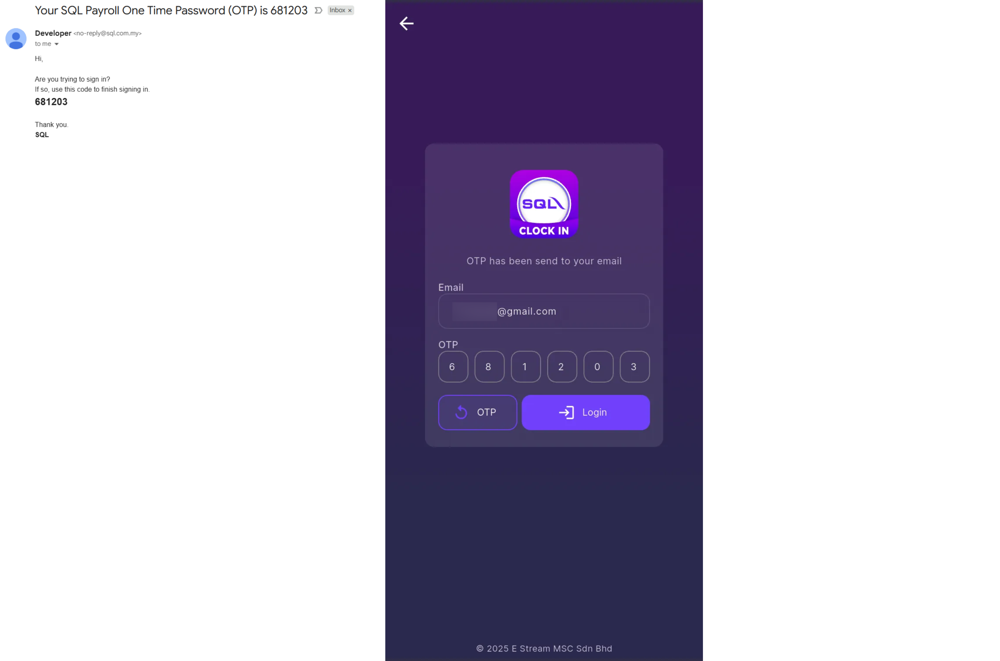

3. Select a company and branch.

    

### Try Demo Account

> User may try out the app as manager

1. Start Exploring.

    

2. Under "Testing Company (Demo Data)", select any branch.

    

:::note[tips]
If you want to logout, click on the button at the top right
:::

## Permission

### Camera

**From SQL Clock In app:**

1. Select **_'While using the app'_**

    

**From Device Settings:**

1. Navigate to App Info > App permissions > Camera and select **_'Allow only while using the app'_**

    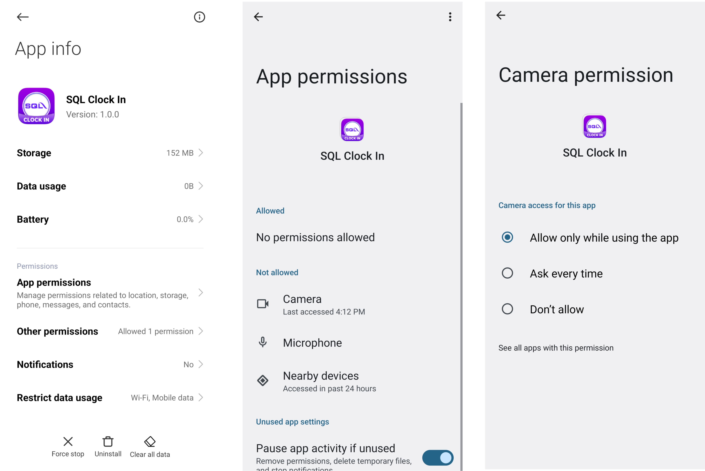

### Nearby Devices (Bluetooth)

**From SQL Clock In app:""

:::info
For **Android 11 and below**, may skip to Step 2
:::

1. Select **_'Allow'_**

    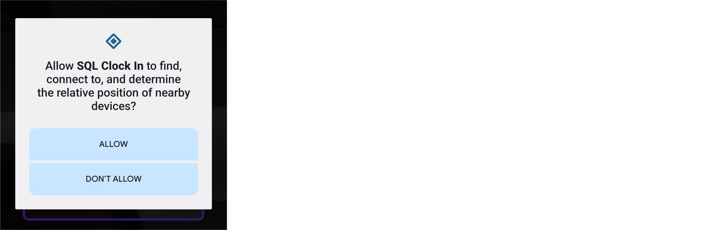

2. Turn on Bluetooth Service

    

**From Device Settings:**

:::info
Only for **Android 12 and above**
:::

1. Navigate to App Info > App permissions > Nearby devices and select **_'Allow'_**

    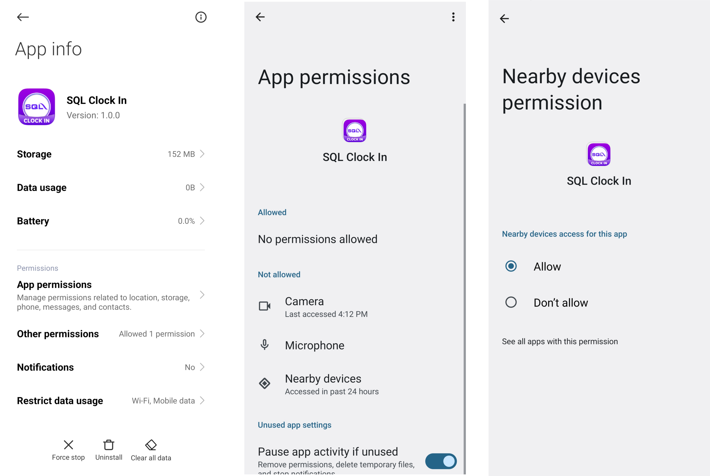

### Location

**From SQL Clock In App:**

:::info
For **Android 12 and above**, may skip to Step 2
:::

1. Select **_'While using the app'_**

    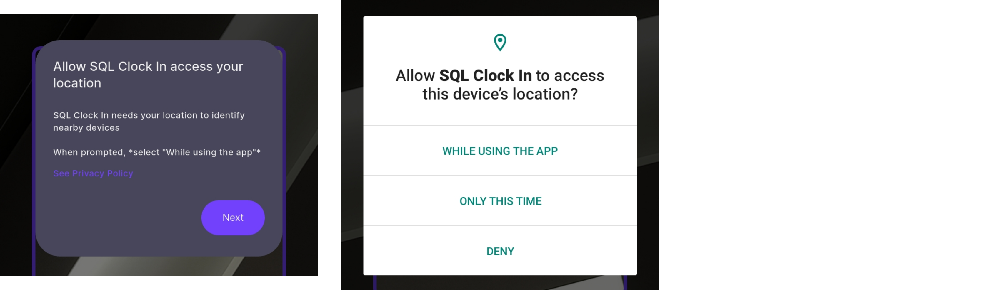

2. Turn on Location Service

    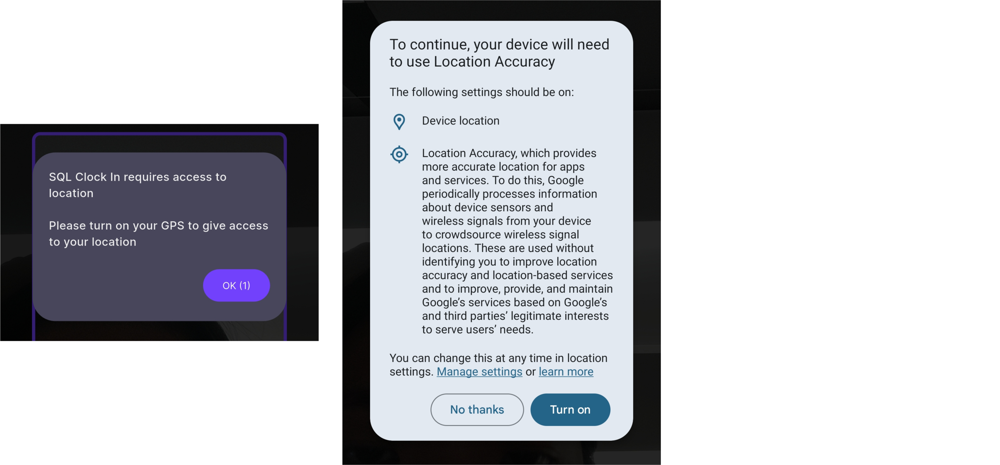

**From Device Settings:**

:::info
Only for **Android 11 and below**
:::

1. Navigate to App Info > Permissions > Location and select **_'Allow only while using the app'_**

    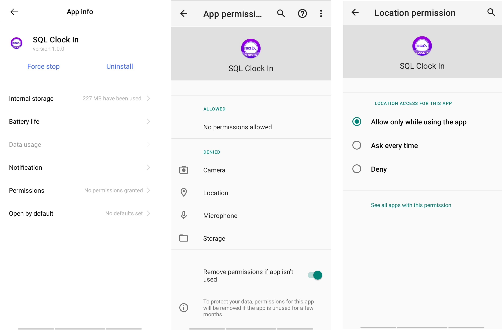

## Dashboard

    

    - ***'Clock In / Out'* button:** Navigate to [QR Scanner](#qr-scanner)
    - **Gear icon (top right):** Navigate to [Settings](#settings)
    - **Logout icon (top right):** Logout from SQL Clock In app

## QR Scanner

For employees to scan the QR Code generated from SQL HRMS app to clock in / out

    

    - The scanner will sleep after a duration of inactivity
    - The scanner will wake up when there's motion detected
    - The duration of inactivity and motion detection sensitivity can be adjusted in the [settings](#settings)
    - ***Error icon*** at the top right corner will only appear when there are issues
      - Tap on the icon to view what are the issues (only those with issues will appear)

| **Issue**                | **Explanation**                                                                                                                                                                                                     |
| :----------------------- | :------------------------------------------------------------------------------------------------------------------------------------------------------------------------------------------------------------------ |
| Wifi is not detected     | Make sure that the scanner is connected to wifi                                                                                                                                                                     |
| Bluetooth is not found   | Make sure that the scanner's Bluetooth service is turned on and Nearby devices permission is allowed    Refer [bluetooth service and nearby devices permission](hrms/permission/#nearby-devices--bluetooth) |
| Location is not detected | Make sure that the scanner's Location service is turned on and permission is allowed    Refer [location service and permission](#location)                                                                  |

| **Dialog Message**                                            | **Explanation**                                                                                                                                                                                                                                                                                                                                                                                                                                                                                                                                                                                                            |
| :------------------------------------------------------------ | :------------------------------------------------------------------------------------------------------------------------------------------------------------------------------------------------------------------------------------------------------------------------------------------------------------------------------------------------------------------------------------------------------------------------------------------------------------------------------------------------------------------------------------------------------------------------------------------------------------------------- |
|  | Employee scanned an invalid QR Code that is not generated from SQL HRMS app                                                                                                                                                                                                                                                                                                                                                                                                                                                                                                                                                |
| 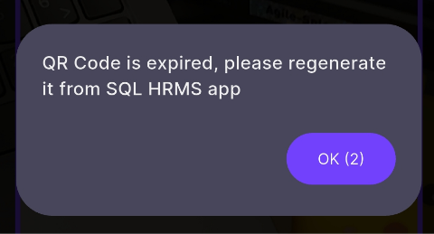 | Employee scanned an expired QR Code                                                                                                                                                                                                                                                                                                                                                                                                                                                                                                                                                                                        |
| 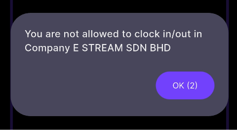 | Employee generated the QR Code under a different company and is not allowed to clock in / out                                                                                                                                                                                                                                                                                                                                                                                                                                                                                                                              |
| 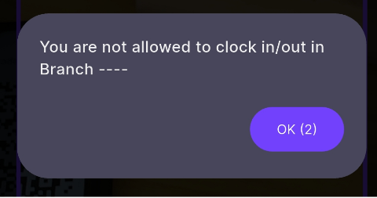 | Employee is under a different branch and is not allowed to clock in / out                                                                                                                                                                                                                                                                                                                                                                                                                                                                                                                                                  |
| 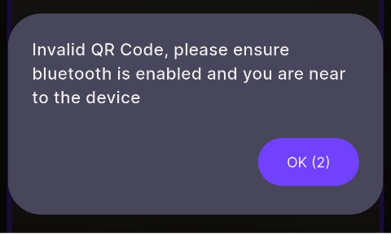 | 1. Employee's Bluetooth service is not turned on   2. Employee's required _Nearby Devices_ permission is not allowed   3. Employee is not near the scanner   3. Scanner's Bluetooth service or Location service is not turned on   4. Scanner's required _Nearby Devices_ or _Location_ permission is not allowed    For SQL HRMS, refer [bluetooth service and nearby devices permission](hrms/permission/#nearby-devices--bluetooth)   For SQL Clock In, refer [location service and permission](#location) and [bluetooth service and nearby devices permission](#nearby-devices-bluetooth) |
|  | Employee has successfully clocked in                                                                                                                                                                                                                                                                                                                                                                                                                                                                                                                                                                                       |
|  | Employee has successfully clocked out                                                                                                                                                                                                                                                                                                                                                                                                                                                                                                                                                                                      |

## Settings

    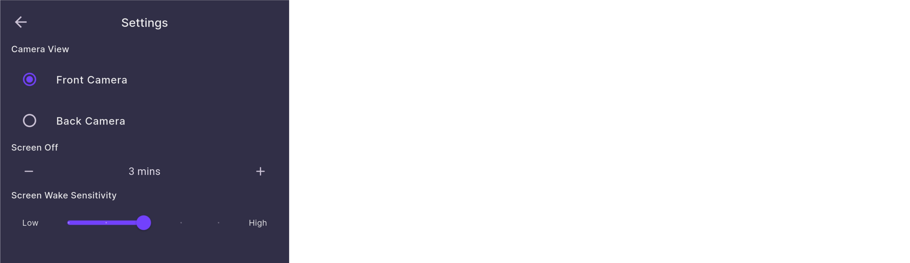

    - **Camera View:** User can switch the default direction of the QR Scanner camera
    - **Screen Off:** User can adjust how long (1 to 30 mins) of inactivity is allowed before the scanner sleeps
    - **Screen Wake Sensitivity:** User can adjust how sensitive they want their scanner to wake up from motion detection after scanner is asleep
