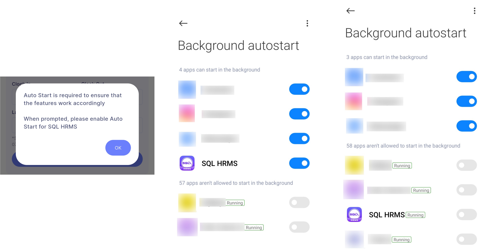

:::info
This setting only available on **Android** devices that supports Auto Start
:::

1. Search **'SQL HRMS'** and select "Allow Auto Start"

    

:::info
Encouraged to enable **Autostart** for SQL HRMS to ensure E TMS and Announcement features work accordingly
:::
