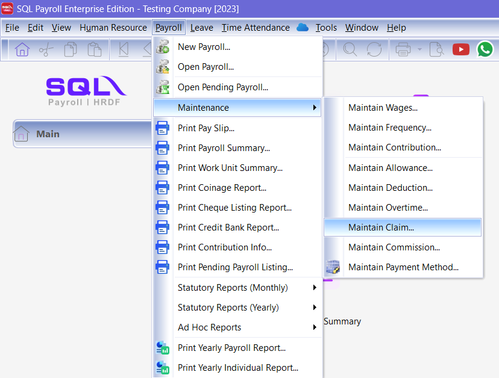
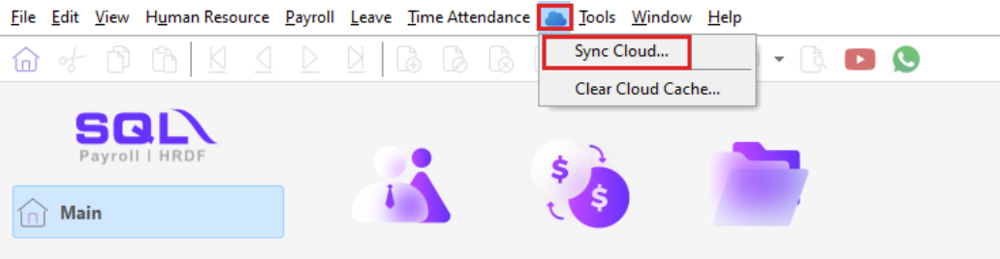
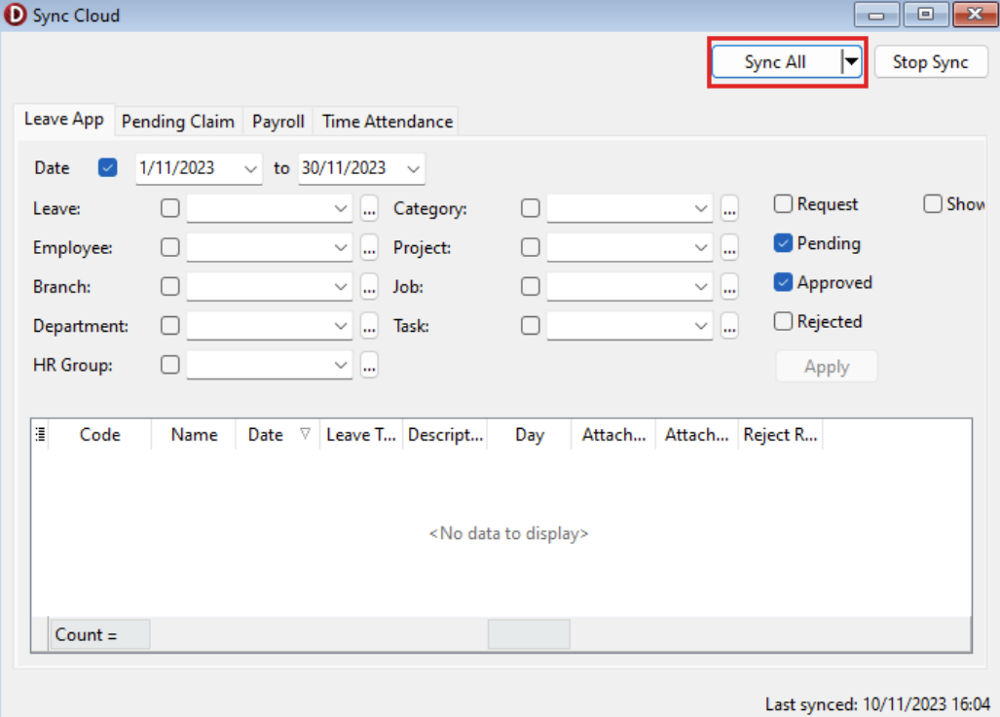
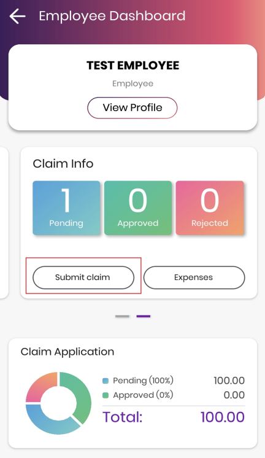
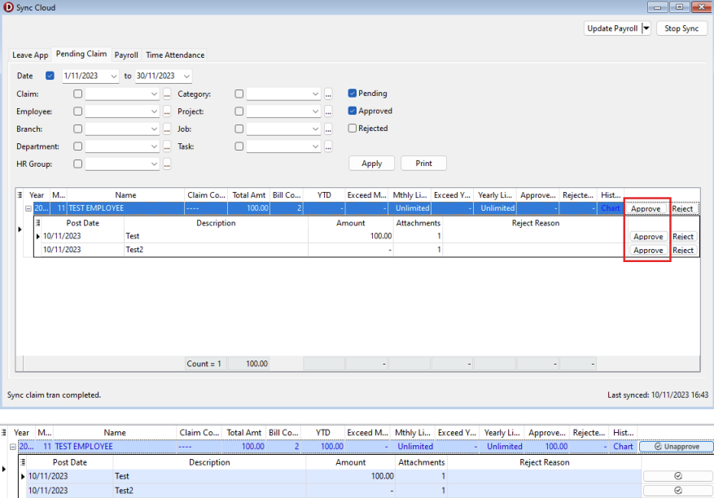
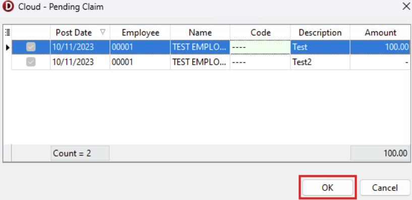
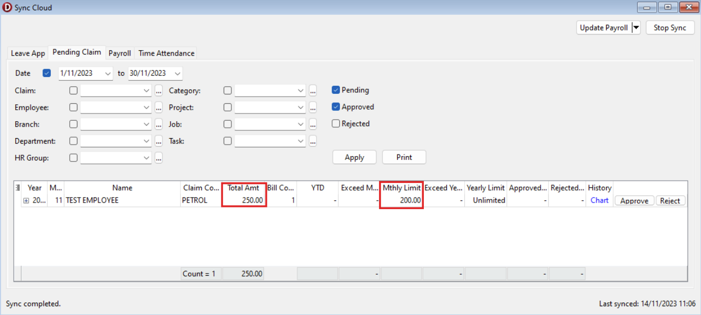
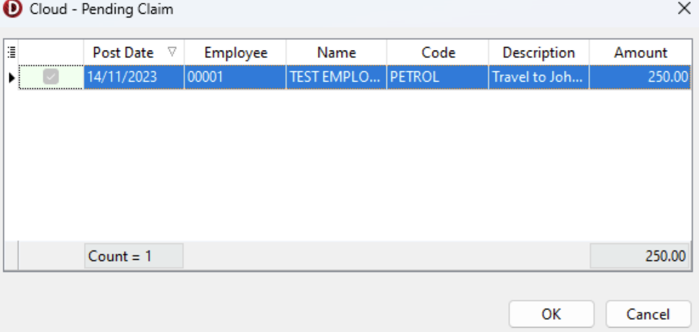

## Introduction

E Claim is a feature which allows your employees to submit a claim through SQL HRMS mobile app and then synchronize the claim application back to SQL Payroll.

## Prerequisites

Before proceed with the guide below, you will need to have SQL Drive setup. Find out how to setup in the [enable SQL Drive guide](enable-sql-drive)

## Create Claim Code (ADMIN)

1. In SQL Payroll, go to **Payroll** > **Maintenance** > **Maintain Claim**

   

2. Create **New**, give it a code name (e.g. Petrol) and click on **Save**

   :::note
   Optional: Yearly Limit & Monthly Limit

   Set to a specific amount to limit employee total claim amount.
   :::

   

## Setup employee access to SQL HRMS mobile app (ADMIN)

1. In SQL Payroll, go to **Maintain Employee** > **Employee profile**. Make sure to fill up the employee **email address**

   

2. After that, go to **Cloud** > **Sync Cloud**

   

3. Click on **Sync Now**

   

4. Wait until the status changed to "**Sync completed**"

   

## SQL HRMS mobile app (EMPLOYEE)

:::info
A video guide for this step is available in [Youtube](https://www.youtube.com/watch?v=h1nJzSHkjDQ)
:::

1. Our **SQL HRMS** app is available in _Google Play Store (Android)_ and _App Store (iOS)_. Before download, verify the app publisher is **eStream Software**

   

2. Install, open the app, and proceed to login with the email address registered in Maintain Employee (refer to Step 3)

3. During login process, employee will need to enter the OTP (One Time Password) sent to the registered email for verification purpose

4. Submit Claim (Employee)

   | 1. Go to **Employee View**                          | 2. Swipe Left to show Claim section                               |
   | --------------------------------------------------- | ----------------------------------------------------------------- |
   |      |  |
   | **3. Enter Claim Details and Upload Attachments**   | **4. Submit the claim**                                           |
   |  |            |

## Sync Claim Application to SQL Payroll (ADMIN)

:::note
This section explains the approval/rejection process by ADMIN

**Approve**: system will calculate the claim amount when processing payroll

**Reject**: system will **NOT** calculate the claim amount when processing payroll
:::

1. In SQL Payroll, go to **Cloud** > **Sync Cloud**

   

2. Navigate to **Pending Claim**, then click **Sync All**

   

3. Once synced successfully, you will see a listing of pending claim to be approved or rejected

4. Double click on any of the claim listing to expand its attachments

5. Click on the Attachment column to view attachments directly

   

### Approve Claim

1. Click Approve

   

   :::tip
   The row turning blue indicates that it has been successfully **approved**
   :::

2. Click Sync Now again, system will then sync the status with SQL HRMS app so employee can see the latest status

3. Navigate to **Payroll** > **New Payroll**, and click _Process_

   

4. You will be prompted with the pending claim that will be included, click **OK** to proceed

   

5. Double click on the employee on left sidebar to check payroll details. You will be able to see that claim amount is included in the month end payroll

   

### Reject Claim

1. Click **Reject**

   

   :::info
   The row turning red indicates that it has been successfully **rejected**. The system will **not** include the claim amounts during payroll processing.
   :::

2. Click Sync Now again, system will then sync the status with SQL HRMS app so employee can see the latest status.

3. Approve Claim

## FAQ

### What if the claim amount exceeded monthly/yearly limit and you still want to approve it?

System do not force you to reject the claim, however you will be given two reminder if you chose to proceed and approve the claim (shown below).

1. Example: **Petrol Claim**

   Monthly limit: **RM250**

   Employee Claim Amount: **RM200**

   

   :::tip
   You can reject the claim at this window if you do not wish to proceed.
   :::

2. Click approve, system will calculate the extra amount which exceeded limit. (**First reminder**)

   

3. Click Sync Now.

4. Go to **Payroll** | _New Payroll_ | Click _Process_ | Click _OK_

   

5. System will prompt a new window "Claims Exceed Limit" (**Second reminder**)

   

6. Click OK to approve and proceed with the claim.

   

If you do not wish to reject the claim, untick it and Click **OK**

