## Dashboard

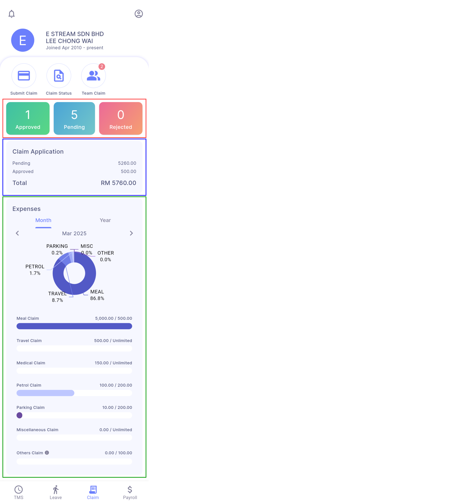

- **Claim Status Count Summary**:
    - User's total approved, pending and rejected claims in the current year
    - User can tap on each status to view claims with the respective status
- **Claim Amount Summary**: User's total amount of pending and approved claims submitted in the current year
- **Claim Balance Summary**: User’s pending and approved claims on each expenses types by month and by year

## Claim Submission
**Step 1:** 

**Default Claim:** Select expense type, claim date, amount and description

**E-Invoice Claim:** Select attachment that includes a **VALID** E-Invoice QR code
- User can view the MTD limit, YTD limit and claim balance for each selected expenses type
- For E-Invoice Claim, post date, ref 1 and ref 2 will be filled in based on the E-Invoice and are not editable
- User need to allow Camera and Photos (only for iOS device) permission in order to continue the service (refer [Android Permission](../permission.md#android-2) and [iOS Permission](../permission.md#ios-2))

**Step 2:** Submit

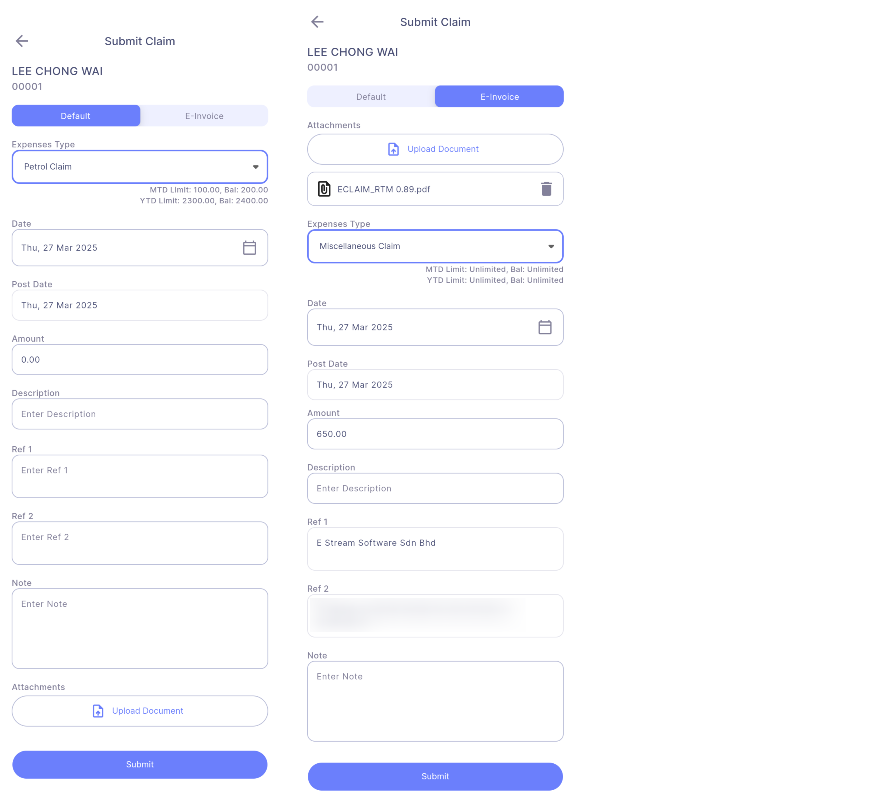

#### Claim Submission Warning Dialog Box
The app will help to do the following checkings after user click on the ***'Submit' button***: 

1. **Exceed MTD Limit:** Prompts if total submitted amount (including previous submission) exceed the monthly limit of the expenses type

    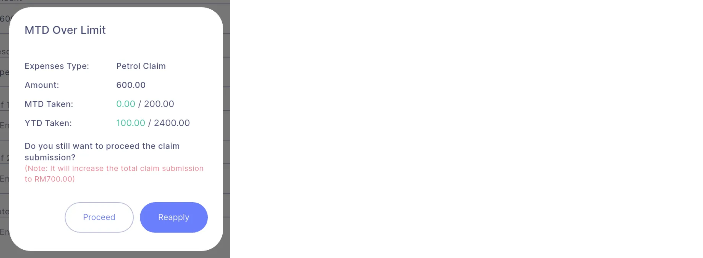

2. **Exceed YTD Limit:** Prompts if total submitted amount (including previous submission) exceed the yearly limit of the expenses type

    

:::info
User can choose to change the claim details by submitting a new claim (***'Reapply' button***) or proceed with the current claim submission (***'Proceed' button***) if exceed monthly limit, but **NOT ALLOWED** to proceed the submission if exceed yearly limit
:::

#### Claim Submission Sucessful
The app will prompt this dialog message upon successful submission

1. Successful Dialog Box

    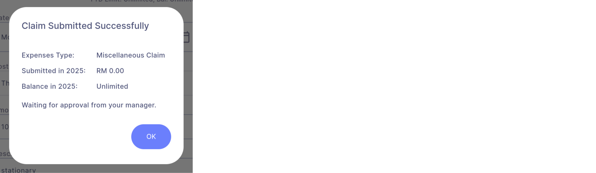

2. App Notification (Manager side)clai

    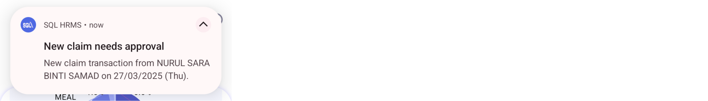

3. Email Notification (Manager side)

    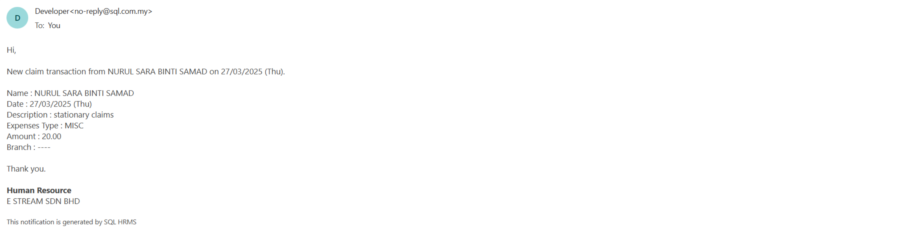

## Claim Status
User can view all his claim transactions once enter this page

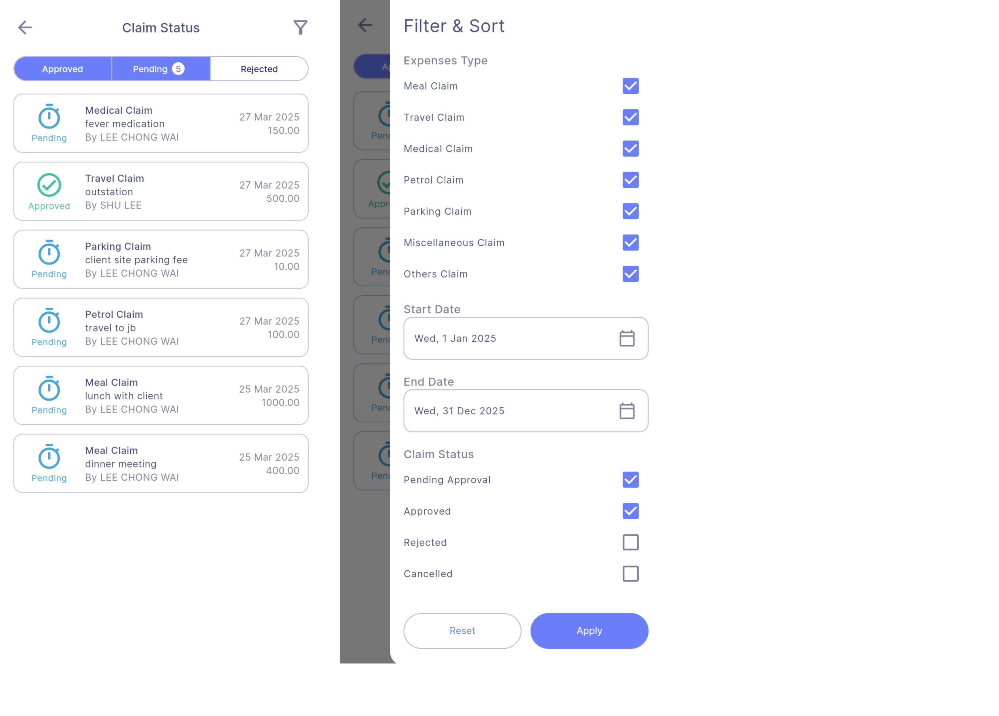

- User can apply filter and sorting order to view different claim transaction listing:
    - Filtering options:
        - Expenses type
        - Date range
        - Claim status
    - Sorting options:
        - Date
        - Expenses type
        - Claim Status  
- Type of claim status:  

    | **Icon** | **Claim Status** | **Remark** |
    | :------- | :--------------- | :--------- |
    |  | Pending Approval | Status after normal employee applied a claim submission |
    |  | Approved | Approved by manager from app and not synced to payroll system |
    |  | Approved (Sync) | Synced and approved on payroll system |
    |  | Rejected | Rejected from app / payroll system |
    |  | Cancelled | Cancelled by user from app |

## Claim Transaction Detail

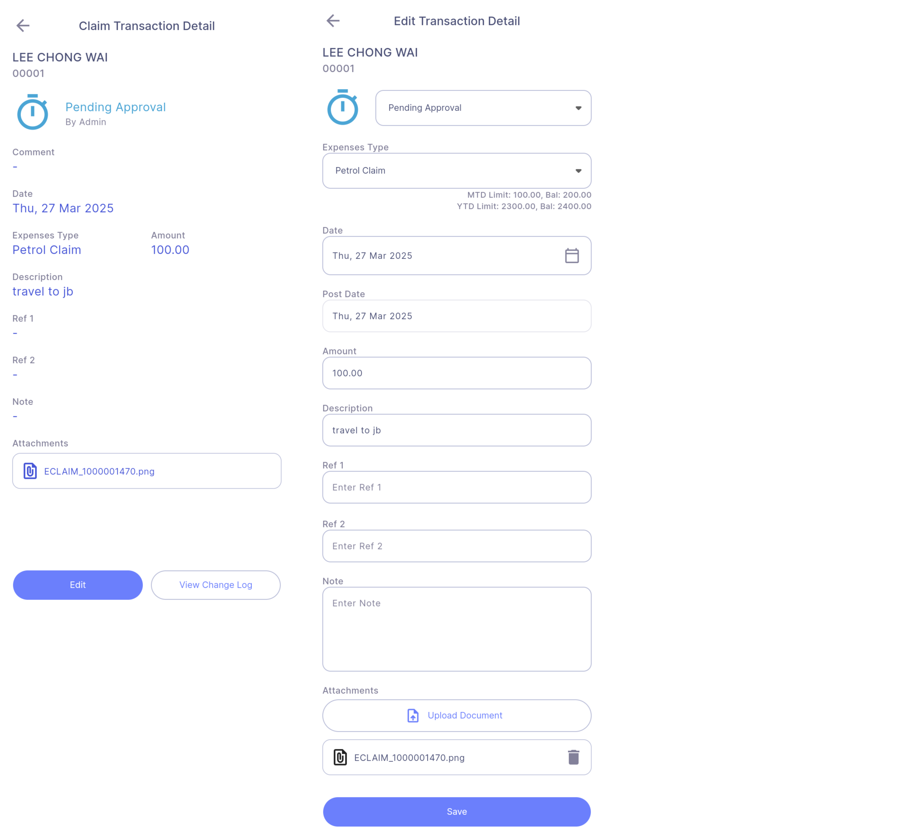

- User are allowed to edit the claim transaction details or cancel the claim on **Pending Approval** claims.  
- ***'View Change Log' button***: View change log of the claim

## Team Claim (Manager only)
Manager can view all claim transactions of his team once enter this page

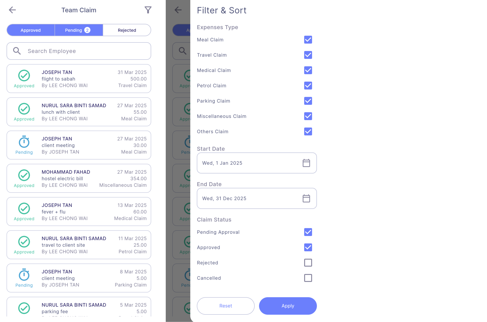

- Manager can apply filter and sorting order to view different claim transaction listing:
    - Filtering options:
        - Expenses type
        - Date range
        - Claim Status
        - Branch
        - Department
    - Sorting options:
        - Date
        - Expenses type
        - Claim Status

### Claim Approval

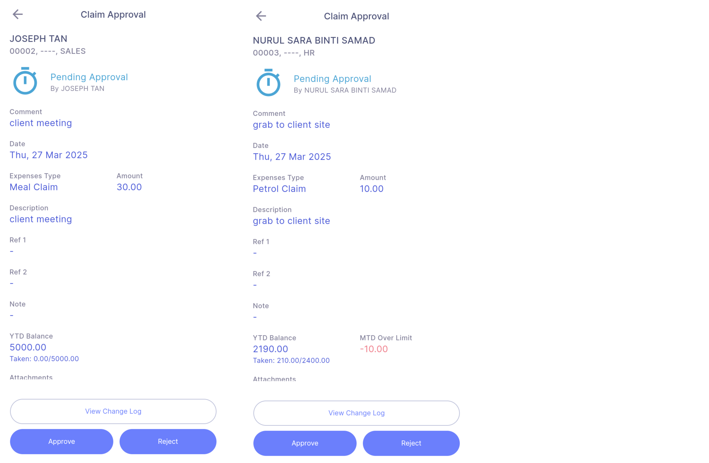

- Managers can apply different actions on his team’s claim transaction based on the claim status
    | **Claim Status** | **Allowed Actions** |
    | :--------------- | :------------------ |
    | Pending Approval | Approve, Reject |
    | Approved | Undo Approved, Reject |
    | Approved (Sync) | - |
    | Rejected | Approve, Undo Rejected |
    | Cancelled | - |

- ***'View Change Log' button***: View change log of the claim

#### Claim Approval Warning Dialog Box
The following checkings will be carried out when manager approving a claim: 

1. **MTD Claim Over Limit:**
    - The app will prompt this dialog box if total approval amount (including previous claim transaction) already exceed the monthly limit of the expenses type
    - Manager can choose to cancel the claim approval (***'Back' button***) or proceed with the current claim approval (***'Proceed' button***)

        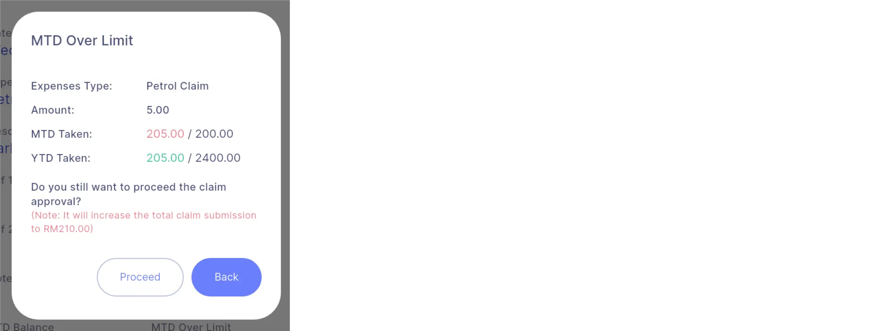

2. **YTD Claim Over Limit:**
    - The app will prompt this dialog box if total approval amount (including previous claim transactions) already exceed the yearly limit of the expenses type
    - Manager is **NOT ALLOWED** to approve claim transaction that already exceed the year limit

        

#### Claim Comment Dialog Box
Manager can enter a comment for the claim approval / claim status update (optional) before proceed the updates

#### Claim Status Update Successful
The app will prompt a dialog message upon successful update on the claim status

### Notification
#### Claim Approval
User will receive the following notification once manager approves his claim: 

1. App Notification

    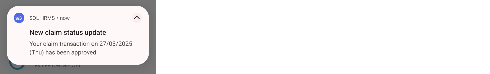

2. Email Notification

    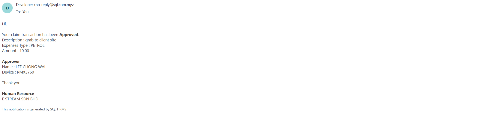

### Claim Approval Failed
User will receive the following notification if manager failed to approve his claim (exceed year limit): 

1. App Notification

    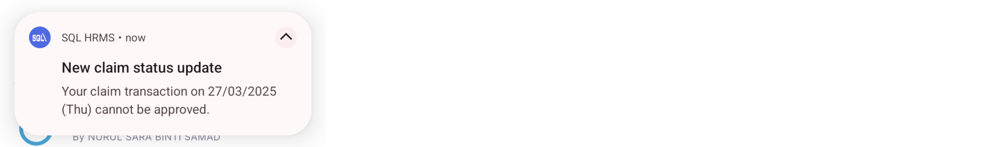

2. Email Notification

    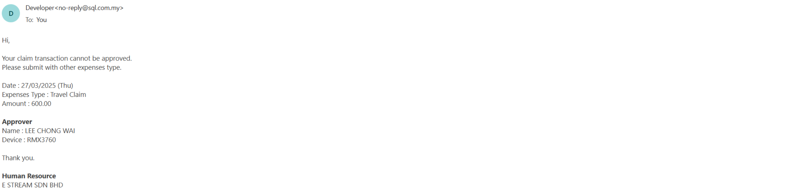

### Claim Approval Rejected
User will receive the following notification once manager rejects his leave: 

1. App Notification

    

2. Email Notification

    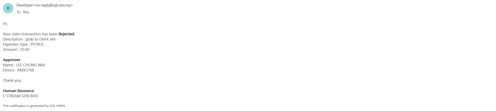

## Activity Center
User can view his and his team’s (manager only) claim transaction updates from the Activity Center (Dashboard | Activity Center (Bell icon on top left))

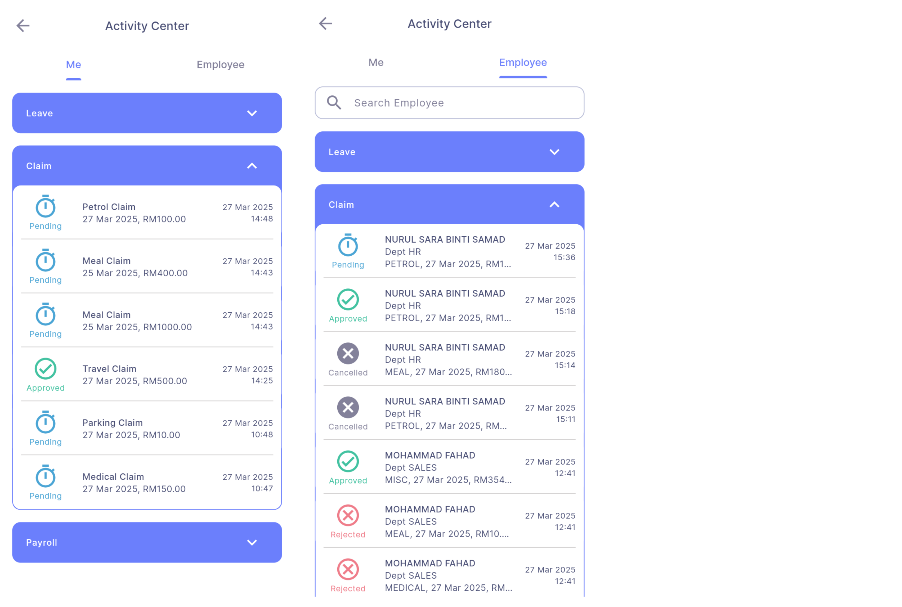
