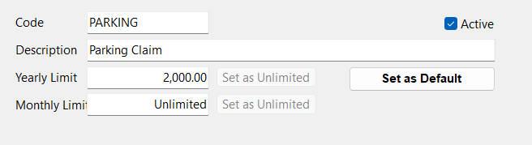
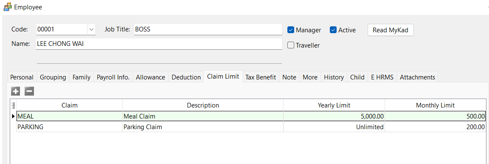
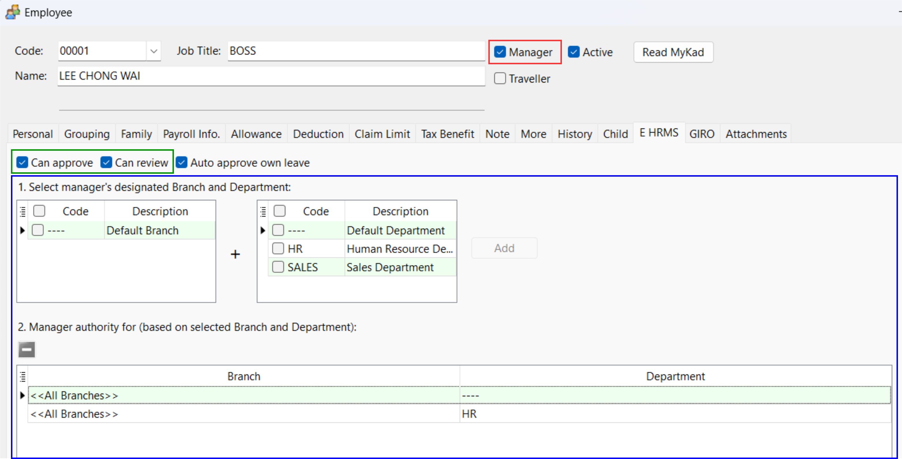

## Maintain Claim

1. Navigate to Payroll > Maintenance > Maintain Claim…, select a Claim or Create New
2. Set Yearly Limit and Monthly Limit

    Option 1: Maintain Claim

    

    Option 2: Maintain Employee > Claim Limit tab

    

:::info
SQL Payroll/SQL HRMS app will prioritize claim limit set in Maintain Employee over the claim limit in Maintain Claim
:::

## Manager Authority Settings

1. Navigate to Maintain Employee > E HRMS tab

- ***'Manager' checkbox***: Checked to make the employee a manager
- **Manager Authority**:
  - Can Approve: Able to approve team’s claim submissions and leave applications
  - Can Review: Only able to verify team’s claim submissions and leave applications
- **Manager Team**: Select branch and department that will be managed by the employee
