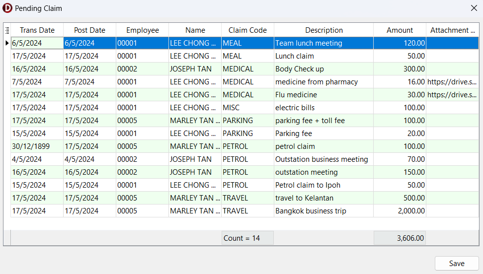

1. Navigate to ☁️ > Sync Cloud… > Pending Claim > Sync All
    - Checkbox Hint:
        - Pending: Show leave applications with **Pending Approval** status
        - Approved: Show leave applications with **Approved** status
        - Rejected: Show leave applications with **Rejected** status
    - **Blue Highlight:** Approved claim
    - **Red Highlight:** Rejected claim
    - Editable columns:
        - Comment
        - Action:
            - Approved
            - Reject
            - Unapprove
            - Unreject

## Edit Mode

1. Right-click on the grid, click "Edit"

    - Editable columns
        - Trans Date
        - Post Date
        - Claim Code
        - Description
        - Amount

2. Save
