## Introduction

E Leave is a feature in SQL HRMS which greatly simplifies the process of managing employees leave applications

:::info
E Leave is utilizing email as the channel for notifying managers/employees. In order to make it work, there are some simple setup need to be done. If you have a **custom company email address**, you can create additional user for E Leave and configure following the steps below. Whereby for users who doesn't have a custom company email address, you can utilize **Google Email (Gmail)** or **Microsoft Outlook** in the setup, they are free. 🤩
:::

## Generate App Password

:::note
Skip to [**Setup**](#setup) if you are using custom company email address. This guide is applicable to **Google Email (Gmail)** and **Microsoft Outlook** only.
:::

### Google Email (Gmail)

1. Visit [Google account](https://accounts.google.com/) and login into your gmail

2. From the sidebar, click on **Security** tab

   

3. Turn on **2-Step Verification** (Skip this step if you have turned it on)

   1. Click on **2-Step verification**

      

   2. Press on **GET STARTED**

      

   3. Enter your **Gmail Password**

   4. Press **Continue**

   5. Press **Sent**

   6. Enter **Gmail code**

4. After enabling **2-Step Verification**, we will be able to generate the **App Password**

   :::warning
   If you don't see this option, it might be due to the following issues:

   - 2-Step Verification is not set up for your account
   - 2-Step Verification is only set up for security keys
   - Your account is through work, school, or other organization
   - You turned on Advanced Protection

   :::

5. Click on **App Passwords** section

6. Enter your gmail password to continue

7. Next, Select **Mail** as the app and **Windows Computer** as the device. Click **Generate** to create an app password

   

8. Copy and note down the **App password**, you will need to fill it in the _password_ field following the [Setup](#setup) guide

   

### Microsoft Outlook

1. Visit [Microsoft account](https://account.live.com/proofs/Manage?mkt=en-us) and login into your email

2. Navigate to **Security** tab, and enable **Two-step verification**

   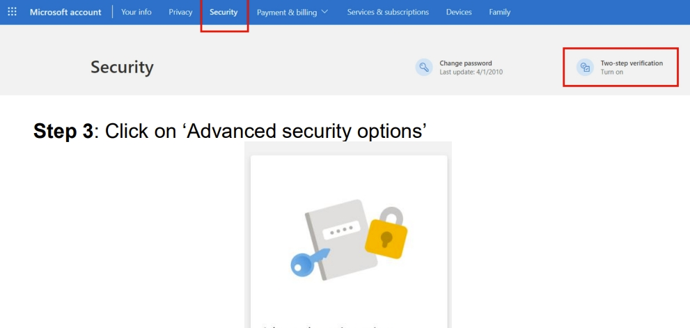

3. Next, find the **App passwords** section, and click "**Create a new app password**"

   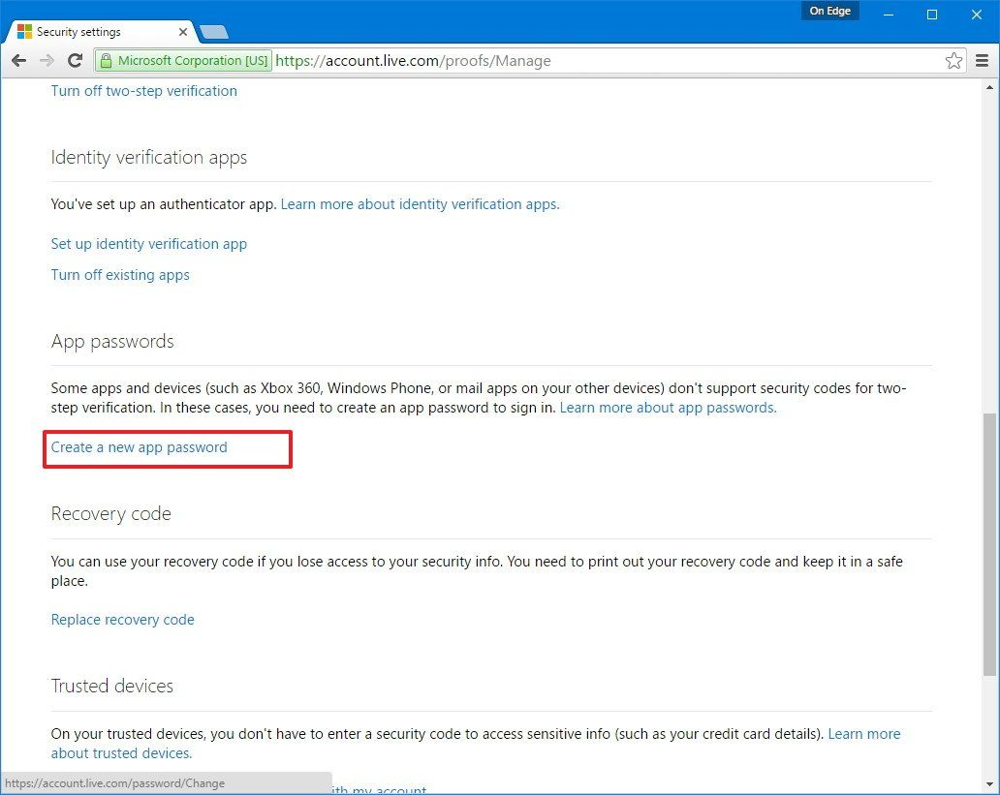

4. Copy and note down the **App password**, you will need to fill it in the _password_ field following the [Setup](#setup) guide

   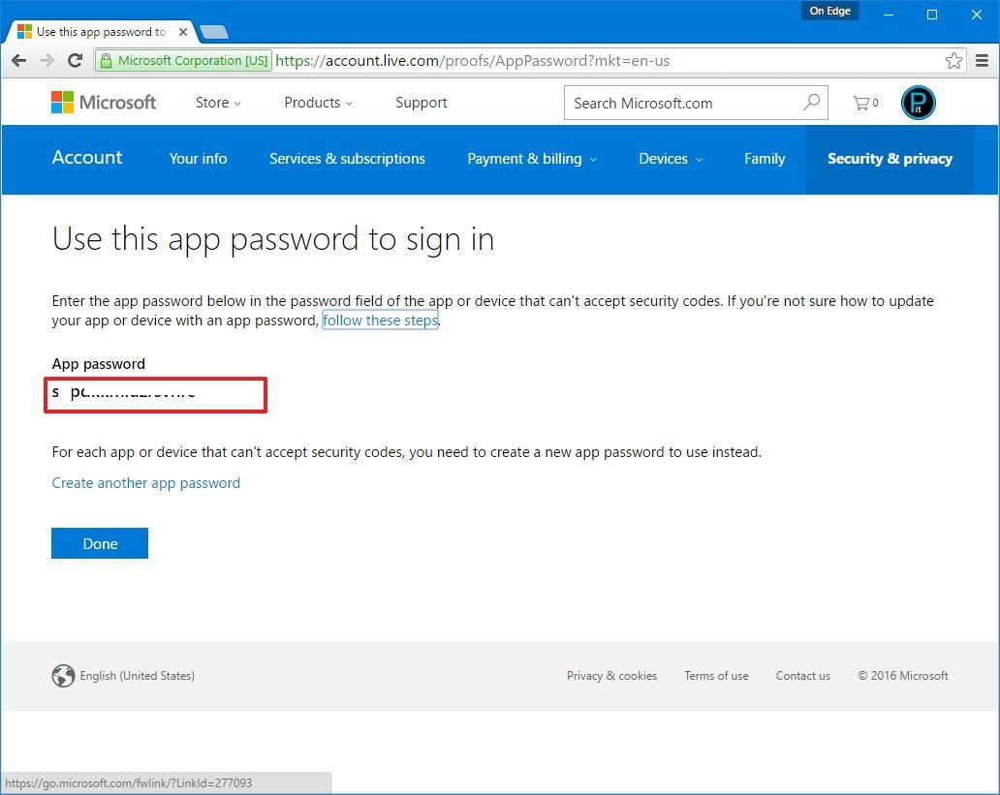

## Setup

1. In SQL Payroll, go to **File** > **Company Profile**

2. Under the **General** tab, enter the company email (this will be the recipient email in the E Leave notification)

   

3. Next, navigate to the **Email Settings** tab, fill in the details

4. Click **Send Test Email** to test the functionaliy of the config and save

   | Fields      | Description                                                                 | Google Email (Gmail) | Microsoft Outlook    | Custom               |
   | ----------- | --------------------------------------------------------------------------- | -------------------- | -------------------- | -------------------- |
   | SMTP Host   | Email SMTP Host                                                             | `smtp.gmail.com`     | `smtp.office365.com` | user defined host    |
   | Port        | Email SMTP Port                                                             | 587                  | 587                  | user defined port    |
   | User        | User email which used in generating the app password OR custom user created | gmail                | microsoft email      | custom user          |
   | Password    | The 16-character app password OR custom user password                       | -                    | -                    | custom user password |
   | Sender Name | Name of the email sender for notification                                   | -                    | -                    | -                    |

   

   :::tip
   Upon successful, the email address configured in the **User** field should receive an email
   :::

   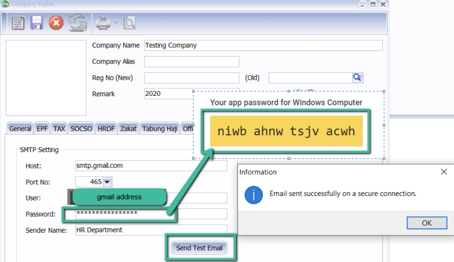

5. To preserve the settings, navigate to **Cloud ☁️** Icon on the menu bar > **Sync Cloud...**

   

6. Under the tabview, select the **Leave App** tab and click on the **Sync Now** button

   

   :::info
   Repeat step 5 and 6 for every changes to the configuration, this is to ensure configuration are synchronized to cloud
   :::

## Sync EA or Payslip to E Leave

1. Navigate to **Cloud ☁️** Icon > **Sync Cloud**

   

2. From the tabbed view, select **Payroll**
3. Tick **Include Employee Payroll Info**
4. Tick **Upload Payslip** and specify the **year and month** of payslip
5. Choose the **report format** for _Payslip_
6. Tick **Include EA Form Info**
7. Tick **Upload EA Form** and specify the **year**
8. Choose the **report format** for _EA Form_
9. Lastly, click on the **Sync Now** button

   

10. Wait until the status bar (located at the bottom) show as **Sync completed**.

    

11. That's all! You can now login into **SQL HRMS** to see the documents

    

### View Payslip from SQL HRMS

1. First, go to **Employee View**

2. Click **View Payslip**, you will be able to view your payslip info for the month

   

### Download Payslip from SQL HRMS

1. We do provides ability to download the payslip. In the **Employee View**, click on the **Monthly Payroll**

   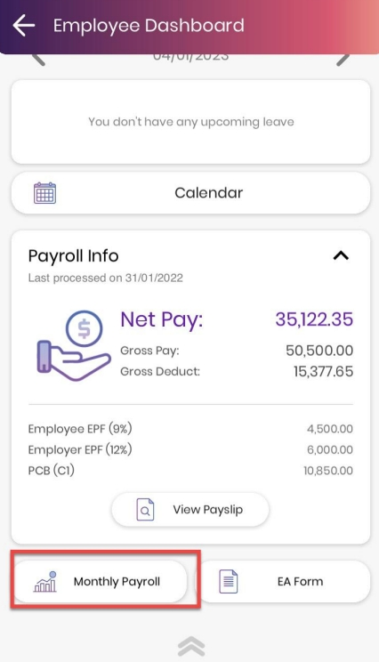

2. Select the month that you wish

   

3. There will be a payslip icon on the top right, click on it

   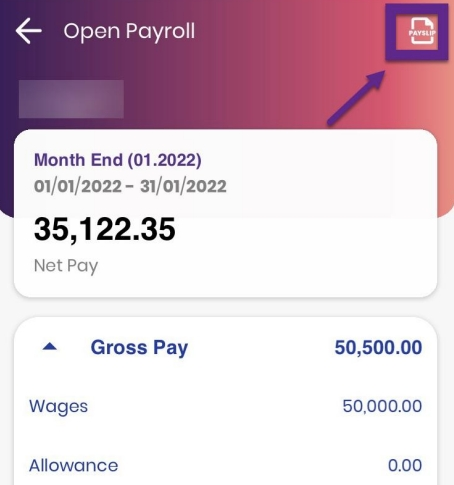

### Download EA Form from SQL HRMS

1. Besides payslip, employee can download EA Form directly from the app too. In the **Employee View**, clic on the **EA Form**

   

2. Select the year of EA Form you wish to download

   

3. Click on **Download** icon on the top right, this will initialize a download to your phone 🥳

   

## Multi Level Approval

:::info
This feature allows multiple managers in managing the leave application of your employees (e.g. a leave application will require more than 1 manager to approve)
:::

### Feature Setup

1. In SQL Payroll, go to **File** > **Company Profile** > **E Leave**

2. In the tabbed view, navigate to **E HRMS**, tick **Multi-Level Approval**

   

3. Next, go to **Maintain Employee**, assign the **manager role** to the employee. This employee will act as a manager for the leave application

   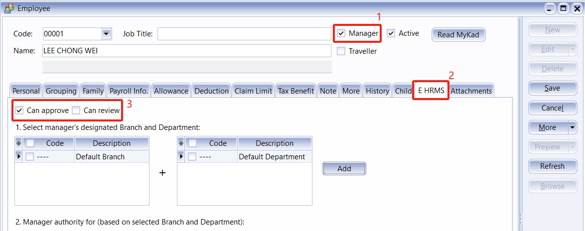

4. The table below illustrates the action one manager can do given different privileges:

   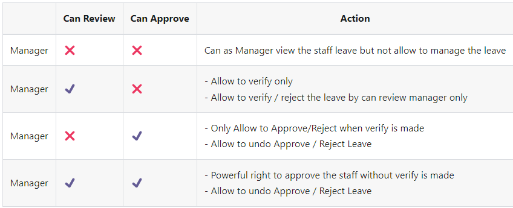

### Example of SQL HRMS behaviors

The table below show some example of screens given different privileges & circumstances (observe the button options **circled**):

| Can Review only                                        | Can Approve only                                                              | Review + Approve                                                                         |
| ------------------------------------------------------ | ----------------------------------------------------------------------------- | ---------------------------------------------------------------------------------------- |
| only allow to **Verify** ([Example](#can-review-only)) | If **not yet verified**, unable to approve ([Example](#can-approve-directly)) | Allow to **approve directly** (without review)([Example](#verified-can-approve--reject)) |
| -                                                      | Once **verified**, can approve / reject ([Example](#can-approve-directly))    | Allow to **undo approve** leave application ([Example](#unapproved))                     |
| -                                                      | -                                                                             | Allow to **undo rejected** leave application ([Example](#unrejected))                    |

### Leave Status in SQL Payroll

In the **Sync Cloud** window, there total of **4 types of status**:

- `Request`: **pending for verification**
- `Pending`: verified, **pending review by Manager**
- `Approved`: approved leave applications
- `Rejected`: rejeted leave applications

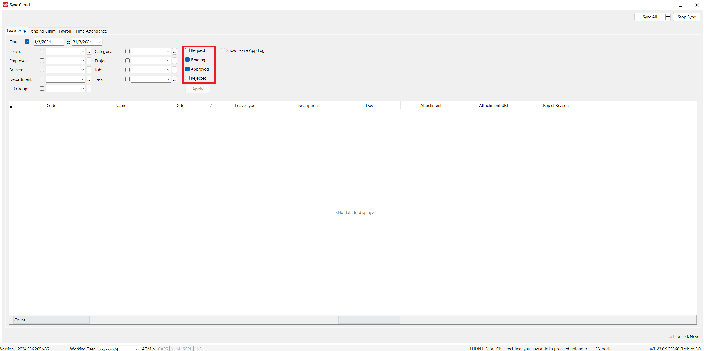

## Appendix

### Can Review only

### Can Approve directly

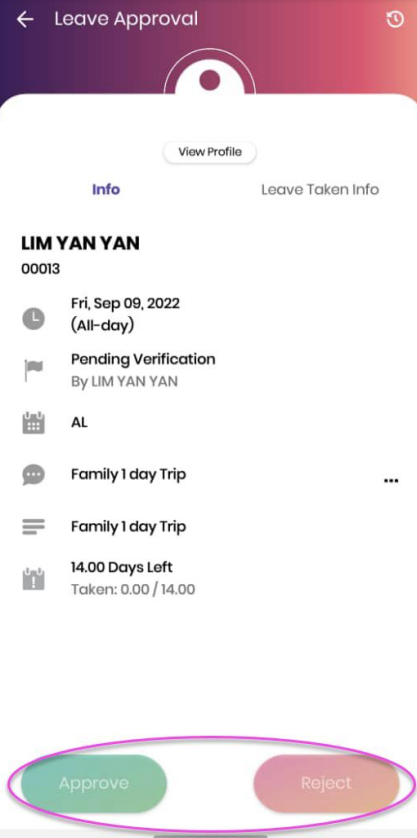

### Verified, can Approve / Reject

### Unapproved

### Unrejected

### Permission Table

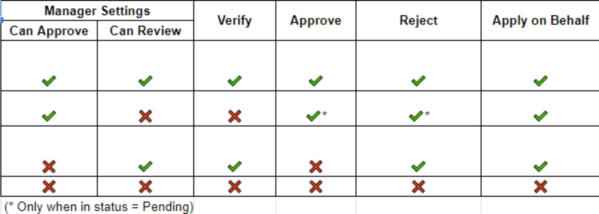

### The flow of Can Review only permission

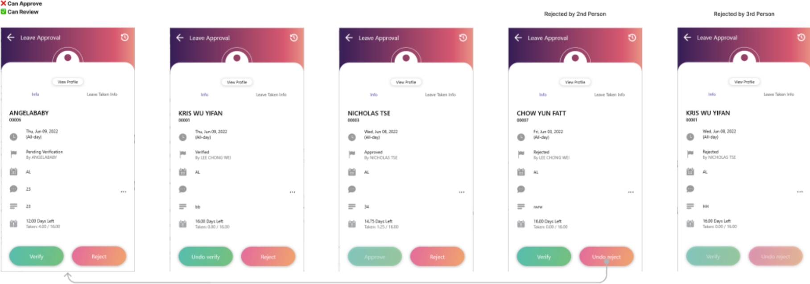

### The flow of Can Approve only permission

### The flow of Review + Approve

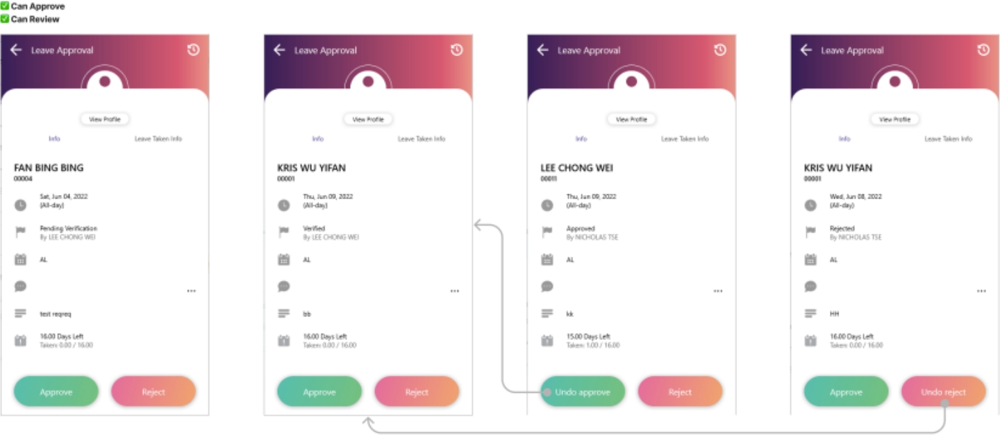
