## Dashboard

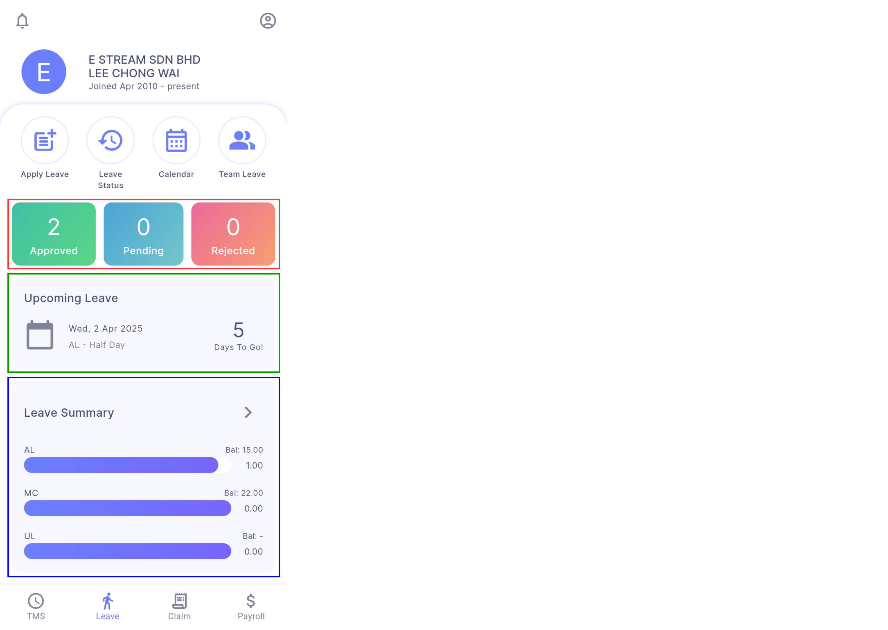

- **Leave Status Count Summary**
    - User’s total approved, pending and rejected leaves in the current year
    - User can tap on each status to view leave applications with the respective status
- **Upcoming Leave**: User’s upcoming approved leave  
- **Leave Balance Summary (AL, MC and UL)**
    - User can tap on the card to view detailed leave balance for all his leave types

## Leave Balance

### Employee
User can view leave balance of different year by navigating to different year

### Manager
If user is a manager, he can view his team's leave balance by tapping on the employee card
apply
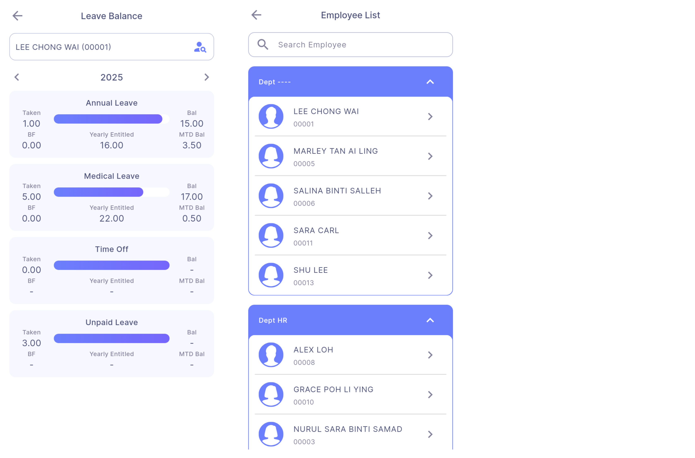

## Leave Application

### Employee

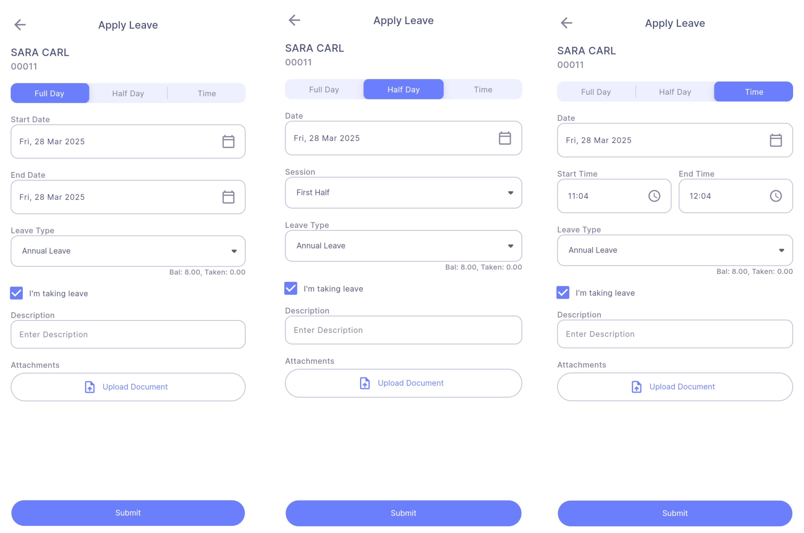

**Step 1:** Select leave duration type: Full Day, Half Day, Custom Time

**Step 2:** Select leave date, leave time, leave type, description
    - User can view year balance and leave taken for the selected leave type
    - ***'I'm taking leave' checkbox*** : 
        - Checked: Normal leave application
        - Unchecked: Apply leave as OT replacement
    - User need to allow Camera and Photos (only for iOS device) permission to continue the service (refer [Android Permission](../permission.md#android-2) and [iOS Permission](../permission.md#ios-2))

**Step 3:** Submit

:::info
If user is a manager and has the Manager Auto Approval access (set in payroll system Maintain Employee | E HRMS tab | Auto Approval Own Leave), leave applied will automatically posted as **Approved** leave status
:::

### Apply Leave On Behalf (Manager only)
Manager can help his team to apply leave on behalf by tapping on the employee card to switch employee

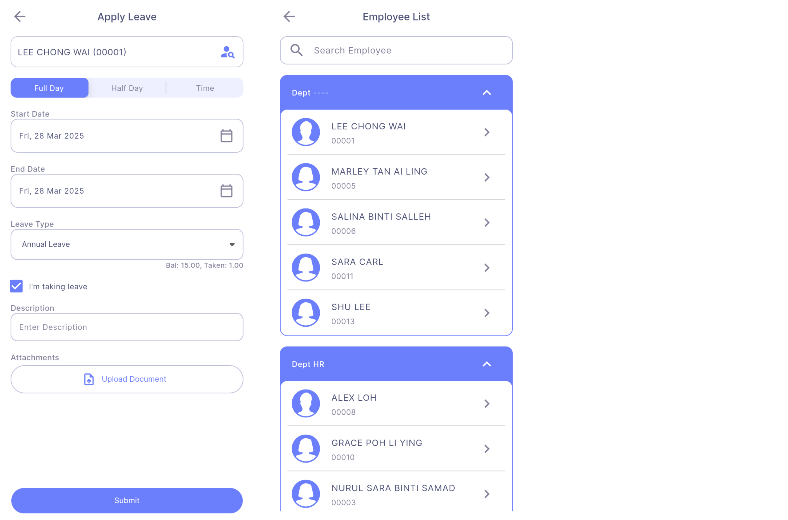

- Leave applied by Approval Manager will be posted as **Approved**
- Leave applied by Verify Manager will be posted as **Pending Approval**

#### Skipped Public Holiday / Rest Day Dialog box
App will automatically skipped all the public holidays and rest days if found within the applied date range

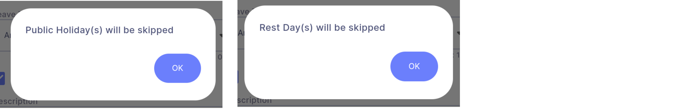

#### Leave Application Warning Dialog Box
The app will help to do the following checkings after user click on the ***'Submit' button***: 

1. **Duplicate Leave Application:** Prompts if there is leave applied on the same date

    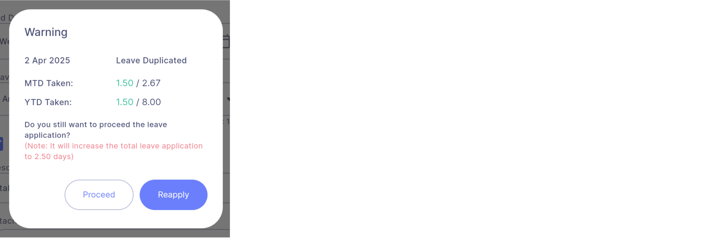

2. **Exceed MTD Limit:** Prompts if the applied leave day(s) exceed the month limit (only for entitled leave type)

    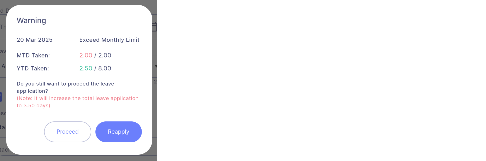

3. **Exceed YTD Limit:** Prompts if the applied leave day(s) exceed the year limit (only for entitled leave type)

    - User is not allowed to proceed with the leave application once exceeds year limit

    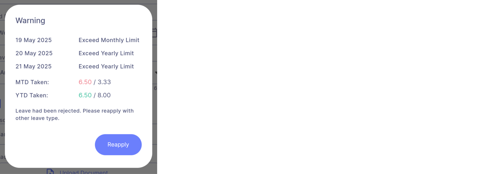

:::info
User can choose to change the leave details by submitting a new leave (***'Reapply' button***) or proceed (***'Proceed' button***) with the current leave application (not allowed if leave application exceeds year limit) 
:::

#### Leave Application Successful
1. Successful Dialog Box

    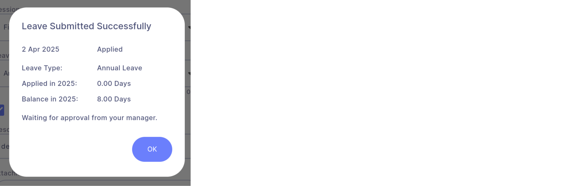

2. App Notification (Manager side)

    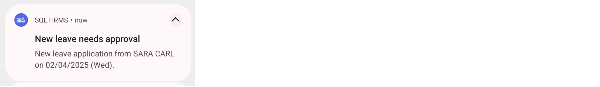

3. Email Notification (Manager Side)

    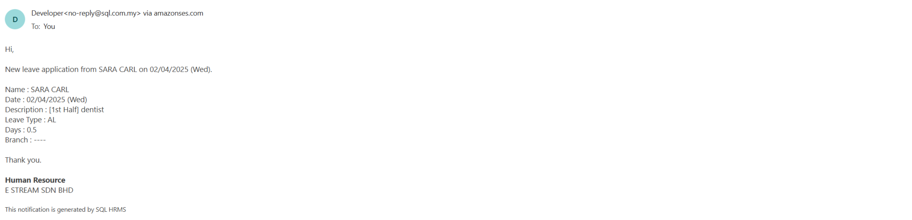

## Leave Status

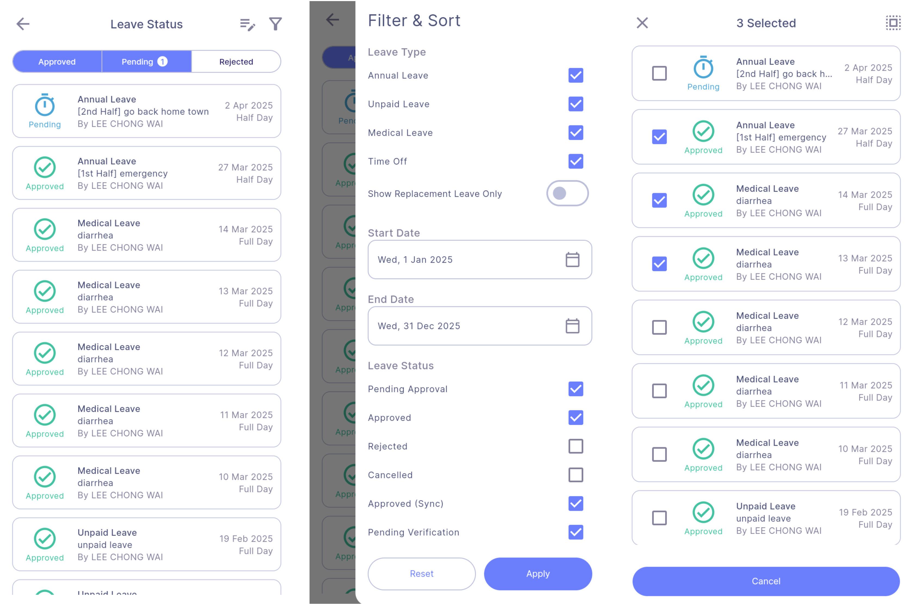

- User can view all his leave applications once enter this page. 
- User can apply filter and sorting order to view different leave application listing:
    - Filtering options:
        - Leave type
        - Date range
        - Leave status
    - Sorting options:
        - Date
        - Leave type
        - Leave status
- User can batch edit cancel **Approved / Pending Approval / Pending Verification / Rejected** leave applications
- Type of leave status:  

    | **Icon** | **Leave Status** | **Remark** |
    | :------- | :--------------- | :--------- |
    |  | Pending Approval | Status after normal employee applied a leave application (without [Multi-Level Approval](payroll-setup#multi-level-leave-approval--notification-settings)) |
    |  | Pending Verification | Status after normal employee applied a leave application (with [Multi-Level Approval](payroll-setup#multi-level-leave-approval--notification-settings)) |
    | 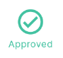 | Approved | Approved by manager from app and not synced to payroll system |
    | 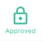 | Approved (Sync) | Synced and approved on payroll system |
    | 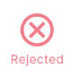 | Rejected | Rejected from app / payroll system |
    |  | Cancelled | Cancelled by user from app |

## Leave Application Detail

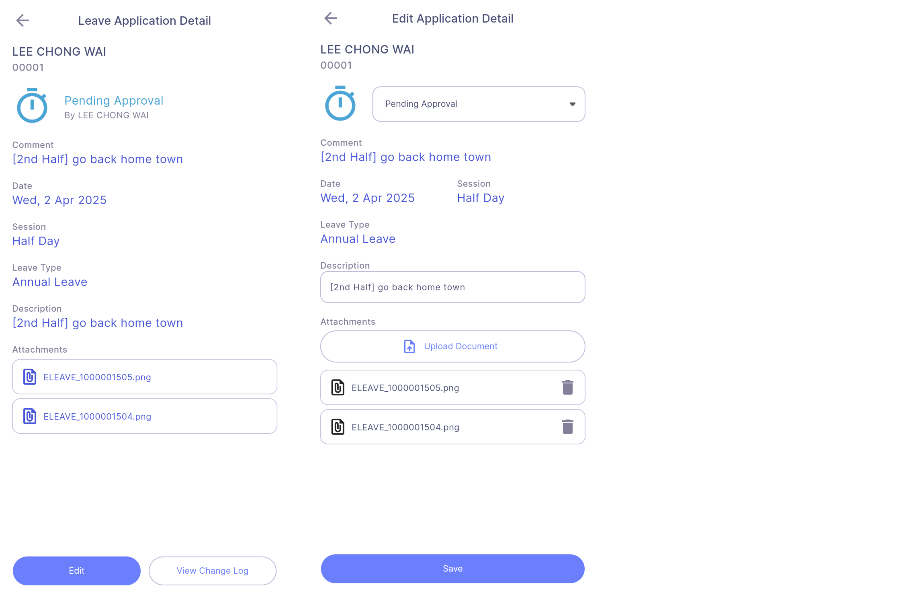

- User are allowed to edit the leave application details or cancel the leave on **Approved / Pending Approval / Pending Verification** leave applications.  
- ***'View Change Log' button:*** View change log of the leave

## Team Leave (Manager only)
Manager Types: (refer [Manager Authority Settings](payroll-setup.md#manager-authority-settings))

1. **Approval Manager:** Can approve employee leave

2. **Verify Manager:** Can verify employee leave (required Approval Manager to approve a leave application)

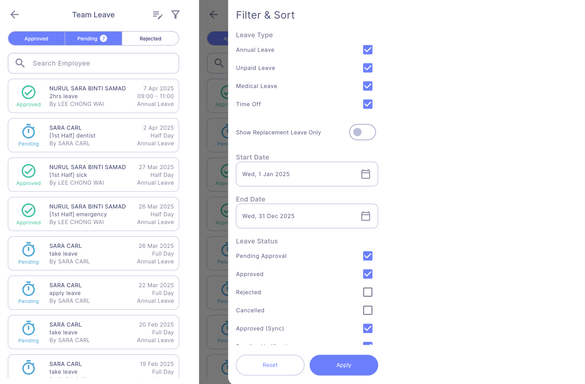

- Manager can view all leave applications of his managing team once enter this page. 
- Manager can apply filter and sorting order to view different leave application listing:
    - Filtering options:
        - Leave type
        - Show replacement leave only
        - Date range
        - Leave Status
        - Branch
        - Department
    - Sorting options:
        - Date
        - Leave type
        - Leave Status
- Manager can batch edit leave application status by clicking on the top right icon. (refer [Batch Leave Approval](#batch-leave-approval)) 

### Leave Approval

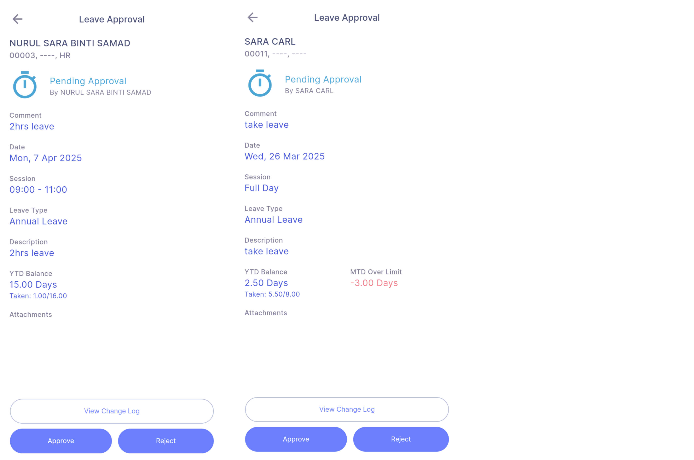

- ***'View Change Log’ button:*** View change log of the leave
- Managers can apply different actions on his team’s leave application based on the leave status and his authority 
    - Actions that can be done by **Approval Manager**: 
        | **Leave Status** | **Allowed Actions** |
        | :--------------- | :------------------ |
        | Pending Verification | Approve Reject |
        | Pending Approval | Approve, Reject |
        | Approved | Undo Approved, Reject |
        | Approved (Sync) | - |
        | Rejected | Approve, Undo Rejected |
        | Cancelled | - |
    - Actions that can be done by **Verify Manager**: 
        | **Leave Status** | **Allowed Actions** |
        | :--------------- | :------------------ |
        | Pending Verification | Verify, Reject |
        | Pending Approval | Undo Verify, Reject |
        | Approved | Reject |
        | Approved (Sync) | - |
        | Rejected | Verify, Undo Reject |
        | Cancelled | - |

#### Leave Approval Warning Dialog Box
The following checkings will be carried out when manager approving a leave: 

1. **MTD Leave Over Limit:**
    - Manager are allowed to proceed leave approval with same / other leave type (only if there are other leave type options) if total leave day applied (including previous leave application) already exceed the monthly limit of the leave type
        - Leave type options include:
            - Current leave type
            - Non entitled leave type
            - Entitled leave type which year balance > 0
    - Manager can choose to cancel the leave approval (***'Back' button***) or proceed with the current / other leave type (***'Proceed' button***)

        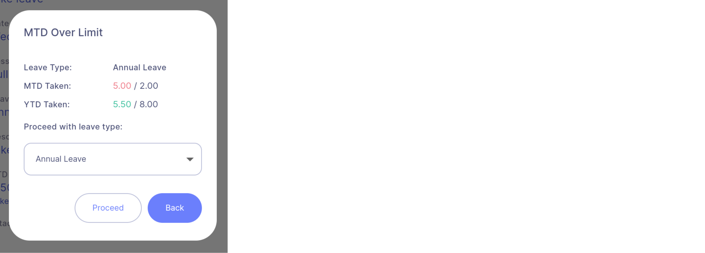

2. **YTD Leave Over Limit:**
    - Manager are allowed to proceed leave approval with other leave type if total leave day applied (including previous leave application) already exceed the yearly limit of the leave type
        - Leave type options include:
            - Non entitled leave type
            - Entitled leave type which year balance > 0
    - Manager is NOT ALLOWED to approve leave application that already exceed the year limit and there are no other available leave type options

        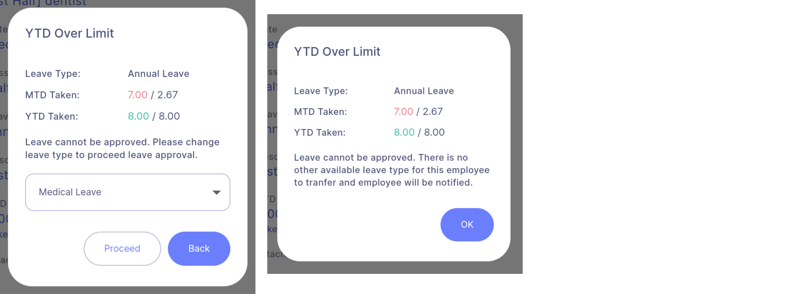

#### Leave Comment Dialog Box
Manager can enter a comment for the leave approval (optional) before proceeding with the updates

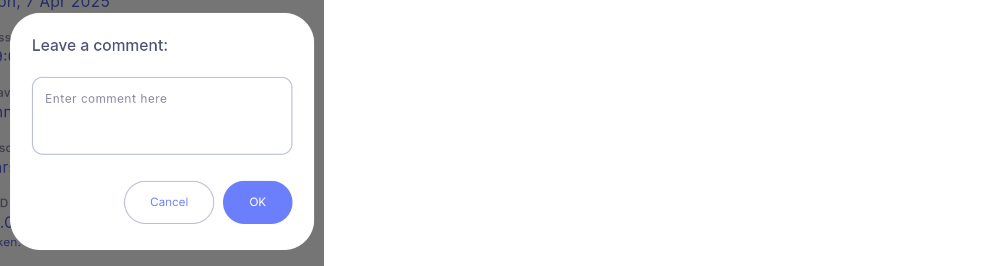

#### Leave Status Update Successful
The app will prompt a dialog message upon successful update on the leave status

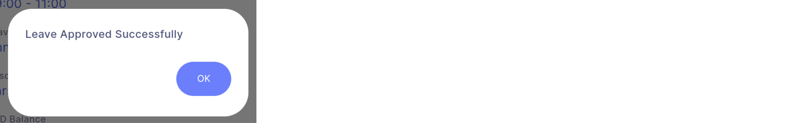

### Batch Leave Approval
**Step 1:** Select the action that manager wants to carry out (Approval Manager View and Verify Manager View)

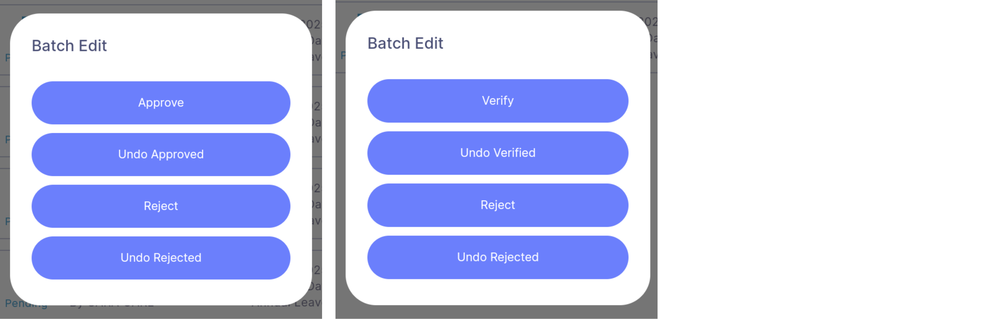

**Step 2:** Select the leave application that is required for batch edit. (Approval Manager View and Verify Manager View)

:::info
Batch Leave Approval will undergo the same checkings as Leave Approval and warning message will be prompted if exceed month limit or year limit
:::

### Leave Approval Notification
#### Leave Approval
User will receive the following notification once manager approves his leave: 

1. App Notification

    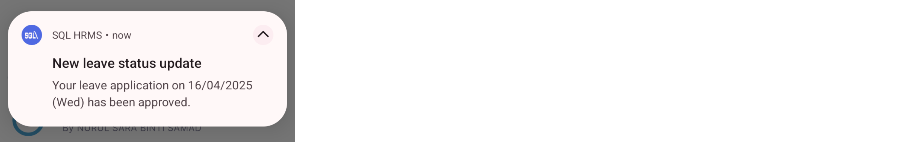

2. Email Notification

    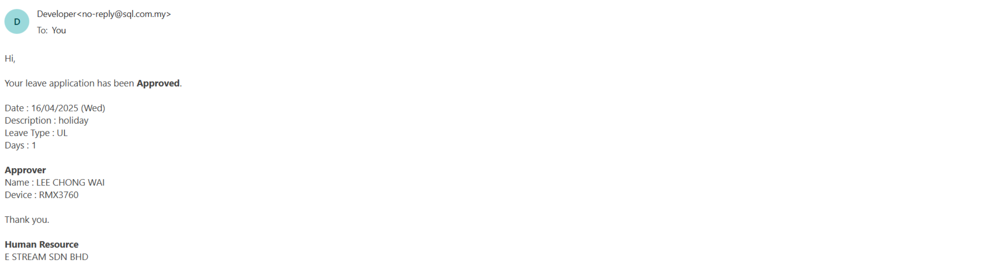

#### Leave Approval Failed
User will receive the following notification if manager fails to approve his leave (exceed year limit): 

1. App Notification

    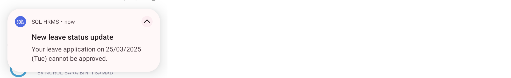

2. Email Notification

    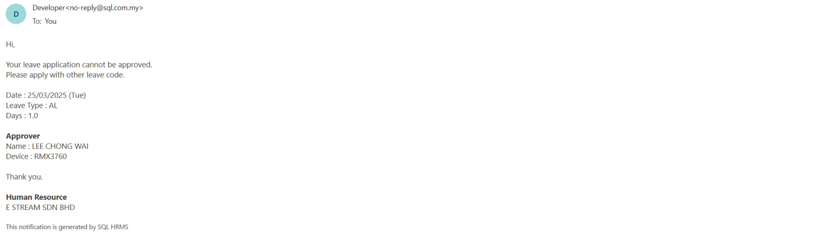

#### Leave Rejected
User will receive the following notification once manager rejects his leave: 

1. App Notification

    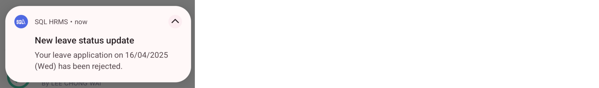

2. Email Notification

    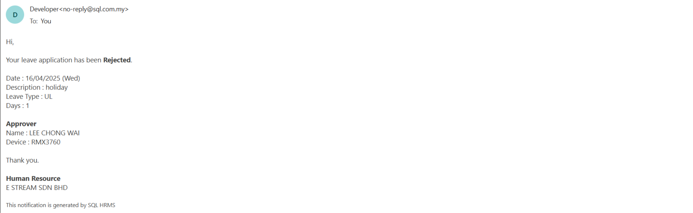

## Leave Calendar

### My Leave Calendar
User can view all the leave applied in calendar view (excluding rejected and cancelled leave applications)

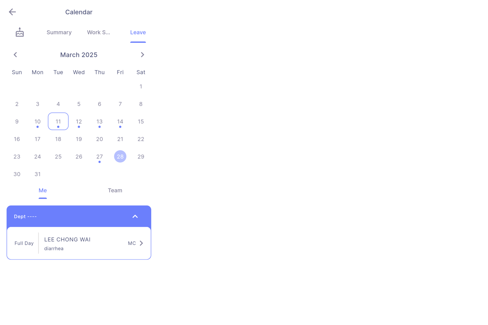

- User can tap on the leave cards to enter Leave Application Detail page to view more info / perform edit action

### Team Leave Calendar
User can view his team’s applied leave in the calendar view 

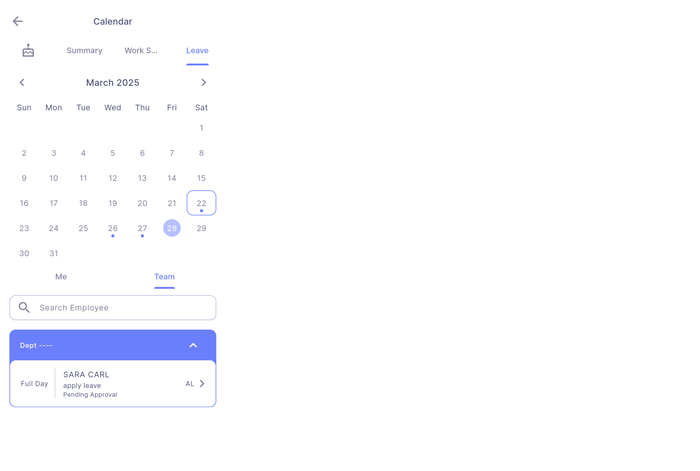

- **Only manager** can tap on the leave cards that belongs to his managing team (refer [Manager Authority Settings](payroll-setup.md#manager-authority-settings)) to enter **Leave Approval** page to view more info / perform leave approval

## Activity Center
User can view his and his team’s (manager only) leave application updates from the Activity Center (Dashboard | Activity Center | Bell icon (top left))

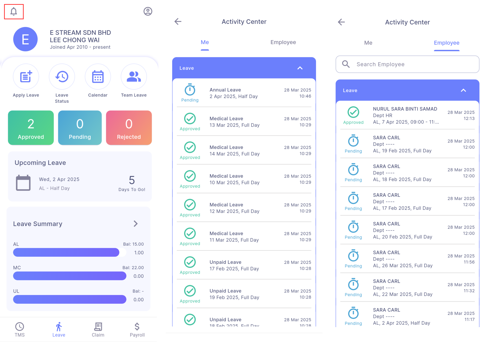