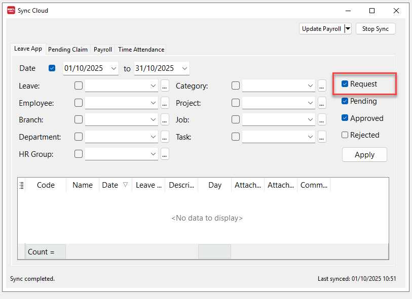
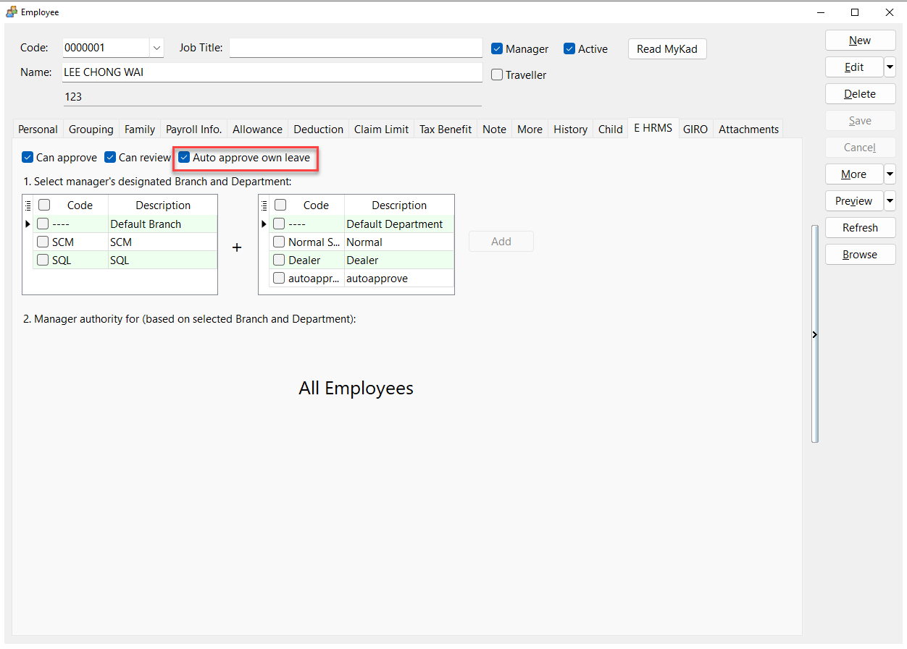
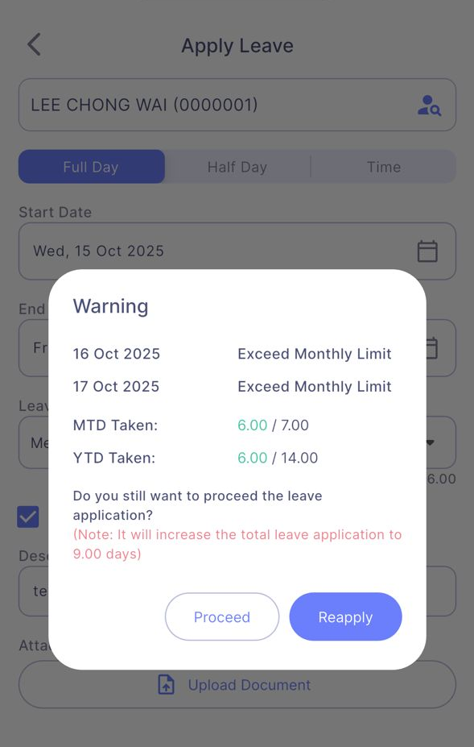
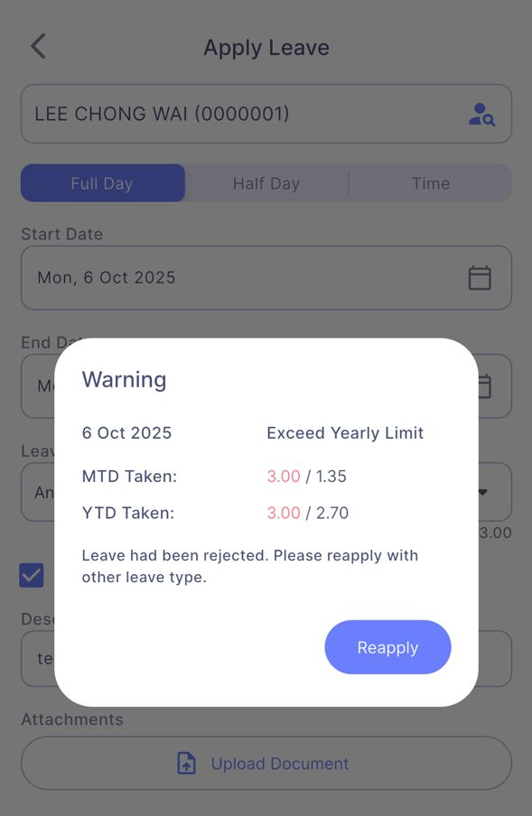
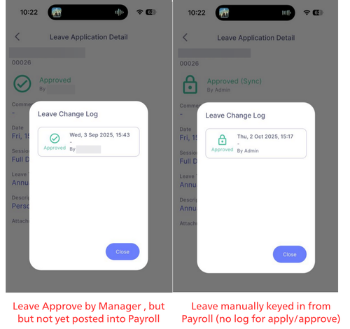
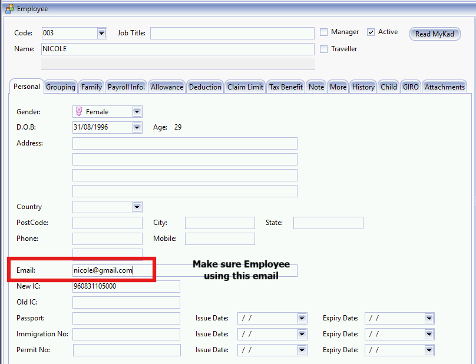
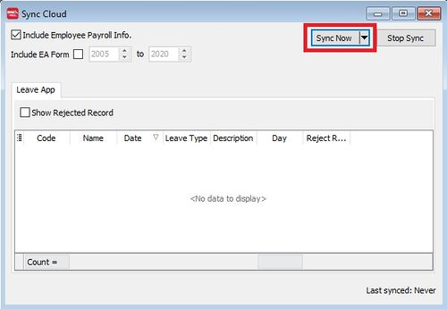
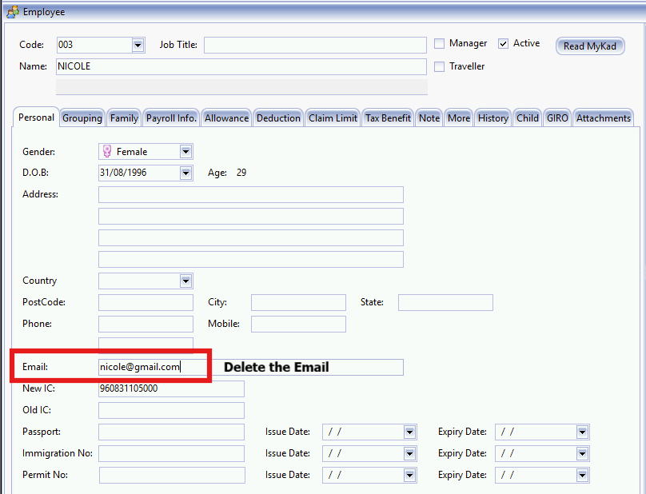

## Leave Applications & Approvals

### 1. Leave application stays “Pending” in HRMS and doesn’t appear in Payroll after Sync Cloud



By default, only **Approved** leave status is shown in Payroll. Open **Sync Cloud** and tick **Request** and **Pending Leave** to view all pending applications.

### 2. Why don’t I see an option to add attachments?

Your company hasn’t enabled SQL Drive storage. Follow [the setup guide](https://docs.sql.com.my/sqlpay/integration/hrms/payroll-setup#sql-drive) to activate SQL Drive. (Requires an active SQL Drive subscription—contact your service agent for details.)

### 3. Why is my leave auto-approved instantly?

If your HR assigns you the **Manager** role and enables **Auto approve own leave**, your leave requests are approved automatically.



### 4. Why can’t I edit certain approved leave applications?

- **Approved (Sync)** status means the leave is already committed to SQL Payroll and cannot be edited.
- **Approved** (without Sync) can still be edited in HRMS.

:::info
Review the full set of HRMS leave status icons in the [app usage guide](https://docs.sql.com.my/sqlpay/integration/hrms/e-leave/app-usage#leave-status).
:::

---

## Leave Limits & Calculations

### 5. What is the Month-to-Date (MTD) limit formula?

- **Worked more than 1 year / Join date not set:**

    ```text
    Leave Entitlement ÷ 12 × Current Month + B/F Days – Taken Days

    Example:
    Calculation Month: October 2025
    Join Date: 01/01/2019
    Year 2025 Entitlement: 16 Days
    B/F: 3 Days
    Taken: 4 Days

    Calculation: 16 ÷ 12 × 10 + 3 – 4
    = 13.33 + 3 – 4
    = 12.33 Days
    ```

- **Worked less than 1 year:**

    ```text
    Leave Entitlement × (Report Month – Join Month + 1)
    ÷ (12 – Join Month + 1) – Taken Days

    Example:
    Calculation Month: October 2025
    Join Date: 01/07/2025
    Year 2025 Entitlement: 6 Days (Prorated)
    Taken Leave: 0 Days

    Calculation: 6 × (10 – 7 + 1) ÷ (12 – 7 + 1) – 0
    = 6 × 4 ÷ 6
    = 4 Days
    ```

### 6. Why doesn’t my MTD calculation match HRMS?

MTD balance should only include leave taken **up to** the calculation month. For example, October MTD should exclude leave applications dated in November or later.

### 7. What happens when leave exceeds the MTD limit?

- **Employee:** Can still submit the leave request.

    

- **Manager:** Receives a prompt during approval and can keep the same leave type or switch to another type.

### 8. What happens when leave exceeds the Year-to-Date (YTD) limit?

- **Employee:** Sees a prompt indicating the leave exceeds the YTD limit and must reapply using a different leave type.

    

- **Manager:** Can transfer the submission to another (e.g., unpaid) leave type during approval.

---

## Troubleshooting & Usage Tips

### 9. Error: `OOPS! We have encountered some problems... type 'NULL' is not a subtype of type 'String'`


Cause: Leave or claim descriptions are blank.

- **Claims:** SQL Payroll → **Payroll** → **Maintenance** → **Maintain Claim**. Ensure every claim code has a description.
- **Leave:** SQL Payroll → **Leave** → **Maintain Leave Type**. Ensure every leave type has a description.

### 10. Why doesn’t the HRMS birthday calendar show my team’s birthdays?

The birthday calendar displays only colleagues in the **same branch and department** as the logged-in user.

### 11. Why does the Leave Balance Summary show different taken days versus Manager Approval view?

- **Leave Balance Summary:** Includes all submitted leave, even if approval is pending.
- **Manager Approval view:** Shows only approved leave.

### 12. Why does HRMS show duplicate leave applications while Payroll shows only one?

This occurs when:

- An employee applies via HRMS but the request hasn’t been posted to Payroll yet.
- Another leave entry for the same date was keyed directly into Payroll.

**How to investigate:**

- **HRMS:** Open the duplicate date → select **View Change Log**.
    
- **Payroll:** Cloud → **Sync Cloud**. If the leave still appears under the **Leave** tab, it hasn’t been posted. Once posted, it disappears from Sync Cloud.

**Fix:**

1. Reject the HRMS leave application (in HRMS or Payroll). If rejected in Payroll, click **Update Payroll** afterwards.
2. Delete the duplicate leave record in Payroll.
3. Post the HRMS leave from Sync Cloud and click **Update Payroll** to push it into Leave Application.

:::info[Reminder]
If you rely on HRMS for leave and claim applications, always finish with **Update Payroll** so records are posted to SQL Payroll.
:::

### 13. How to register the staff email to access the E Leave?

1. **Update 1 email address** to each employee (staff) in Maintain Employee.



2. Access to menu : **Cloud | Sync Cloud..**

3. Click **Sync Now**.



### 14. How to deregister the staff email to access the E Leave?

1. Remove the staff email from Maintain Employee.



2. Access to menu : Cloud | Sync Cloud..

3. Click Sync Now to update.


