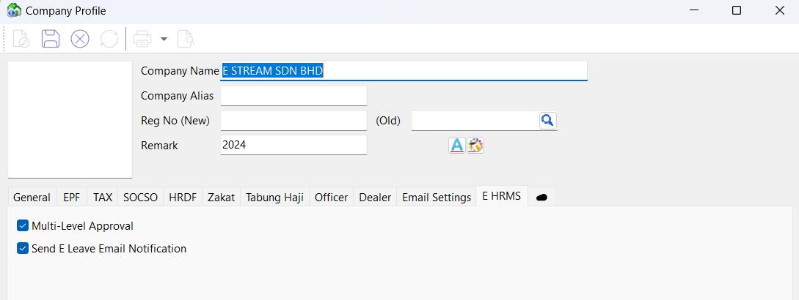

## Multi-Level Leave Approval & Notification Settings

**Step:** Company Profile | E HRMS tab

- ***'Multi-Level Approval' checkbox***: Checked to enable multi-level approval for leave application in E HRMS app
- ***'Send E Leave Email Notification' checkbox***: Checked to allow E HRMS app to send leave and claim notifications to managers.

## Manager Authority Settings

**Step:** Maintain Employee | E HRMS tab

- ***'Manager' checkbox***: Checked to make the employee a manager
- **Manager Authority**:
  - Can Approve: Able to approve team’s leave applications and claim submissions
  - Can Review: Only able to verify team’s leave application and claim submission
  - Auto Approve Own Leave:  Employee who apply leave with this authority will automatically posted as Approved instead of Pending Approval/Pending Verification
- **Manager Team**: Select branch and department that will be managed by the employee
