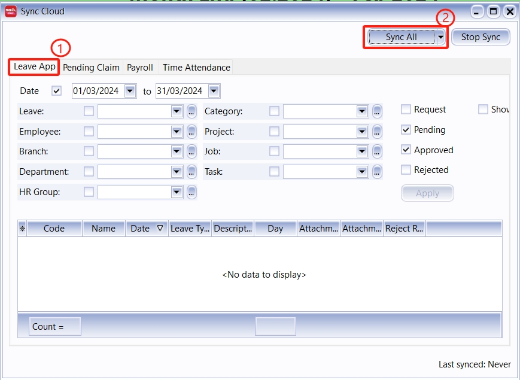

**Step 1:** Cloud Icon | Sync Cloud… | Leave App | Sync All
    - Checkbox Hint:
        - Request:  Show leave applications with **Pending Verification** status
        - Pending: Show leave applications with **Pending Approval** status
        - Approved: Show leave applications with **Approved** status
        - Rejected: Show leave applications with **Rejected** status
        - Show Leave App Log: Show change log for each leave applications
    - **Green Highlight:** Approved leave
    - **Red Highlight:** Rejected leave
    - Editable columns:
        - Comment
        - Action: 
            - Approved
            - Reject
            - Unapprove
            - Unreject	

**Step 2:** Update Payroll / Update E Leave (if only want update leave application to server)