## Dashboard

    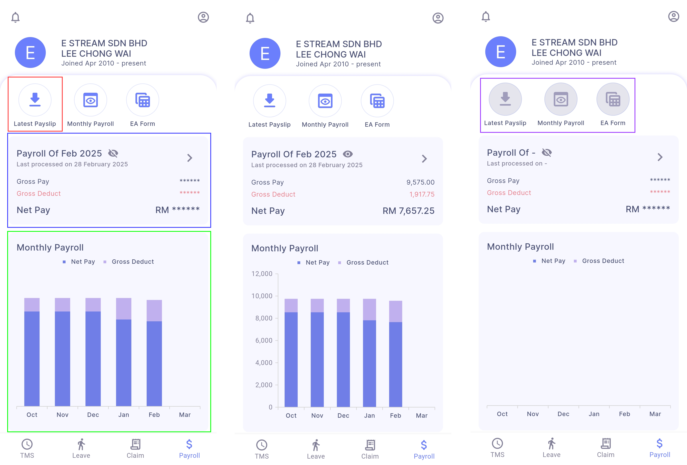

- **Latest Payslip:** Download payslip of user’s latest payroll
- **Latest Payroll:** Summary break down of user’s latest payroll 
  - Eye icon: Set the visibility of payslip amount
  - Right Arrow icon: Direct to detailed payroll information
- **Monthly Payroll:** Payroll summary of employee’s past 6 months payroll including current month
- **Disabled buttons:** Management did not check ***'Include Employee Payroll Info'*** in SQL Payroll (refer [Sync Cloud - Payroll](payroll-setup.md#payroll))

## Monthly Payroll

User can view his monthly net pay and total net income  
    
    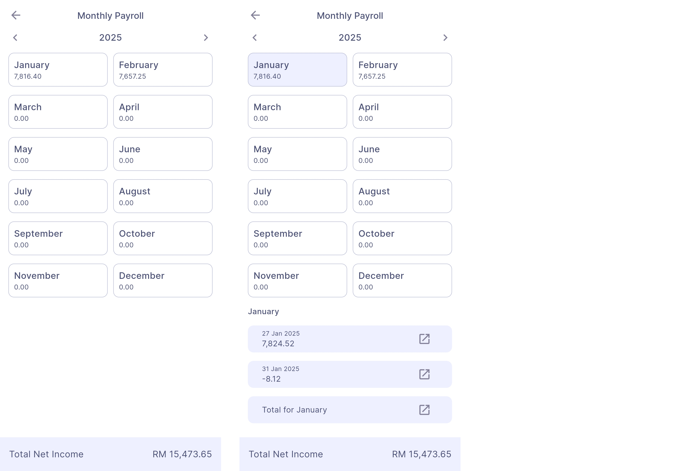

### Monthly Payroll Details

**Step:** Select a month  
    
    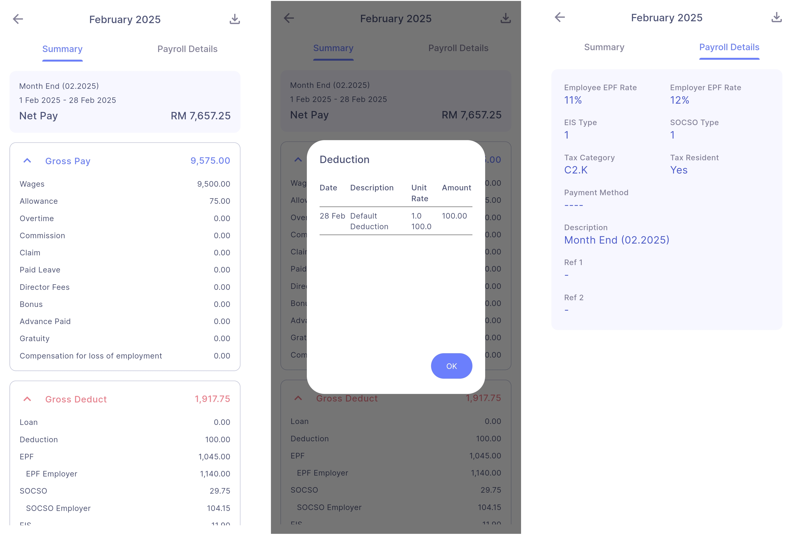

- Payslip can be downloaded by tapping on the ***Download icon*** (top right corner)
- User can tap on a payroll item for more detailed information

## EA Form

    

- If no EA is uploaded, ***'Select Year'*** will show **'No EA Available'** instead
- EA Form can be downloaded by tapping on the Download icon on the top right corner

## Activity Center

**Step:** Dashboard | Bell Icon (top left corner)  
    
    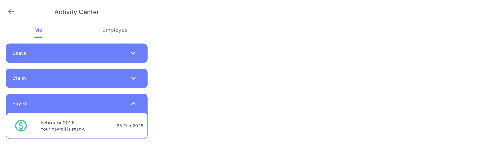

- Show employee’s latest payroll
- User can tap on it will direct user to detailed payroll information

## Side Drawer

**Step:** Dashboard | Person Icon (top right corner)  
    
    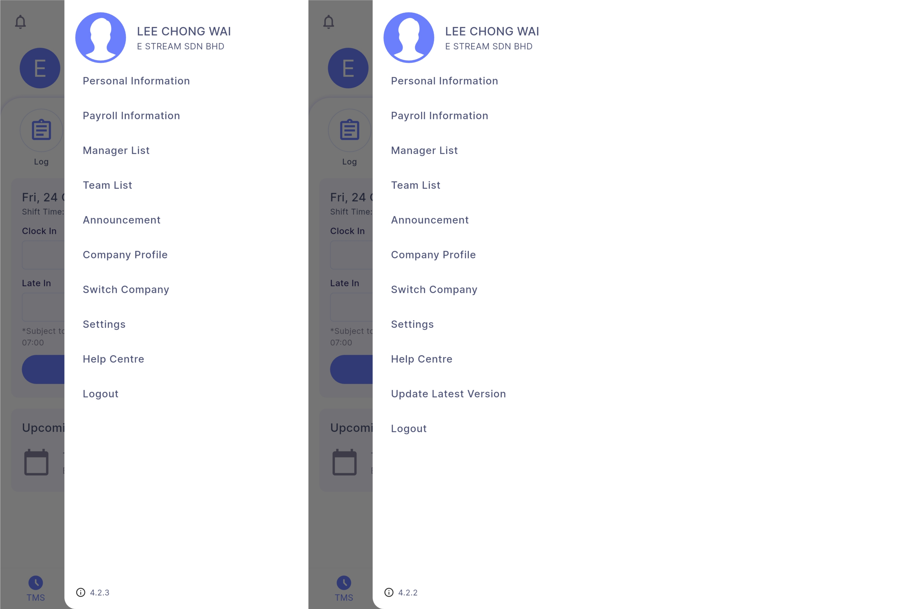

- **Logout:** Logout from SQL HRMS app

### Personal Information

User can view his personal information  
    
    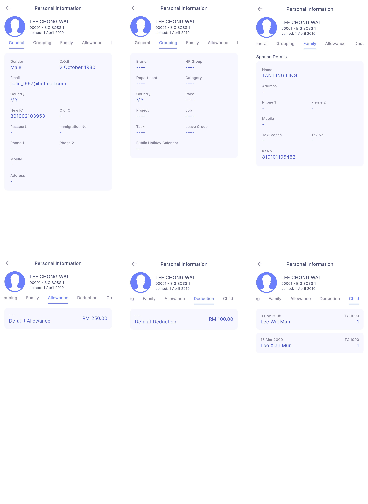

### Payroll Information

User can view his payroll information  
    
    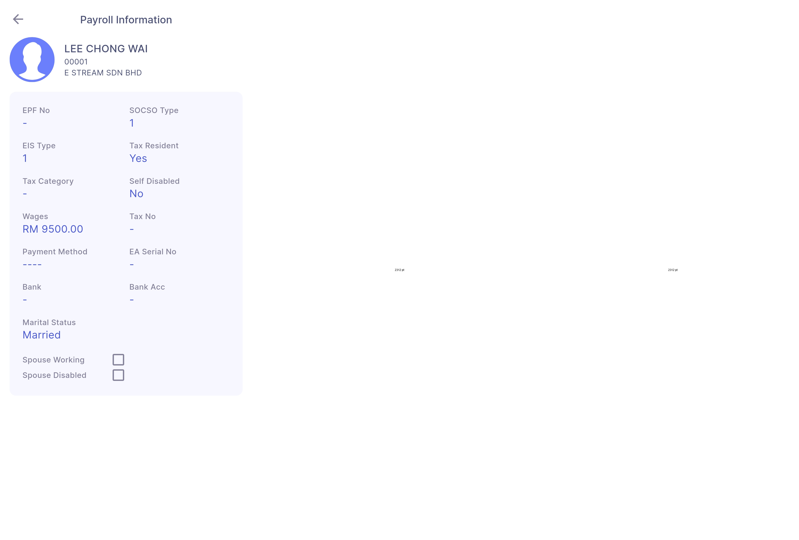

### Manager List

User can view his managers and access their contacts by swiping/tapping on the manager card
    
    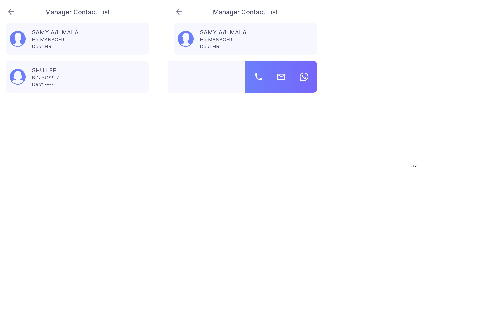

### Team List

User can view his team members’ general personal information  
    
    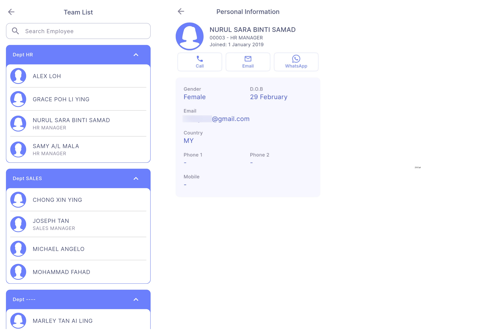

### Announcement

User can view his company announcement  
    
    

- Announcements will be visible for 3 months
- Employee will be notified if there are new announcements from today to future dates
- Time of Announcement Notification:
  - If post date is today, the employee will be notified almost immediately
  - If post date is in future, the employee will be notified at 9am of the specified date
- Eg:  
    
    

:::info
Enable **Autostart** for SQL HRMS to ensure Announcement features work accordingly (refer [Autostart](../autostart.md))
:::

### Company Profile

User can view his company information  
    
    

### Switch Company

User can switch to different company which are linked to the login email  
    
    

- **Green checked icon:** Current selected company

### Settings

    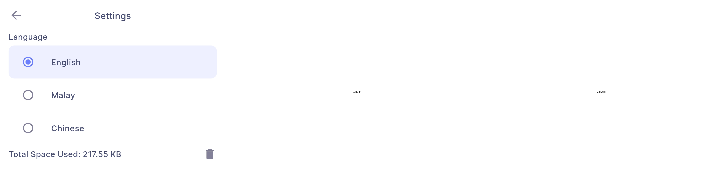

- **Language:** User can switch to different language based on preferences  
- **Total Space Used:** User can press the button at the right to delete cache files created by SQL HRMS  

### Help Center

    

- **Rate Us:** User will be directed to Play Store (Android) / App Store (iOS) to rate SQL HRMS
- **About SQL HRMS:** User will be directed to [SQL HRMS documentation](https://docs.sql.com.my/sqlpay/category/hrms/) where user can learn more about SQL HRMS features
- **Help Videos:** User will be directed to [SQL HRMS playlists](https://www.youtube.com/playlist?list=PLBfrhZPWZd1Vxv3lYf174a3EW7Pdw8Cth) on YouTube where user can learn more about SQL HRMS features
- **SQL Privacy Policy:** User will be directed to [SQL Privacy Policy](https://www.sql.com.my/pdpa/) where user can learn how their information is used without violating user's privacy 

#### User Feedback

User can submit feedback on problems that they are facing or suggestions on how we can further improve SQL HRMS  
    
    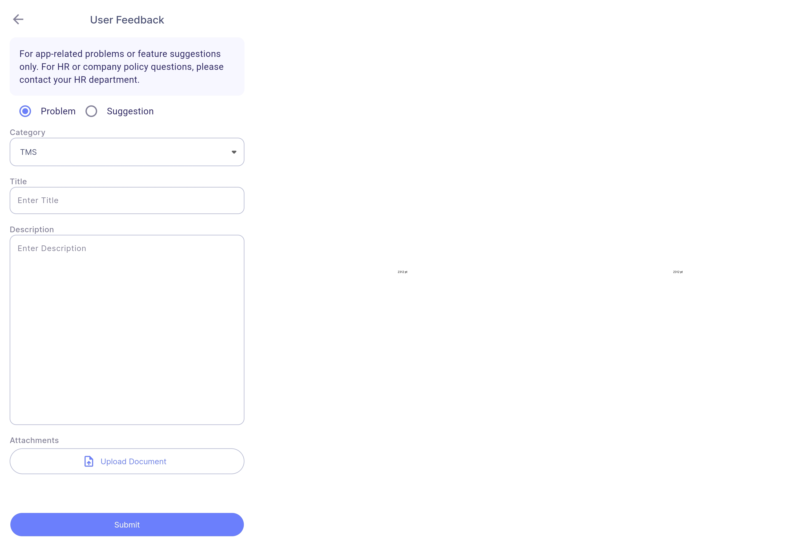

## Birthday Calendar

User can view his team members’ and his own birthday dates in calendar view  
    
    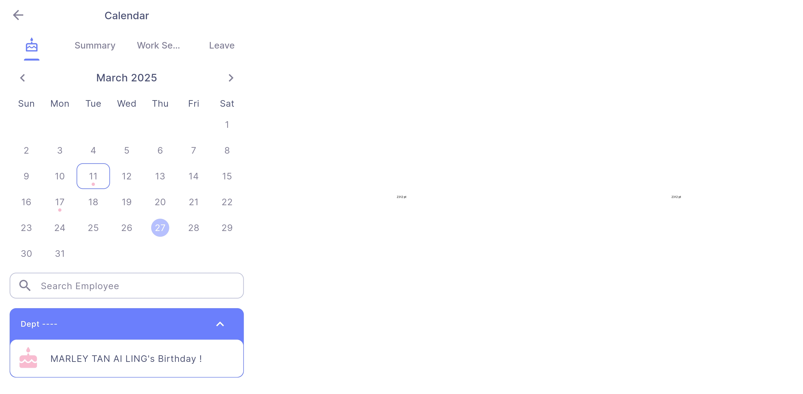

- **Pink dot:** There are birthdays on that date
