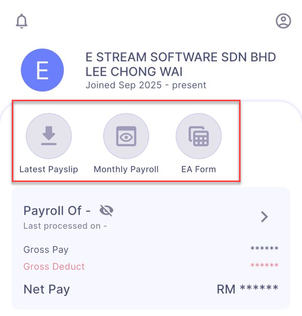
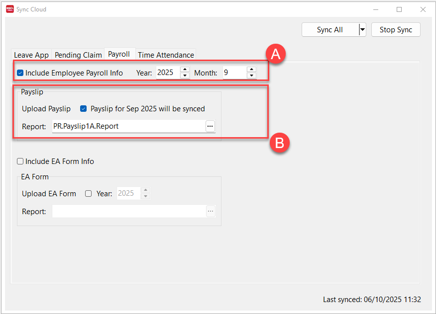

## Access & Sync Issues

### 1. Why can’t I click the **Latest Payslip**, **Monthly Payroll**, or **EA Form** buttons?

Enable the payroll data sync in SQL Payroll:

1. In SQL Payroll, click the **☁** icon.
2. Choose **Payroll**.
3. Tick **Include Employee Payroll Info**, then click **Sync All**.

### 2. Error: `Unauthorized`

Re-enable SQL Drive and sync again:

1. In SQL Payroll, go to **File → Company Profile**.
2. Click the **☁** icon.
3. Toggle **SQL Drive** off and click **Save**.
4. Click **Edit**, toggle **SQL Drive** back on, then save.
5. Re-sync Payslip/EA data in HRMS.

---

## Payslip Availability

### 3. Why are some payslips missing after I change the filter and resync?

Starting with Payroll version **v216**, the sync behaviour differs for Payroll Info versus Payslips:

- **Payroll Info** → syncs from the first month-end up to the month selected in the filter.
- **Payslips** → syncs **only** the exact month selected.

If you select **September 2025**:

- Payroll Info updates from the first month-end through September 2025.
- Payslips sync only for September 2025.

:::warning Important
If you re-sync an earlier month (for example, **June 2024**):

- Payroll Info refreshes from the first month-end through June 2024.
- Payslips overwrite with only June 2024 data.

Any payroll info and payslips **after June 2024 are removed** and must be re-synced month by month.
:::
