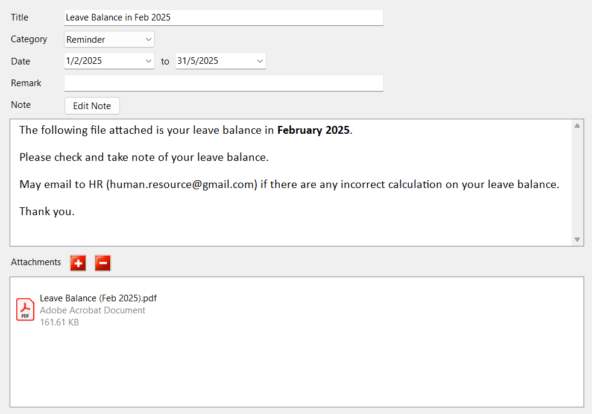
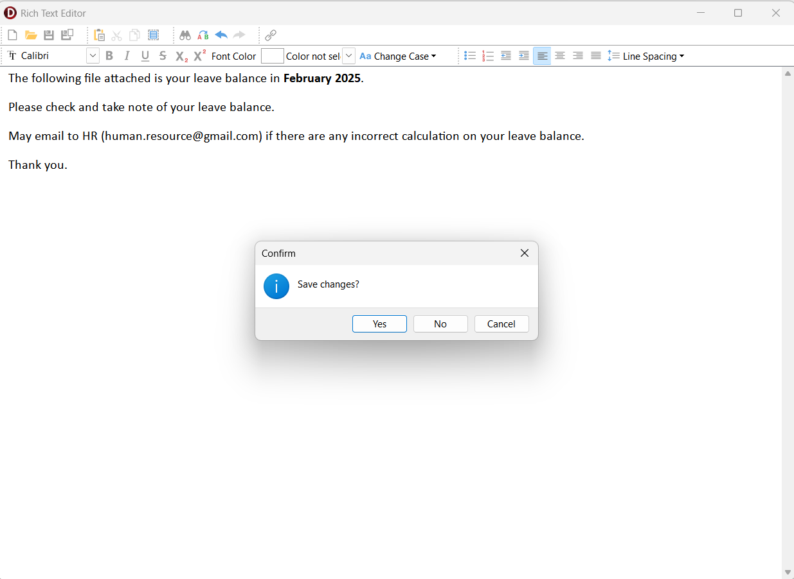
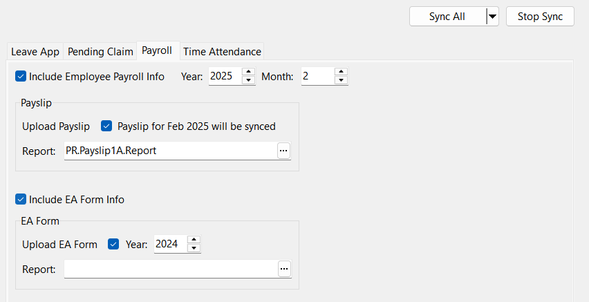

## Maintain Announcement

**Step 1:** Human Resource | Maintain Announcement… | Create New  
**Step 2:** Enter Title and Remark
- Remark is optional and visible in maintenance view only
  
**Step 3:** Select a Category and Date for when the Announcement will be visible to the employees  
  
  

**Step 4:** Edit Note | Enter Note | Close Form | Yes  
  
  

**Step 5:** Add Attachments  
- Maximum of 2 attachments are allowed
- Attachment extensions that are allowed: .jpg, .jpeg, .png, .pdf

**Step 6:** Save  

## Sync Cloud

### Payroll

**Step 1:** Cloud Icon | Sync Cloud… | Payroll  
  
  

- To sync payroll and payslip
  - Check ***'Include Employee Payroll Info'***
  - Select Year and Month
  - Check ***'Upload Payslip'***
  - Select Report format
  
- To Sync EA form
  - Check ***'Include EA Form Info'***
  - Check ***'Upload Payslip'***
  - Select Year and Report format

**Step 2:** Click ***'Sync All'***

### Announcement

**Step:** Cloud Icon | Sync Cloud… | Sync All  

:::info
Make sure to always ***'Sync Cloud'*** when new Announcement is added or if there are any changes to the existing Announcement to ensure both Payroll and SQL HRMS app are in sync with one another
:::
