:::info
Enable **Autostart** for SQL HRMS to ensure E TMS features work accordingly (refer [Autostart](../autostart.md))
:::

## Dashboard

    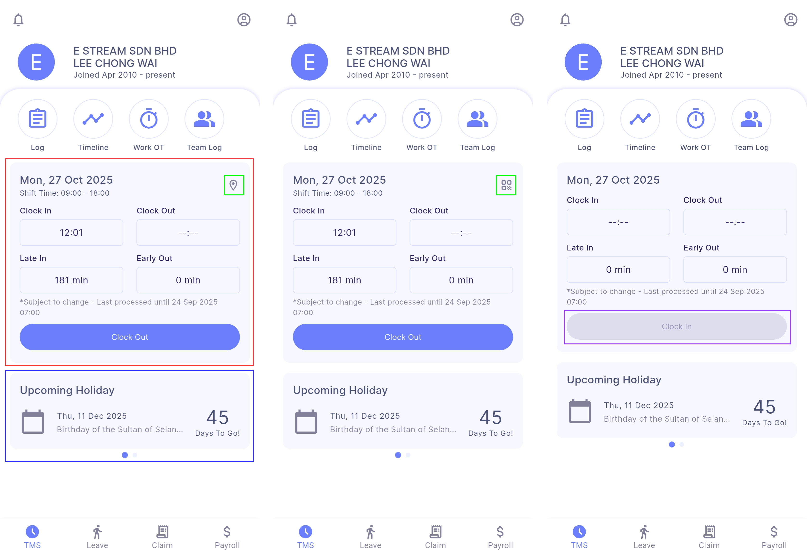  

- **Session Card:** User's work session shift time
    - Icon on the top right corner (green box) indicates the clock method (by GPS or QR) of the day. If there is no icon displayed, it means that user is not required to clock for that day  
    - It shows user's first Clock In and last Clock Out of the day with an estimated calculation of late in and early out
    - User can tap on the card to direct to User's Attendance Log
    - User can tap on the ***'Clock In' button*** to direct to Clock In / Clock Out page
        - If no work session is assigned or no clock method is selected, the button will be disabled  
- **Upcoming Holiday:** User's upcoming public holidays

## Clock In / Clock Out

### By GPS

| **Button** | **Explanation** |
| :--------- | :-------------- |
|  | SQL HRMS app's Location service is unable to start. This may due to the following reasons:    1. User's location service is not enabled   2. The required location permission is not allowed    Refer [Location Service and Permission](../permission.md#location) |  
| 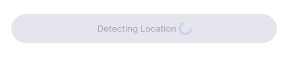 | SQL HRMS app is trying to get user's current location | 
| 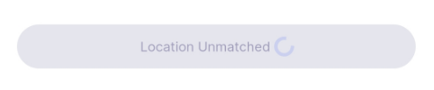 | User is not within work location. However, if user is really within their work location, SQL HRMS app will continuously try to get a more accurate position so that user will be able to Clock In / Clock Out | 
| 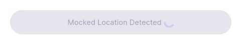 | User's location is mocked and is not allowed to Clock In / Out | 
|  | User is within work location and is allowed to Clock In |  
|  | User is within work location and is allowed to Clock Out |  

**Clock In**  
    
    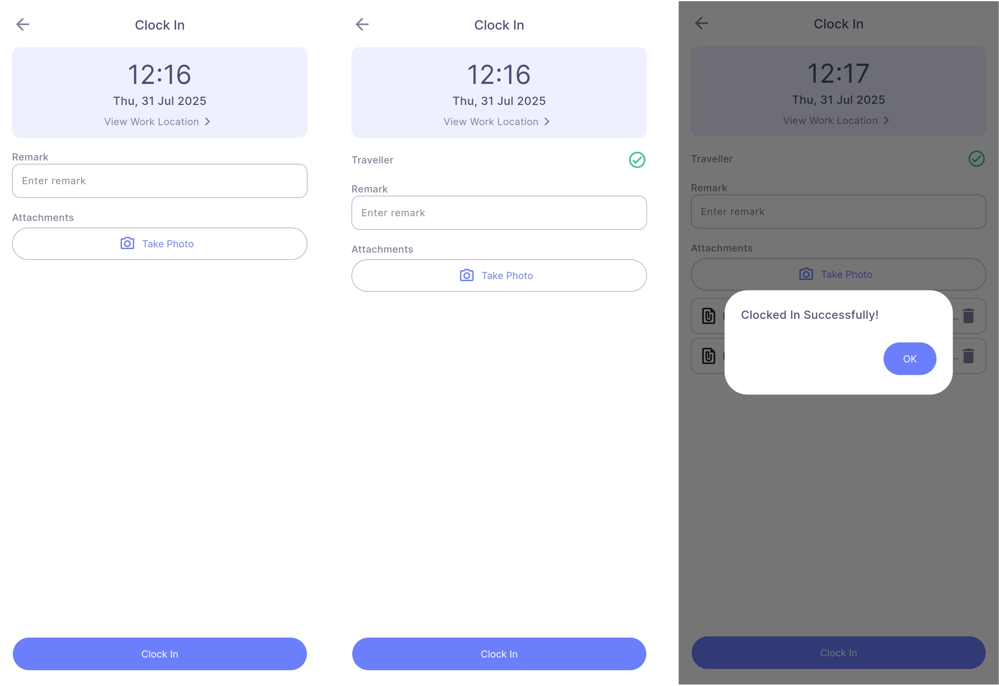  

- User who is a traveller will show a **'Traveller'** with green check  

:::info
If user forget to clock out, the app will reset the time tracking after 10 hours (600 mins) after Session Work End time and last Clock In time
    
    
:::

**Clock Out**  
    
    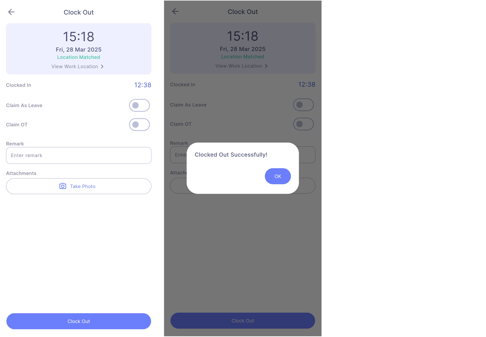  

- If ***'Claim OT' switch*** is turned on
    - The **'OT Break Time (min)'** will be visible
    
        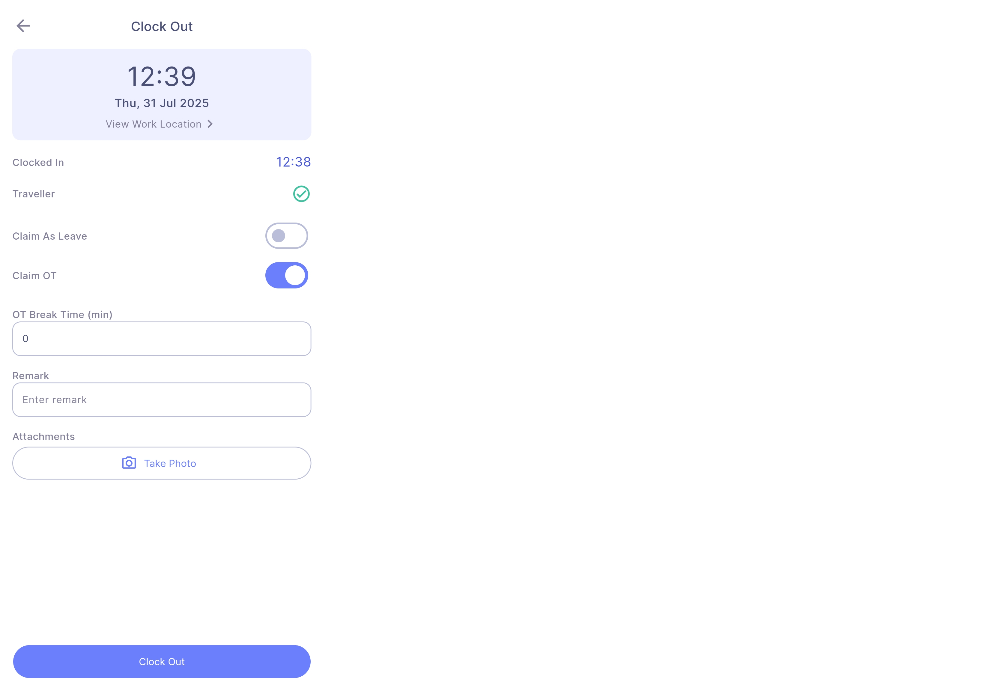

    - When employee tap the ***'Clock Out' button***, a few different dialog may be shown, as explained below

    | **Dialog** | **Explanation** |
    | :--------- | :-------------- |
    | 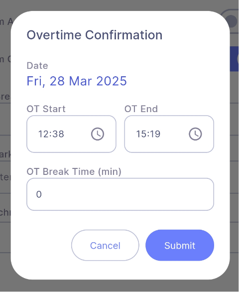 | If [OT Rules](#work-ot) are fulfilled, an **'Overtime Confirmation'** dialog will be prompt that allows the employee to adjust their OT time and OT break time |  
    | 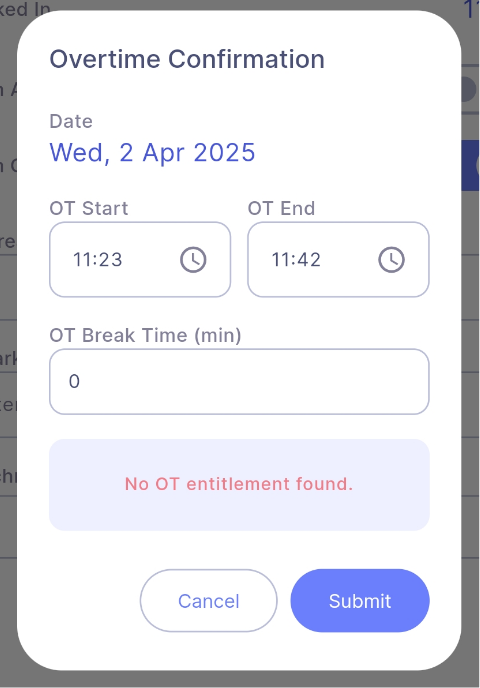 | If no [OT Rules](#work-ot) is found, an **'Overtime Confirmation'** dialog (with *'No OT entitlement found'* stated at the bottom) will be prompt that allows the employee to adjust their OT time and OT break time |  
    | 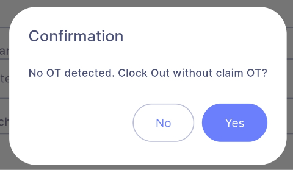 | If not within OT Period, employee will be given option to continue Clock Out without claiming OT |  
    | 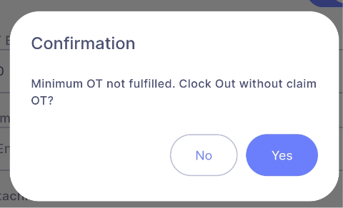 | If minimum OT set in [OT Rules](#work-ot) is not fulfilled, employee will be given option to continue Clock Out without claiming OT |

- ***'Claim As Leave' switch*** will only be visible on Rest Day and Public Holiday
- If ***'Claim As Leave' switch*** is turned on
    - An earn replacement leave application will be posted when employee clocked out
    - When employee tap the ***'Clock Out' button***, a **'Claim As Leave'** dialog will be prompt that allows the employee to pick the leave type that they want to claim

    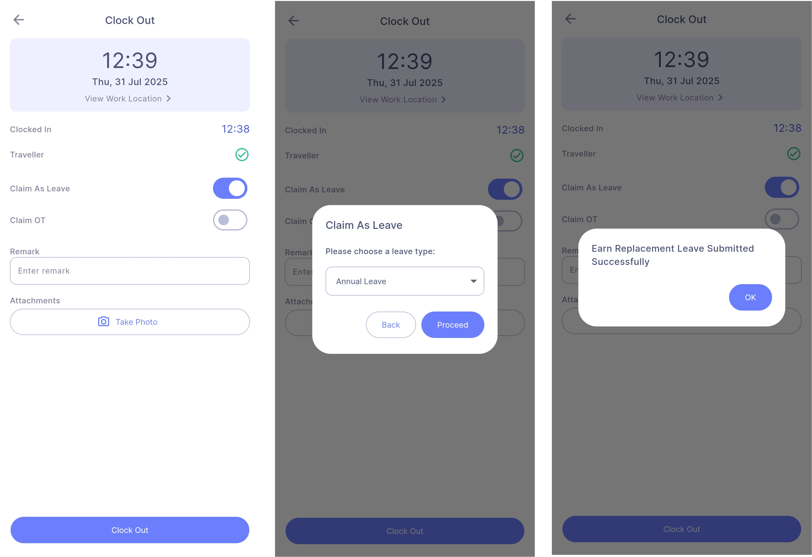  

### By QR  

| **Button** | **Explanation** |  
| :--------- | :-------------- |  
|  | SQL HRMS app's Bluetooth service is unable to start. This may due to the following reasons:    1. User's Bluetooth service is not enabled   2. The required nearby devices permission is not allowed    Refer [Bluetooth Service and Nearby Devices Permission](../permission#nearby-devices--bluetooth) |  
|  | User is allowed to Clock In |  
|  | User is allowed to Clock Out |  

**Clock In**  

    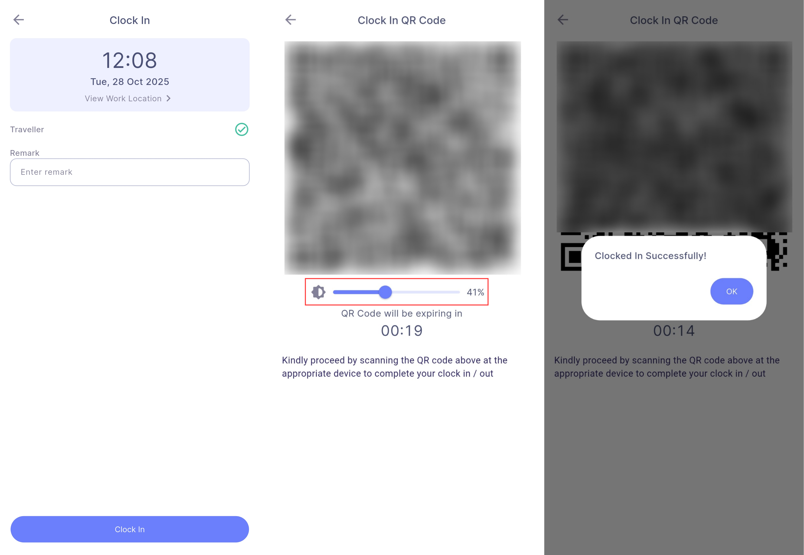  

- **'Attachments'** field will not be available  
- Proceed to Clock In will generate a QR Code that will be scanned by SQL Clock In app  
    - User can adjust the brightness of the screen with the slider  
    - The QR Code will only be valid for 20s before user will need to regenerate a new QR Code  

**Clock Out**  

    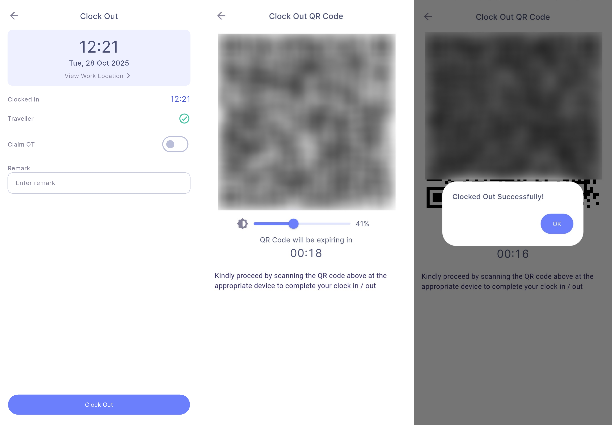  

- If ***'Claim OT' switch*** is turned on, it will go through similar OT validations as *By GPS* before QR Code is generated  

:::warning
Screenshotting the QR Code is not allowed!
:::

### Work Location

**Step:** Tap ***'View Work Location' label button***  
    
      

- **Purple Location icon:** Employee's current location
- **Green Check icon:** Location that the employee is currently in

:::info
Multiple work locations with the same coordinate will be considered as one
:::

## Work Session Calendar

### My Work Session

User can view his own work session in calendar view  
    
    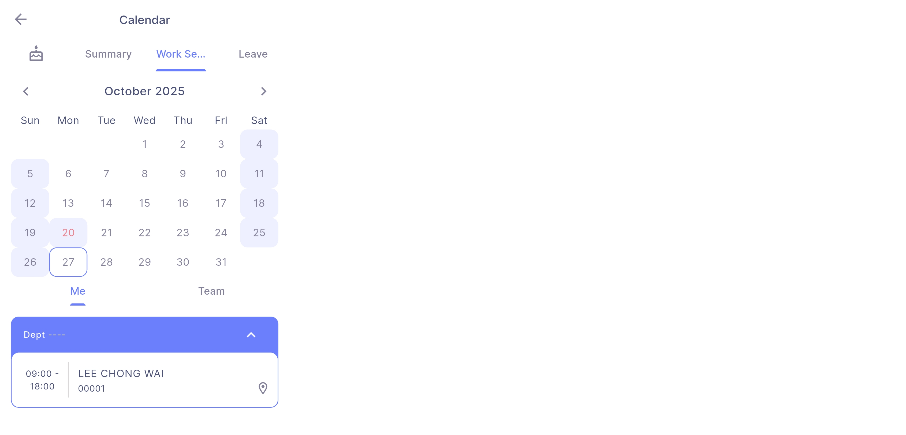  

- **Red font with purple box:** Public Holiday
- **Purple box:** Rest Day
- **Icon (bottom right corner):** Clock Method
- **Whole card:** Direct to [Work Location](#work-location) page to view locations where the user is allowed to clock in / clock out on that day

### Team Work Session

User can view employee's team member's work session and work session of the employees that the manager is managing  
    
    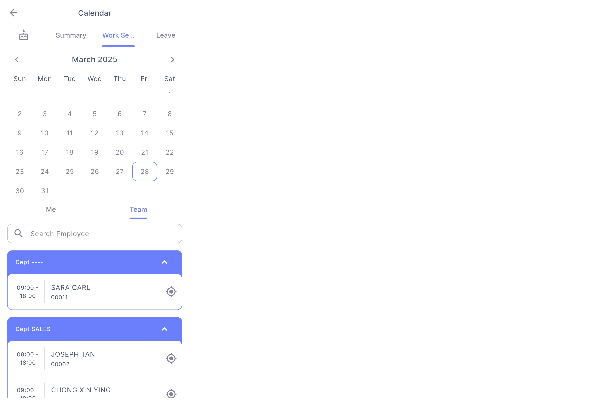  

## Log

### Processed Log

    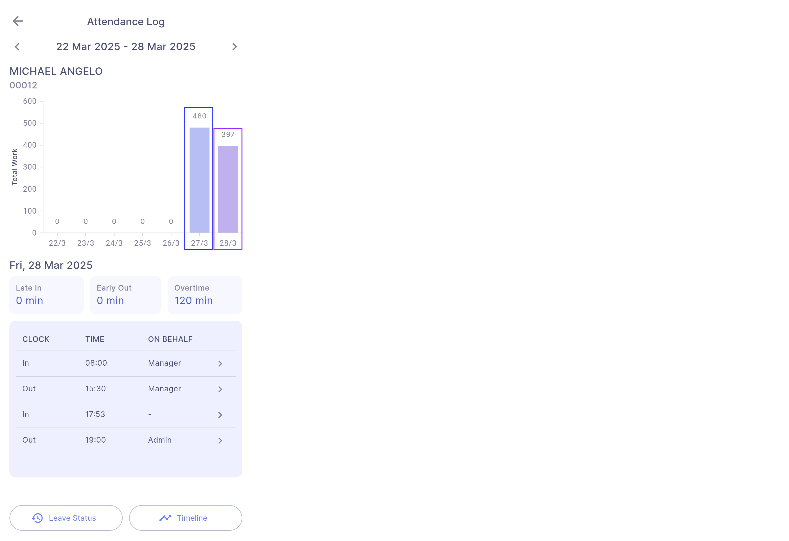  

- The bar chart shows employee summary of a week
    - **Blue bar (480 minutes):** Employee fulfilled expected work duration
    - **Purple bar (397 minutes):** Employee did not fulfill expected work duration
- On Behalf indicates the log is clock by whom
    - **Admin:** Log filled in from SQL Payroll
    - **Manager:** Manager clock on behalf through SQL HRMS app
    - **'-' symbol:** Employee clock by themselves through SQL HRMS app
- Tap on the bar or date to view the summary and attendance logs
- ***'Leave Status' button*** is to view all leave applications applied on that date  
    
    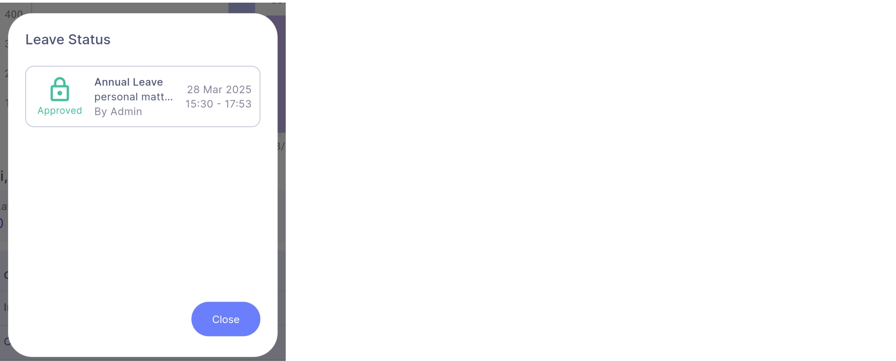 

- ***'Timeline' button*** will direct to Attendance Timeline to view user's locations (refer [Timeline](#timeline) for more details)  
    
    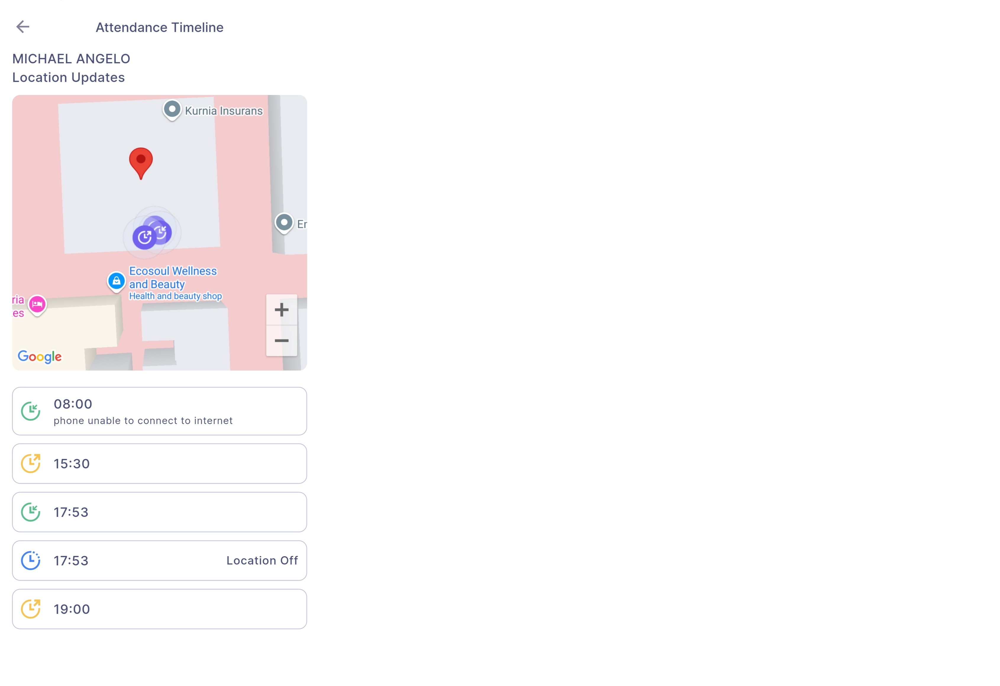 

### Unprocessed Log

    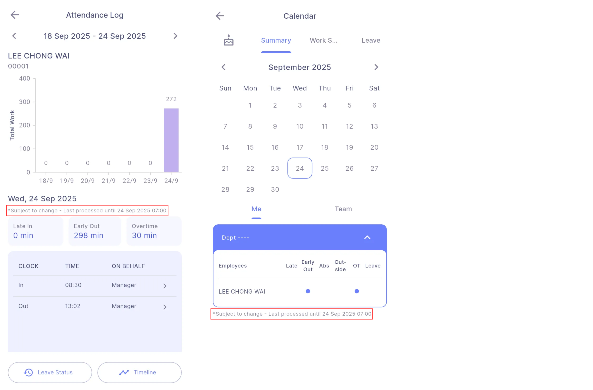  

- Rough calculation on late in, early out and overtime will be calculated on those log that are not synced and processed in SQL Payroll
- User are encouraged to process the logs on SQL Payroll in order to obtain a more accurate results on late in, early out and overtime

## Timeline

      

- **Employee List** will only be visible to managers, employees will be directed into their own timeline
- Timeline plots the user's clock in, clock out and status update locations on a map
- User can view the remark and attachments of each log if available
    - Paper Clip icon will only appear if there's attachment for that log
    - If there are more than one attachment attached, tapping on the Paper Clip icon a pop up will appear with a list of attachments
- User can tap on each log card to focus on the log's location in the map
- Icon identifiers: 
    |   | **Log Icon** | **Map Icon** |
    |:--| :----------- | :----------- |
    | Clock In |  |  |  
    | Status Update |  |  |  
    | Clock Out |  |  |  

## Work OT

Shows the employee's OT entitlement  
    
    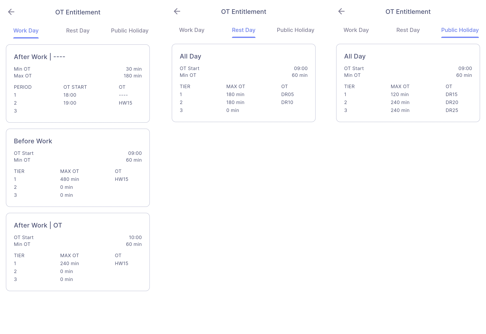  

## Team Log

### My Summary

    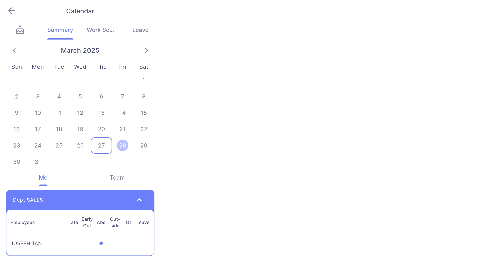

- User can view his own time attendance summary
- User can tap on the card to direct to [**Attendance Log**](#log) to view detailed summary

### Team Summary

    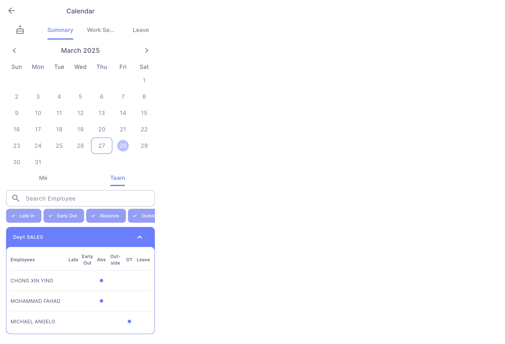

- User can view his team member's time attendance summary 
- **Only manager that is managing that employee** can tap on the card to direct to [**Attendance Log**](#log) for more detailed summary
- ***'Clock on Behalf' button*** will be visible only to manager on current date and previous dates where time attendance summaries have not been process
- Filtering chips can be used to filter the summary: 
    - Late In
    - Early Out
    - Absence
    - Outside
    - OT
    - Leave
  
### Clock On Behalf (Manager only)

Managers are allowed to clock in on behalf for his team by tapping on the ***'Clock on Behalf' button***  
    
    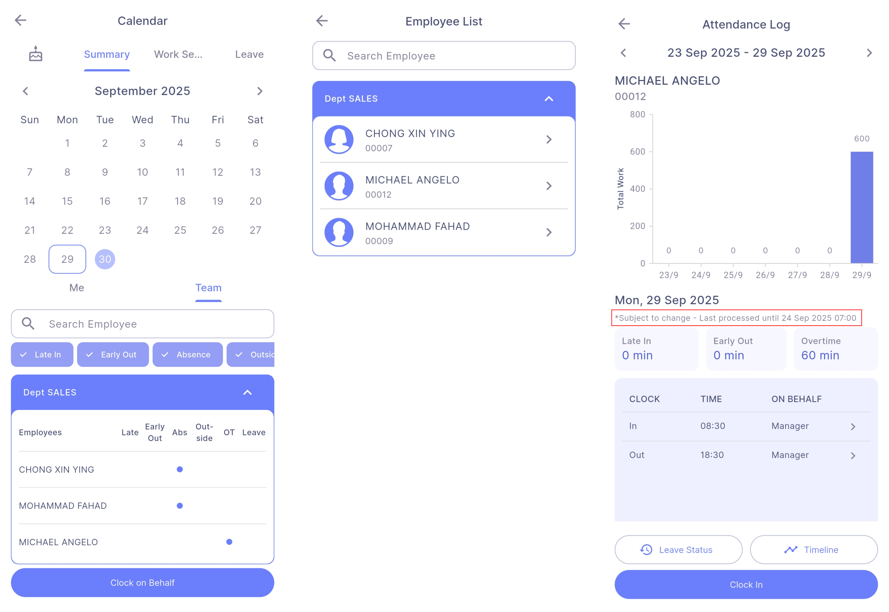  

- After choosing an employee, the manager is directed to the [**Attendance Log**](#log) where a Right Arrow icon on each log and a ***'Clock In' button*** is visible
- Tap on the Right Arrow icon to direct to Attendance Log Detail  

**Clock On Behalf**  
    
    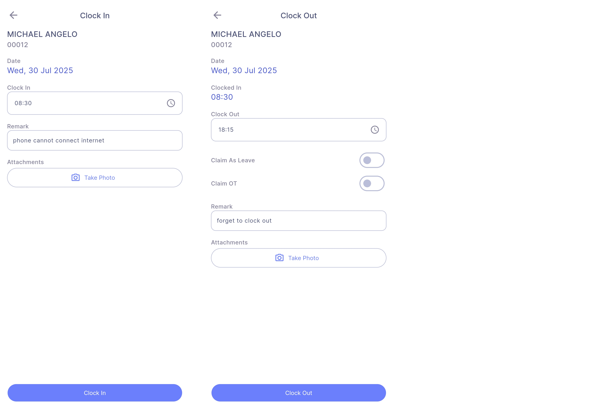  

| **Button** | **Explanation** |
| :--------- | :-------------- |
|  | SQL HRMS app's location service is unable to start. This may due to the following reasons:    1. User's device GPS is not enabled   2. The required location permission is not allowed    Refer [Location Service and Permission](../permission.md#location)|  
|  | SQL HRMS app is trying to get user's current location |
|  | User's location is mocked and is not allowed to Clock In / Out |  
|  | User's location is detected and is allowed to Clock In | 
|  | User's location is detected and is allowed to Clock Out | 

- Manager's location will be captured when help to clock on behalf
- Manager can adjust the employee's clocking time and checked ***'Claim OT'*** or ***'Claim As Leave'*** if needed
- Manager are not allowed to clock out on behalf if employee already clocked out on the next day  
- Manager are not allowed to clock on behalf earlier than the stated last processed date and time

**View Attendance Log Detail (Right Arrow Icon)**  
    
    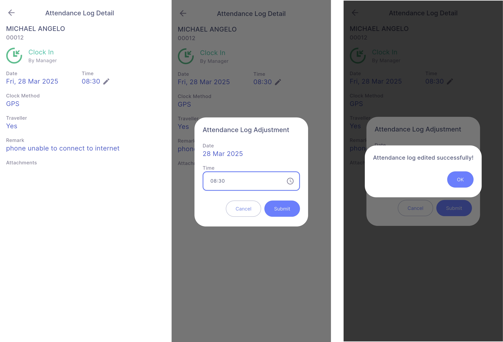  

- A ***Pencil icon*** will be visible next to the time if the log is allowed to be adjusted  
- Any date and time earlier than the stated last processed date and time cannot be adjusted  

## Notification

### Geofence Service

The notification will appear after employee clocked in and has ***'GPS Monitoring'*** enable for their [Work Session](payroll-setup.md#maintain-work-session)  

      

### Clock In / Out Reminder

1. Remind user to clock in when he is within work location  
    
    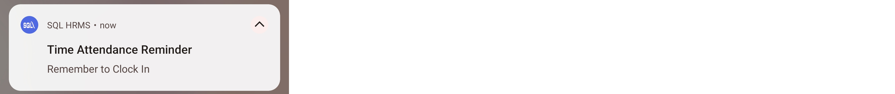

2. Remind employee to clock out it's work end  
    
    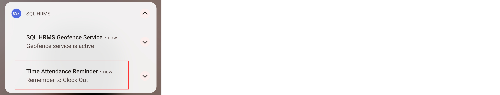

### Status Update

- Managers will receive their managing employees' status update  
- Types of status update: 
    - Location service off  

        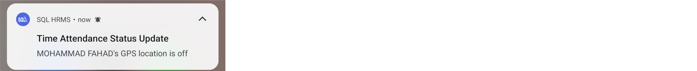

    - Employee outside work location  

        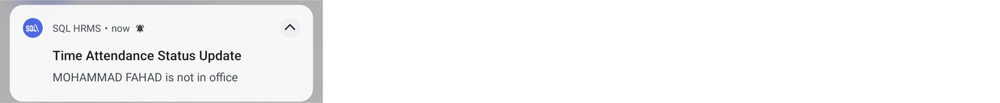

    - Mock / Fake location

        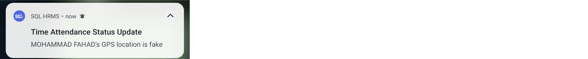

### Clock On Behalf

- The manager themselves and other managers managing the same employee will receive the following notifications once they clock on behalf for an employee  

  - App Notification  
    
        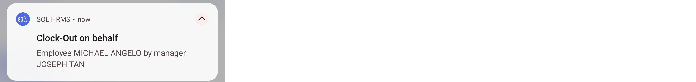

  - Email Notification  
    
        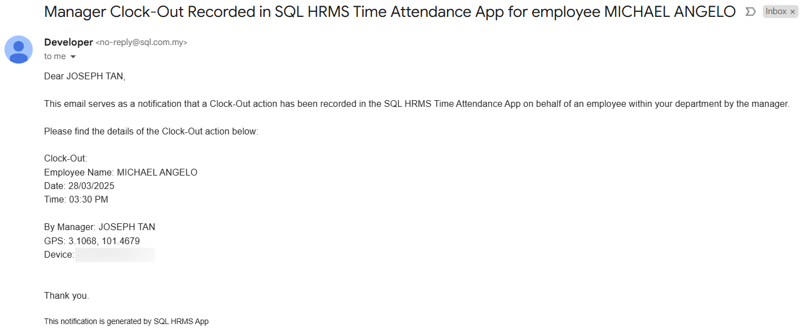

- The employee will receive the following notifications once their manager clock on behalf for them  

  - App Notification  

        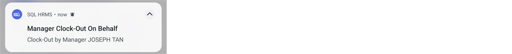 

  - Email Notification  
  
        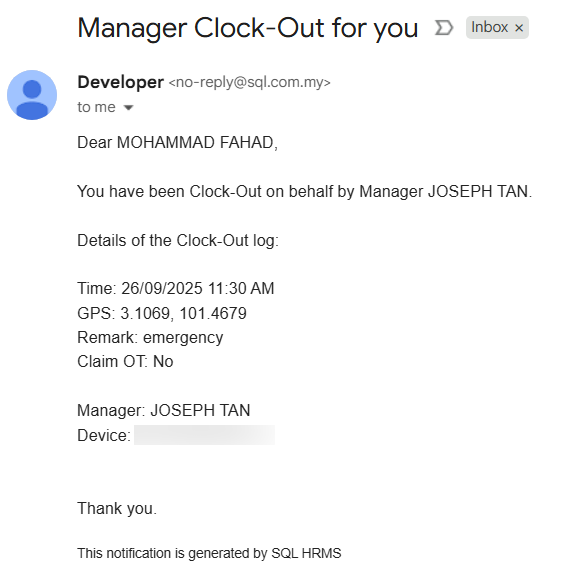

### Adjusted Attendance Log

- The manager themselves and other managers managing the same employee will receive the following notifications once they adjusted an employee's attendance log   

  - App Notification  
    
        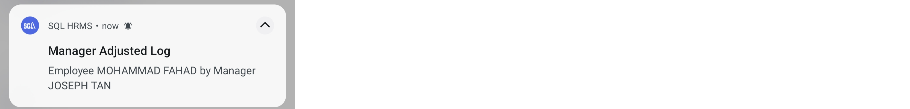  

  - Email Notification  
    
        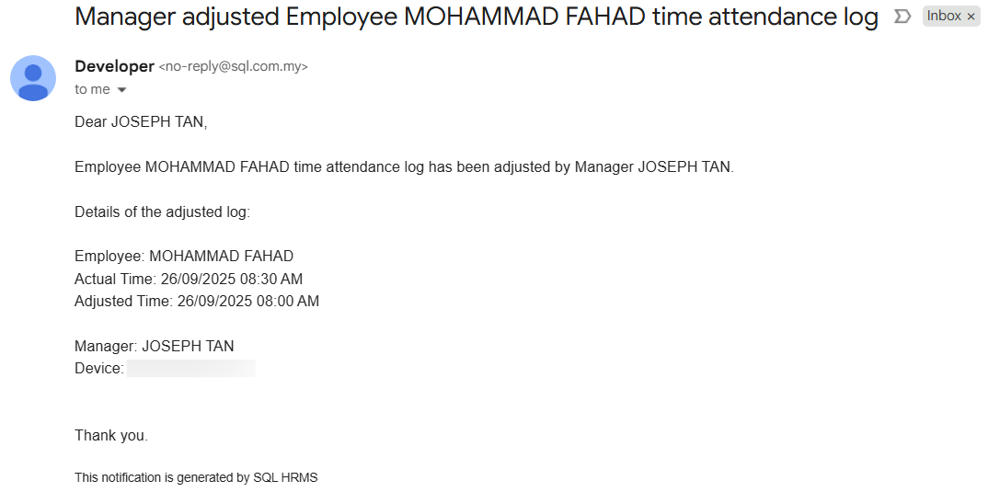  

- The employee will receive the following notifications once their manager adjusted their attendance log  
  
  - App Notification  
 
        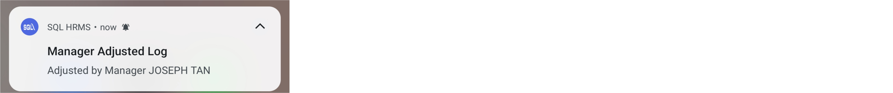

  - Email Notification  
  
        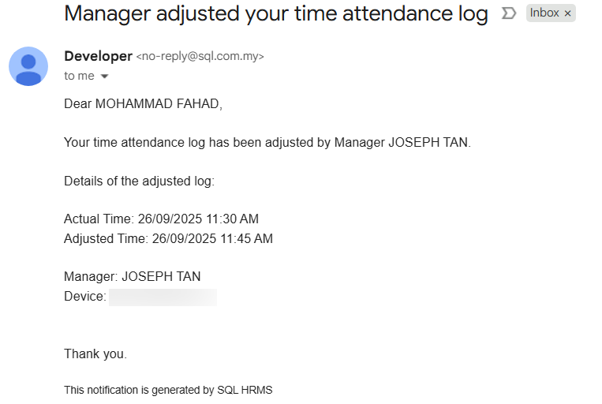

### Employee login from a different device

- Managers will receive an email notification when his team use a different device to login to the app  
- The purpose is to help manager keep track if there are any employees that might help their friends to clock in / out  
    
    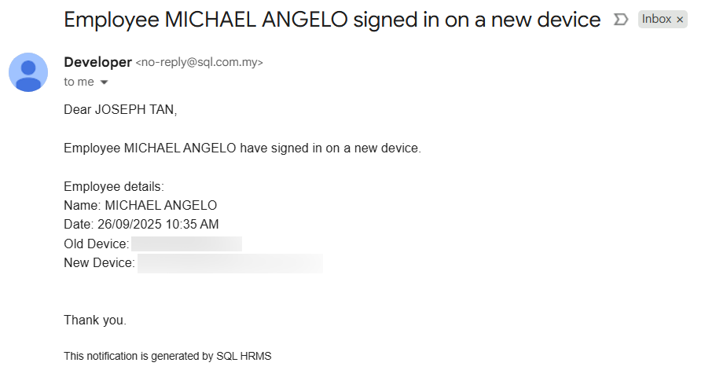
