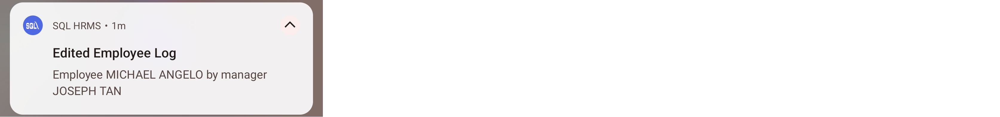
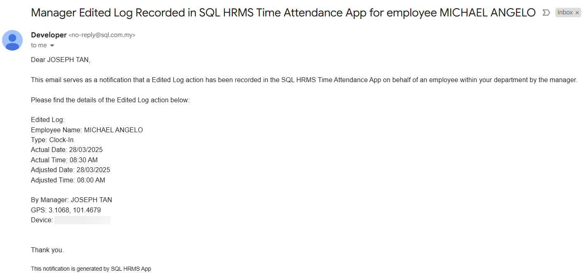
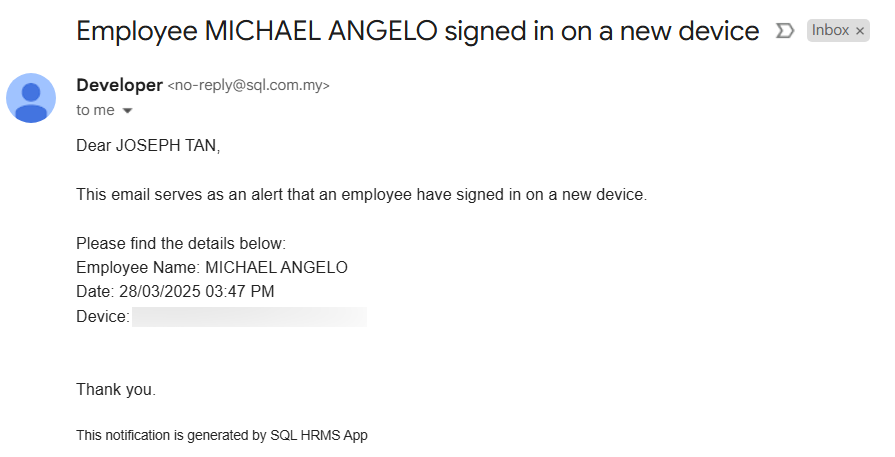

:::info
Enable **Autostart** for SQL HRMS to ensure E TMS features work accordingly (refer [Autostart](../autostart.md))
:::

## Dashboard

      

- **Upcoming Holiday:** User's upcoming public holidays
- **Session Card:** User's work session shift time
    - User can tap on the card to direct to Work Session Calendar
    - User can tap on the ***'Clock In' button*** to direct to Clock In / Clock Out page
        - If no work session is assigned, the button will be disabled

## Clock In / Clock Out

**Clock In**  
    
      

- User who is a traveller will show a **'Traveller'** with green check
- **'Location Matched' / 'Location Unmatched'** will only visible for: 
    - Normal employee (not traveller)
    - Traveller that is only allowed to clock in / out at specific places (assigned Work Location)
- The button will only enabled if the user turns on their Location Service (refer [Android Permission](../permission.md#android) and [iOS Permission](../permission.md#ios)) and their location is within their designated work location(s)

:::info
If user forget to clock out, after a certain period of time, the app will reset the time tracking  
    
    
:::

| **Day Type** | **Reset Period** | **Example** |
| :----------- | :--------------- | :---------- |
| Work Day with Session | 12 hours (720 mins) after Session Work End time | Session Work End: 31/05/2024 6pm   Reset time: 01/06/2024 6am |  
| Rest Day   Public Holiday   Work Day with No Session   | 16 hours (960 mins) after last Clock In time | Last Clock In: 31/05/2024 9am   Reset time: 01/06/2024 1am |

**Clock Out**  
    
      

- If ***'Claim OT' switch*** is turned on
    - The **'OT Break Time (min)'** will be visible
    
        

    - When employee tap the ***'Clock Out' button***, a few different dialog may be shown, as explained below

    | **Dialog** | **Explanation** |
    | :--------- | :-------------- |
    |  | If [OT Rules](#work-ot) are fulfilled, an **'Overtime Confirmation'** dialog will be prompt that allows the employee to adjust their OT time and OT break time |  
    |  | If no [OT Rules](#work-ot) is found, an **'Overtime Confirmation'** dialog (with *'No OT entitlement found'* stated at the bottom) will be prompt that allows the employee to adjust their OT time and OT break time |  
    |  | If not within OT Period, employee will be given option to continue Clock Out without claiming OT |  
    |  | If minimum OT set in [OT Rules](#work-ot) is not fulfilled, employee will be given option to continue Clock Out without claiming OT |

- ***'Claim As Leave' switch*** will only be visible on Rest Day and Public Holiday
- If ***'Claim As Leave' switch*** is turned on
    - An earn replacement leave application will be posted when employee clocked out
    - When employee tap the ***'Clock Out' button***, a **'Claim As Leave'** dialog will be prompt that allows the employee to pick the leave type that they want to claim

    

### Work Location

**Step:** Tap ***'View Work Location' label button***  
    
      

- **Green Check icon:** Location that the employee is currently in

## Work Session Calendar

### My Work Session

User can view his own work session in calendar view  
    
      

- **Red font with purple box:** Public Holiday
- **Purple box:** Rest Day
- **Location icon:** Direct to Work Location page to view locations where the user is allowed to clock in / clock out on that day (refer [Work Location](#work-location))

### Team Work Session

User can view employee's team member's work session and work session of the employees that the manager is managing  
    
      

## Log

### Processed Log

      

- The bar chart shows employee summary of a week
    - **Blue bar (480 minutes):** Employee fulfilled expected work duration
    - **Purple bar (397 minutes):** Employee did not fulfill expected work duration
- On Behalf indicates the log is clock by whom
    - **Admin:** Log filled in from SQL Payroll
    - **Manager:** Manager clock on behalf through SQL HRMS app
    - **'-' symbol:** Employee clock by themselves through SQL HRMS app
- Tap on the bar or date to view the summary and attendance logs
- ***'Leave Status' button*** is to view all leave applications applied on that date  
    
     

- ***'Timeline' button*** will direct to Attendance Timeline to view user's locations (refer [Timeline](#timeline) for more details)  
    
     

### Unprocessed Log

      

- Rough calculation on late in, early out and overtime will be calculated on those log that are not synced and processed in SQL Payroll
- User are encouraged to process the logs on SQL Payroll in order to obtain a more accurate results on late in, early out and overtime

## Timeline

      

- **Employee List** will only be visible to managers, employees will be directed into their own timeline
- Timeline plots the user's clock in, clock out and status update locations on a map
- User can view the remark and attachments of each log if available
    - Paper Clip icon will only appear if there's attachment for that log
    - If there are more than one attachment attached, tapping on the Paper Clip icon a pop up will appear with a list of attachments
- User can tap on each log card to focus on the log's location in the map
- Icon identifiers: 
    |   | **Log Icon** | **Map Icon** |
    |:--| :----------- | :----------- |
    | Clock In |  |  |  
    | Status Update |  |  |  
    | Clock Out |  |  |  

## Work OT

Shows the employee's OT entitlement  
    
      

## Team Log

### My Summary

    

- User can view his own time attendance summary
- User can tap on the card to direct to [**Attendance Log**](#log) to view detailed summary

### Team Summary

    

- User can view his team member's time attendance summary 
- User can tap on the card to direct to [**Attendance Log**](#log) to view detailed summary
- ***'Clock on Behalf' button*** will be visible only to manager on current date and previous dates where time attendance summaries have not been process
- Filtering chips can be used to filter the summary: 
    - Late In
    - Early Out
    - Absence
    - Outside
    - OT
    - Leave
  
### Clock On Behalf (Manager only)

Managers are allowed to clock in on behalf for his team by tapping on the ***'Clock on Behalf' button***  
    
      

- After choosing an employee, the manager is directed to the [**Attendance Log**](#log) where a Right Arrow icon on each log and a ***'Clock In' button*** is visible
- Tap on the Right Arrow icon to direct to Attendance Log Detail  

**Clock On Behalf**  
    
      

- Manager's location will be captured when help to clock on behalf
- ***'Clock In/Clock Out' button*** will be enabled only if the manager's Location Service is enabled (refer [Android Permission](../permission.md#android) and [iOS Permission](../permission.md#ios))
- Manager can adjust the employee's clocking time and checked ***'Claim OT'*** if needed
- Manager are not allowed to clock out on behalf if employee already clocked out on the next day

**View Attendance Log Detail (Right Arrow Icon)**  
    
      

- A Pencil icon will be visible next to the time if the log is allowed to be adjusted  

## Notification

### Geofence Service

The notification will appear after employee clocked in and has ***'GPS Monitoring'*** enable for their [Work Session](payroll-setup.md#maintain-work-session)  

      

### Clock In / Out Reminder

1. Remind user to clock in when he is within work location  
    
    

2. Remind employee to clock out when he leaves his work location  
    
    

### Clock Status Update

- There are three types of status update: 
    - Location service off
    - Employee outside work location
    - Mock / Fake location
- Eg:  
    
    

### Clock On Behalf

Managers managing the same employee will receive the following notifications once a manager help his team to clock on behalf  

1. App Notification  
    
    

2. Email Notification  
    
    

### Edited Attendance Log

Managers managing the same employee will receive the following notifications once a manager edited an employee attendance log   

1. App Notification  
    
      

2. Email Notification  
    
      

### Employee login from a different device

Managers will receive an email notification once his team using a different device to login to the app  
    
    
