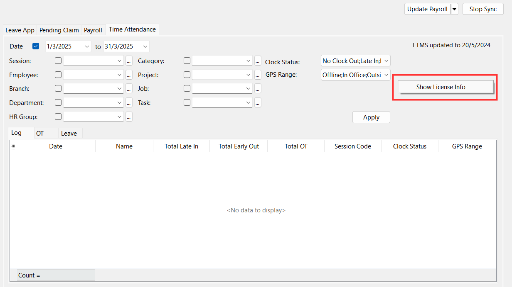
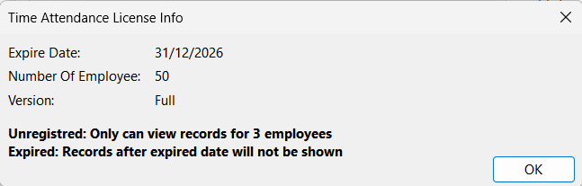

**Affecting reports:**  
- [Sync Cloud Time Attendance](sync-cloud.md)
- [Time Attendance Unassigned Listing](payroll-report.md#time-attendance-unassigned-listing)
- [Time Attendance Unassigned Listing](payroll-report.md#time-attendance-unassigned-listing)

User can check company’s Time Attendance License at Cloud Icon | Sync Cloud… | Time Attendance  
    
    
    

**Unregistered License**  
- Only records for 3 employees will be displayed
- Full access to all features 

**Registered License**
- Displayed employees’ records based of the number of employee purchased
- Full access to all features 

**Expired License**
- Records after the expired date will not be shown 