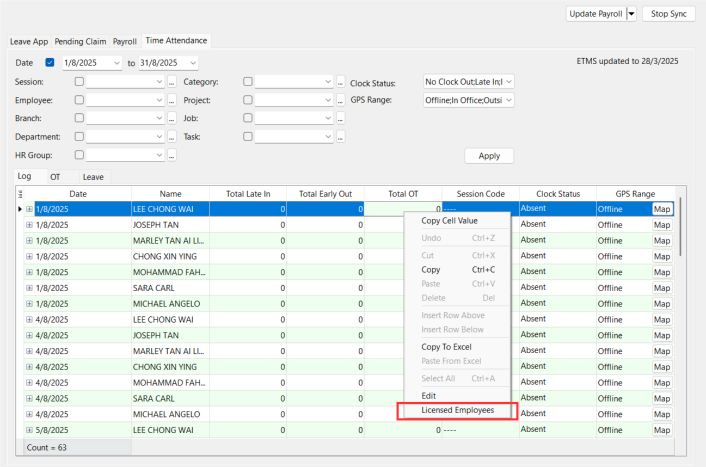
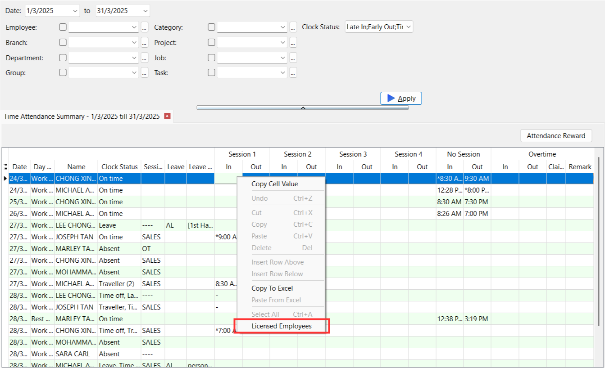
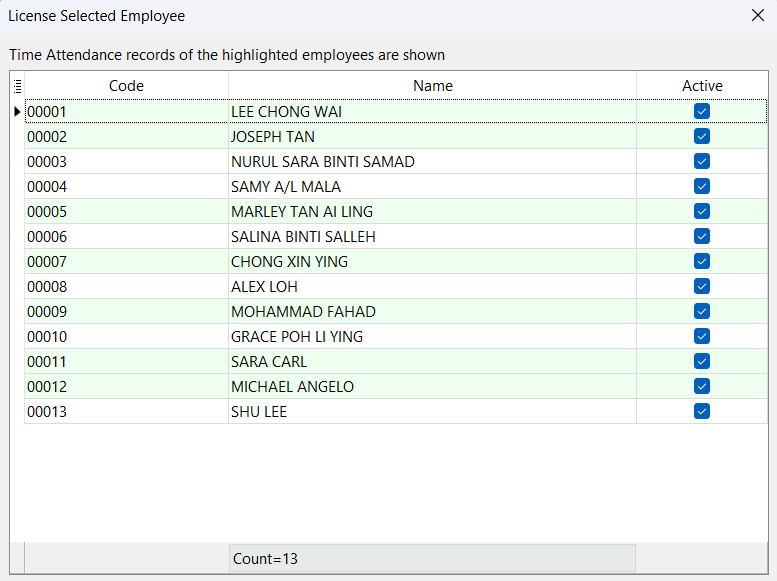

**Affecting reports:**

- [Sync Cloud Time Attendance](sync-cloud.md)
- [Time Attendance Summary](payroll-report.md#time-attendance-summary)
- [Time Attendance Unassigned Listing](payroll-report.md#time-attendance-unassigned-listing)

## License Info

- To view company's license info, navigate to ☁️ > Sync Cloud… > Time Attendance, right click on the empty area and press "Show License Info"

  
  

### Unregistered License

- Only records for 3 employees will be displayed
- Full access to all features

### Registered License

- Displayed employees’ records based of the number of employee purchased
- Full access to all features

### Expired License

- Records after the expired date will not be shown

## Licensed Employees

### Sync Cloud

- To view the selected licensed employees under sync cloud, navigate to ☁️ > Sync Cloud... > Time Attendance > Sync All. Right click on the grid and select Licensed Employees

  

### Report

- Navigate to Time Attendance > Print Time Attendance Summary.../Print Time Attendance Unassigned Listing..., press on "Apply". Right click on the grid and select Licensed Employees

  
  

  - The green highlighted employees are the selected employees and their records will be displayed in the report

:::info
The selected licensed employees may varies between reports if the number of employees (refer [License Info](#license-info)) are less than the total number of employees using ETMS as the system will randomly select employees based on the registered number of employees
:::
