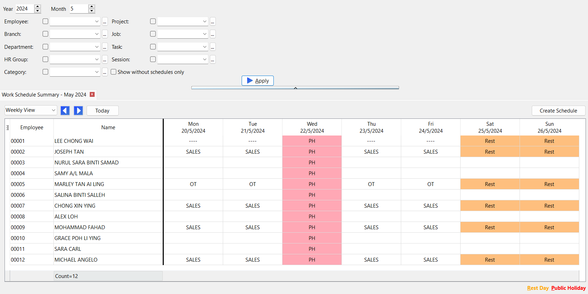
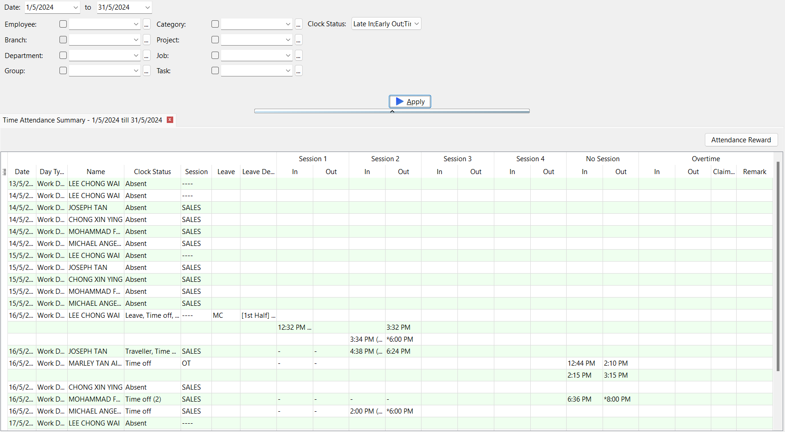
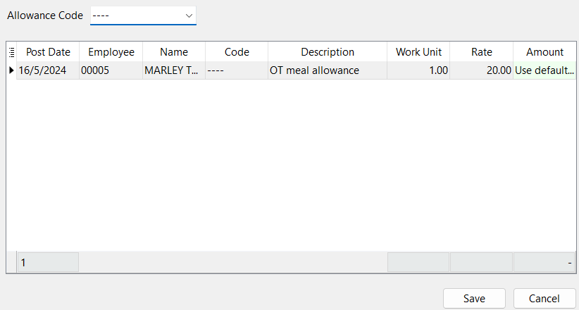
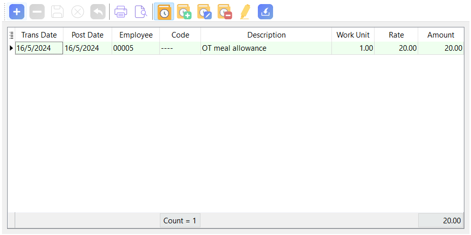
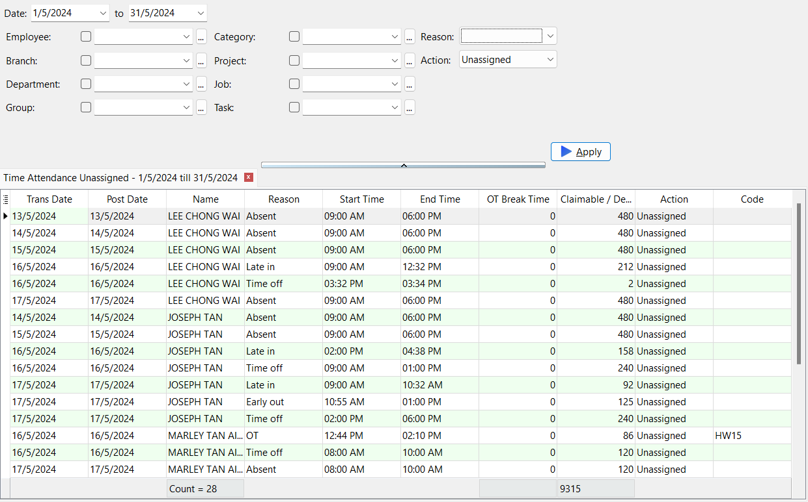
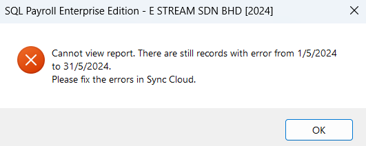

## Work Schedule Summary

**Step:** Time Attendance | Print Work Schedule Summary…  
    
    

- Types of views:
  - Daily View
  - Weekly View
  - Monthly View
- **Red box:** Public holiday
- **Orange box:** Rest day
- **Blank:** No session assigned
- **Others:** Work day with session (font color based on settings in Maintain Session)
- ***'Create Schedule' button***: Direct user to Maintain Calendar
- ***'Today' button:*** Focus on today's date if within date range

## Time Attendance Summary

**Step:** Time Attendance | Print Time Attendance Summary…  
    
    

- Shows all log pairs processed in Sync Cloud
- **'*' symbol:** Adjusted log
- ***'(by mgr)' label:***  Log is clocked by manager through SQL HRMS app
- Overtime pairs will only list those OT records that has been confirm by HR and posted to Pending Overtime with claimable more than 0
- **'-' symbol:** Employee do not have any clock in/clock out records for that session

### Attendance Reward

**Step 1:** Click on Attendance Reward (Make sure all Clock Status are checked)  
    

- Employee who are entitled to **Attendance Reward** (set in [Maintain Employee](payroll-setup.md#maintain-employee)) and fulfilled the conditions will be listed
- Once **'Save'**, the reward will be posted to Pending Allowance

**Step 2:** Select an Allowance Code | Save  
**Step 3:** Payroll | Open Pending Payroll… | Allowance  
    
    

:::info
By default, Meal Allowance is RM20, may contact SQL Support for customization
:::

## Time Attendance Unassigned Listing

**Step:** Time Attendance | Print Time Attendance Unassigned Listing…  
    
    

- Shows all OT and Leave records processed in Sync Cloud  

:::info
If there are log pairs with missing Clock In / Clock Out time which are within the date range, user is not allow to view [Time Attendance Summary](#time-attendance-summary) report and [Time Attendance Unassigned Listing](#time-attendance-unassigned-listing) report until those log pairs are fix in [Sync Cloud](sync-cloud.md)  
    
    
:::
