## Time Zone

**Step 1:** Company Profile | General | Time Zone | Select your country time zone

    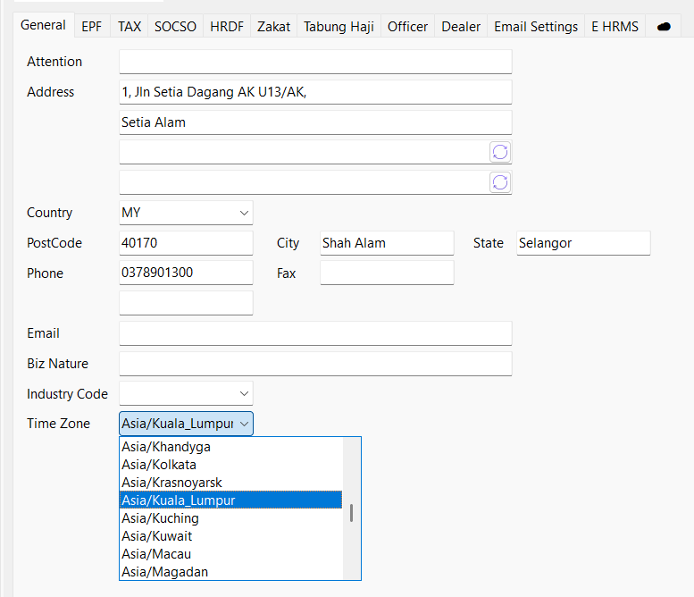

**Step 2:** Save

## Maintain Branch

**Step 1:** Human Resource | Maintain Branch… | Select a Branch / Create New  
    
    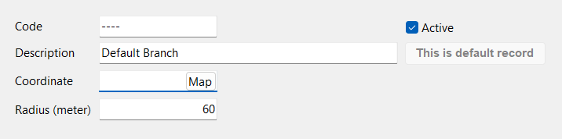

**Step 2:** Map | Enter Branch address | Search | Confirm  
    
    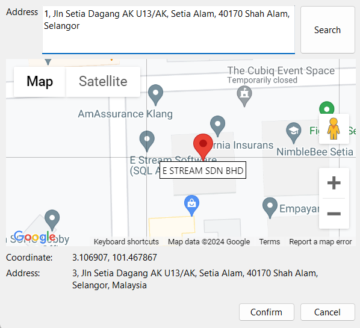

:::tip
    User may click on the map to get a more accurate position
:::

**Step 3:** Enter radius (by default is 60m and min is 5m) | Save  
    
    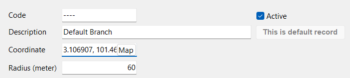

## Maintain Public Holiday

**Step 1:** Leave | Maintain Public Holiday Calendar… | Select a Public Holiday Calendar / Create New  
    
    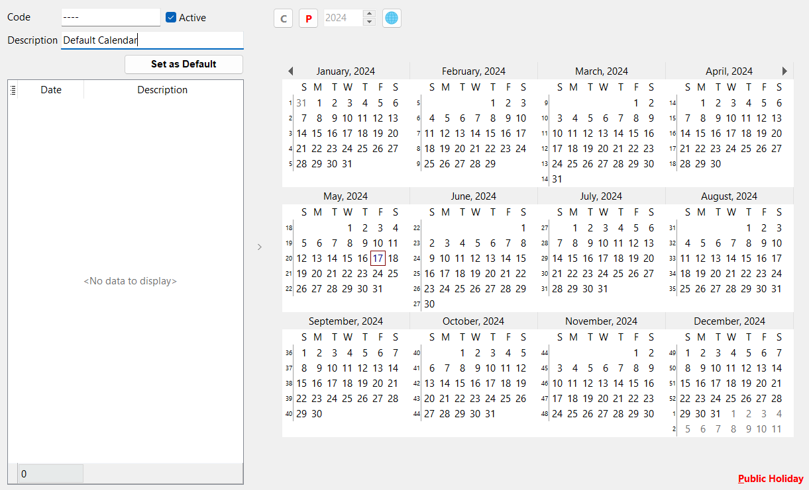

**Step 2: Set public holidays**  
User may import default Malaysia public holiday calendar or set manually  

Option 1: Global Icon | Select a State | OK  
    
    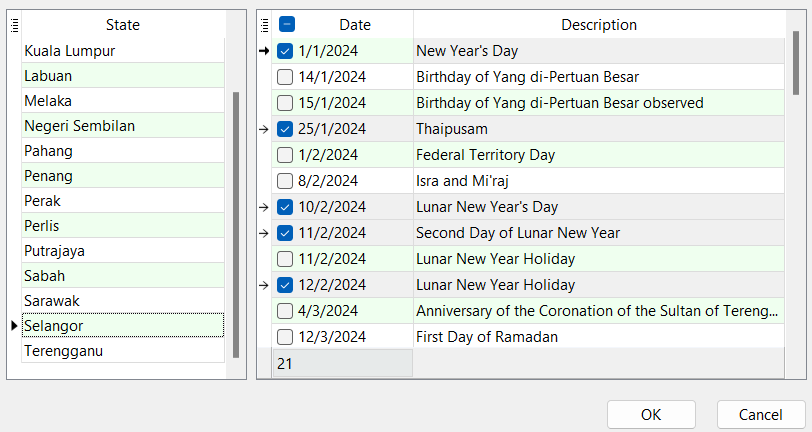

:::info
User may check or uncheck the dates
:::

Option 2: Click on ***'P' button*** | Select date  
    
    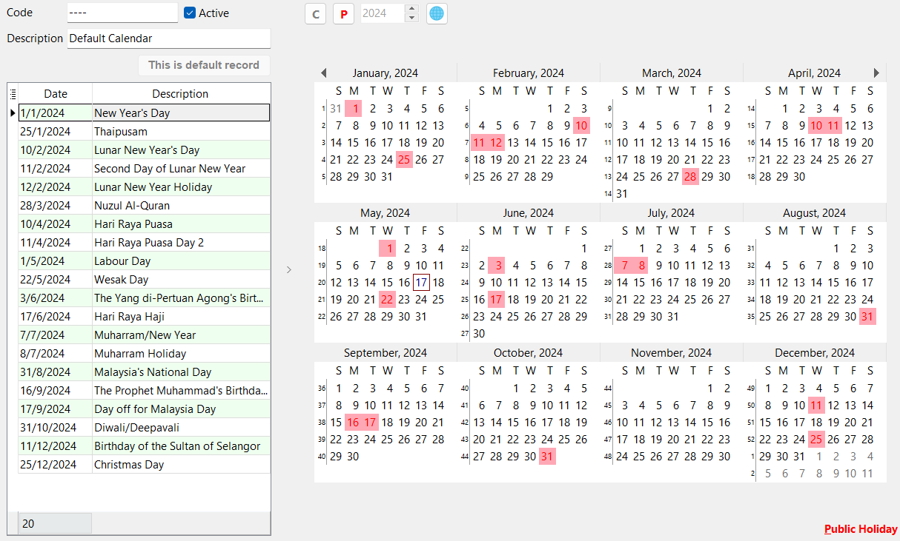

**Step 3:** Save  

## Maintain Work Session

**Step 1:** Time Attendance | Maintain Work Session… | Select a Work Session / Create New  
   
    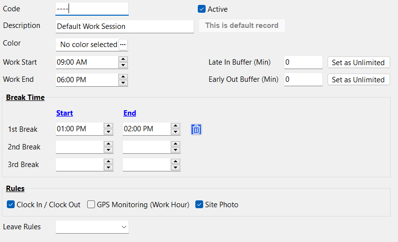

**Step 2:** Enter Work Start, Work End and Buffer (by default is 0 min)  
- ***'Late In Buffer':*** Can be late by how many minutes
- ***'Early Out Buffer':*** Can leave early by how many minutes

**Step 3:** Enter Break Time
- May add up to 3 break times

**Step 4:** Select a Clock Method
- ***'GPS' checkbox:*** Clock in / out using employee's location in SQL HRMS app
- ***'QR' checkbox:*** Clock in / out using QR Code generated from SQL HRMS app and scan it on SQL Clock In app

:::info
1. Only one clock method can be selected. However, if none of the clock method is selected, then the clock in / out button in SQL HRMS app will be disabled and employee does not require to clock in / out.
2. Clock Method on days without work session, public holiday and rest day is by default **GPS**.
:::

**Step 5:** Select Rules  
- ***'GPS Monitoring' checkbox:*** Post status update if employee left work location 
- ***'Site Photo' checkbox:*** Requires to take photo before clock in / out (User cannot upload picture from album)

:::info
***'GPS Monitoring'*** and ***'Site Photo'*** will be disabled if ***'QR'*** or ***no clock method*** is selected
:::

**Step 6:** Save  

**Optional**
- User may select ***'Leave Rules'*** if applicable

:::info
Make sure that the work session is set based on the time zone maintained in Company Profile (refer [here](#time-zone))
:::

## Maintain Work OT

**Step 1:** Time Attendance | Maintain Work OT… | Select a Work OT / Create New  
    
    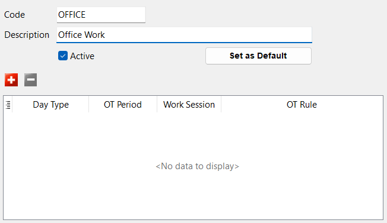

**Step 2:** Click on ***'+' button*** | Select Day Type  
**Step 3:** Select OT Period  
**Step 4:** Select Work Session  
    | **Day Type** | **OT Period** | **Work Session** |  
    | :----------- | :------------ | :--------------- |  
    | Rest Day   Rest Day (Special Rate 1)   Rest Day (Special Rate 2)   Rest Day (Special Rate 3)   Public Holiday | All Day | |  
    | Work Day | Before Work   Break Time   After Work | *Select a Work Session* |

**Step 5:** Set OT Rule by clicking on the ***'…' button***

**Standard Rule - Clock Time**  
    
    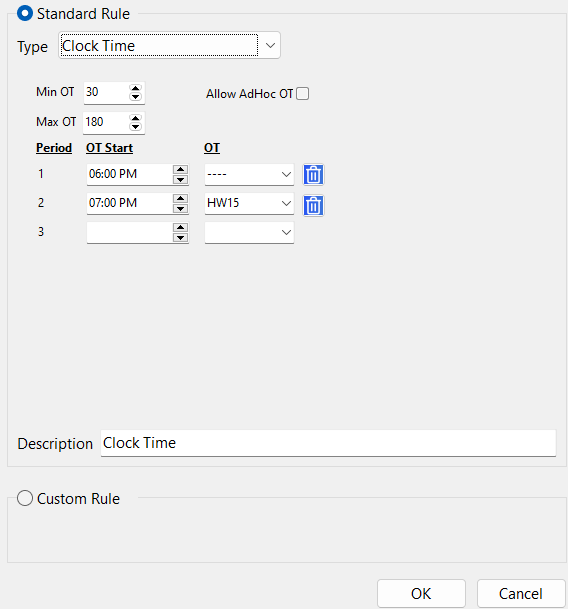

- **'Min OT':** Require to have at least 30 minutes of OT to be eligible for this rule
- **'Max OT':** Maximum claimable OT minutes is 180 minutes (3 hours)
- **'Allow AdHoc OT':** Any OT before 6:00pm will also be calculated

| **Period** | **OT Start** | **OT** | **Explanation** |
| :--------- | :----------- | :----- | :-------------- |
| 1 | 6:00pm | ---- | 6:00pm - 7:00pm, Entitled to OT Code ---- |
| 2 | 7:00pm | HW15 | From 7:00pm onwards, Entitled to OT Code HW15 |  

**Explanation:** If employee start OT at 7:00pm, employee is entitled to OT Code HW15 and can claim up to 180 minutes  

**Standard Rule - Tier**  
    
    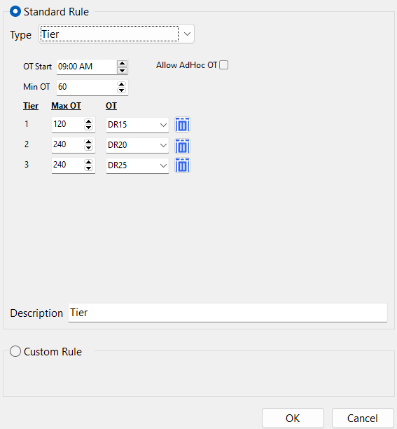

- ***'OT Start':*** Allow to start OT at 9:00am
- ***'Min OT':*** Require to have at least 60 minutes of OT to be eligible for rule
- ***'Allow AdHoc OT':*** Any OT before 9:00am will also be calculated

| **Tier** | **Max OT** | **OT** | **Explanation** | **Example** |  
| :------- | :--------- | :----- | :-------------- | :---------- |
| 1 | 120 | DR15 | First 120 minutes, Eligible to OT Code DR15 | 9:00am - 11:00am |
| 2 | 240 | DR20 | Next 240 minutes, Eligible to OT Code DR20 | 11:00am - 3:00pm |
| 3 | 240 | DR25 | Last 240 minutes, Eligible to OT Code DR25 | 3:00pm - 7:00pm |

:::info
For Custom Rule, may contact SQL Support for customization
:::

**Step 6:** Save

## Maintain Calendar  

**Step:** Time Attendance | Maintain Calendar…  
    
    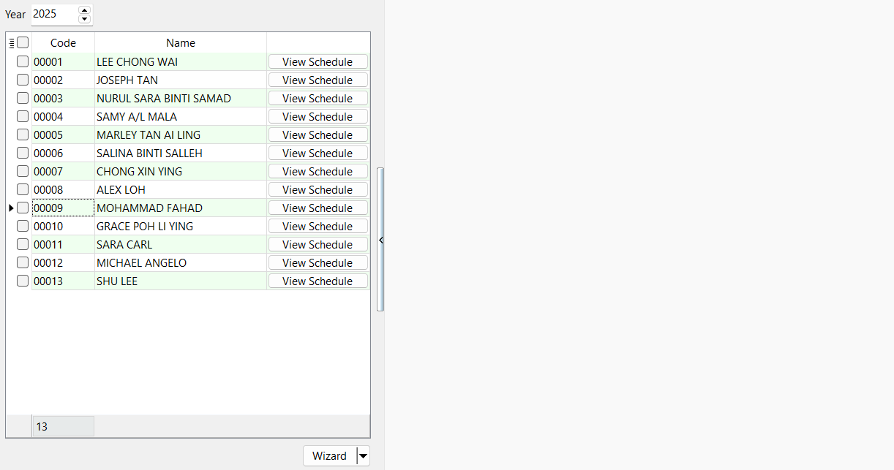

### View Schedule  

**Step:** Click ***'View Schedule' button***  
    
    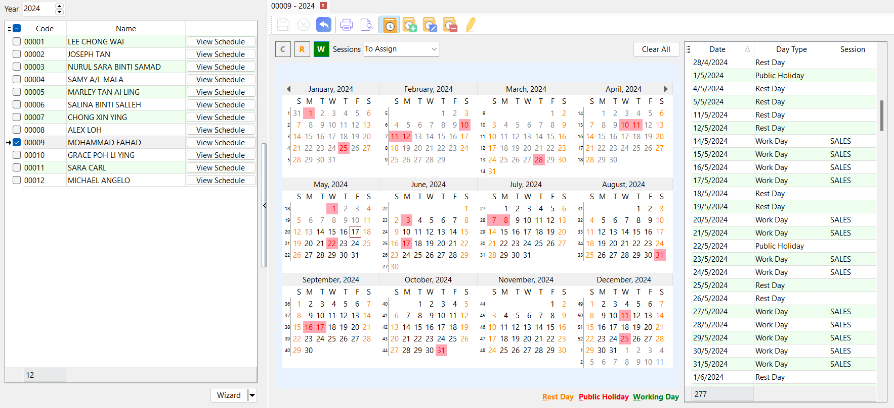

**Work Session Calendar**  
- **Red box:** Public Holiday assigned from Maintain Public Holiday Calendar  
- **Orange font:**  Rest Day  
- **Black font:** Work Day with Session  
- **Grey font:** No schedule is assigned  

**Set Work Session**  
- User may click on ***'R' button*** or ***'W' button*** | Select date from calendar
- ***'C' button*** to clear Work Session / Rest Day
    - Alternatively, user may use ***'Clear All' button*** to clear all Rest Day and Work Session within the date range
- User cannot assign work sessions or change work sessions on dates before summary last processed date  
- On days without work session assigned, no summary will be processed unless there are clock in / clock out logs on that day  

### Wizard  

**Step 1:** Select Employee(s) | Wizard  
    
    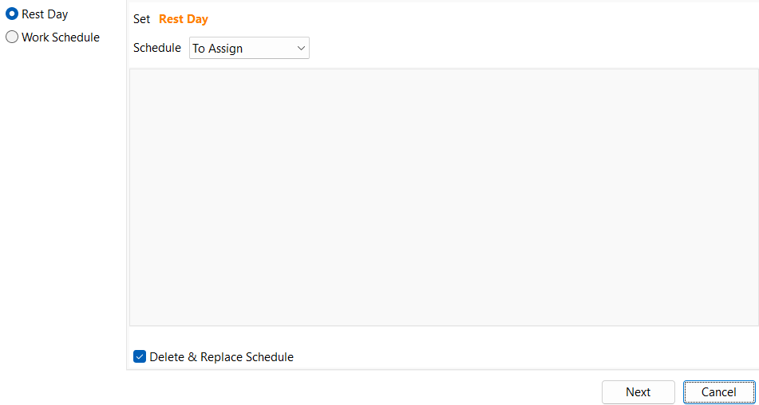

- ***'Delete & Replace Schedule' checkbox:*** Any previously assigned Work Session will be deleted and replace 
    - Only apply to assigned work session on future dates
- Hover **'Rest Day'** for more rest day options:
    - Special Rate 1
    - Special Rate 2
    - Special Rate 3
  
**Step 2:** Select a schedule  
    | **Schedule** | **Explanation** |
    | :----------- | :-------------- |
    | By Months | Assign to every selected day of every selected week of every selected month |
    | Custom | Assign to selected dates |

**Step 3:** Next | Select a Session  
    
    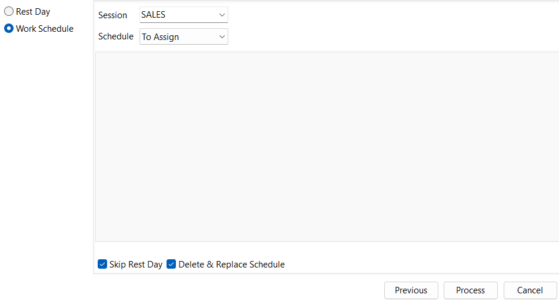

- ***'Skip Rest Day' checkbox:*** Previously assigned Rest Day will not be replaced with Work Session
    - Only apply to assigned work session on future dates
- ***'Delete & Replace Schedule' checkbox:*** Any previously assigned schedule will be deleted and replace
    - Only apply to assigned work session on future dates

**Step 4:** Select schedule type  
    | **Schedule** | **Explanation** |  
    | :----------- | :-------------- |  
    | By Months | Assign to every selected day of every selected week of every selected month |
    | By Days of Month | Assign to every selected day of every selected month |
    | By Weeks | Assign to every selected day of every selected weeks of the year |
    | Custom | Assign to selected dates |  

**Step 5:** Process  

:::warning
User cannot assign work sessions or change work sessions on dates before summary last processed date
:::

### Copy Calendar from Employee

**Step 1:** Select employee(s) | Wizard dropdown | Copy From  
**Step 2:** Select date range and employee to copy from | OK  
   
    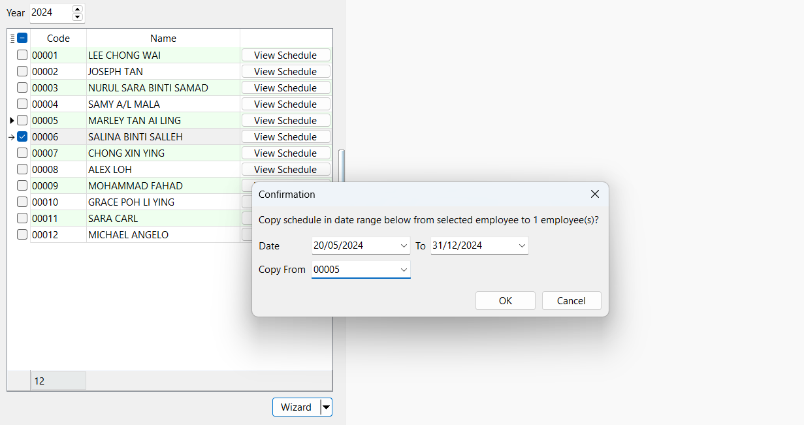

**Explanation:** Copy Employee 00005 schedule (Work Session and Rest Day) from 20/5/2024 to 31/12/2024 to Employee 00006  

:::info
Date From need to be after summary last processed date to future dates (dates before summary last processed date are not allowed to copy)
:::

### Clear All Schedule

**Step 1:** Select employee(s) | Wizard dropdown | Clear All  
**Step 2:** Select date range to delete | OK  
    
    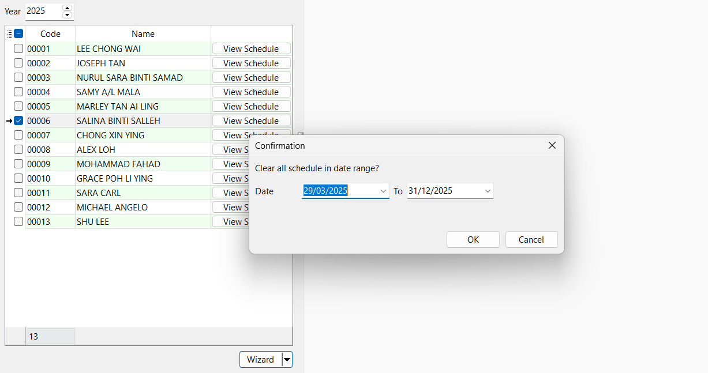

**Explanation:** Delete all schedule (Work Session and Rest Day) of Employee 00006 from 20/5/2024 to 31/12/2024  

:::info
Date From need to be after summary last processed date to future dates (dates before summary last processed date are not allowed to delete)
:::

## Maintain Traveller Location

**Step:** Time Attendance | Maintain Traveller Location…  
    
    

:::info
Only employees who is a **'Traveller'** will be listed (refer [Maintain Employee](#maintain-employee))
:::

### View Location

**Step:** Click View Location  
    
    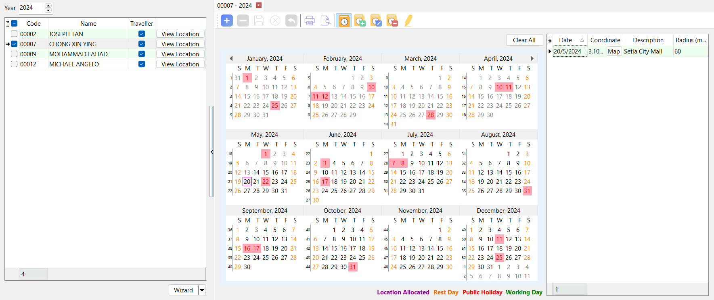

- **Red box:** Public Holiday assigned from Maintain Public Holiday Calendar
- **Orange font:** Rest Day
- **Black font:** Work Day with session
- **Grey font:** No schedule is assigned
- **Purple box:** Work locations allocated
- To clear a work location, focus a record on the grid and click ***'-' button***
    - User may click on ***'Clear All' button*** to clear all work locations within the date range  

### Wizard

**Step 1:** Select Employee(s) | Wizard  
    
    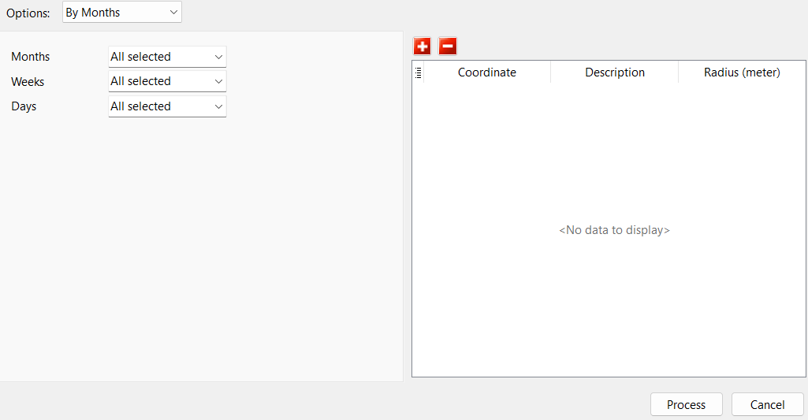

**Step 2:** Select a Schedule  
    | **Schedule** | **Explanation** |  
    | :----------- | :-------------- |  
    | By Months | Assign to every selected day of every selected week of every selected month |  
    | By Days of Month | Assign to every selected day of every selected month |  
    | By Weeks | Assign to every selected day of every selected week of the year |  
    | Custom | Assign to selected dates |  

**Step 3:** Click on ***'+' button*** | Map  
**Step 4:** Select a GPS Type | Enter radius (by default is 60m and min is 5m) and description | Confirm  
    | **GPS Type** | **Explanation** |  
    | :----------- | :-------------- |
    | Branch | Select from a list of branches created in Maintain Branch |  
    | Custom | Search by address |  

    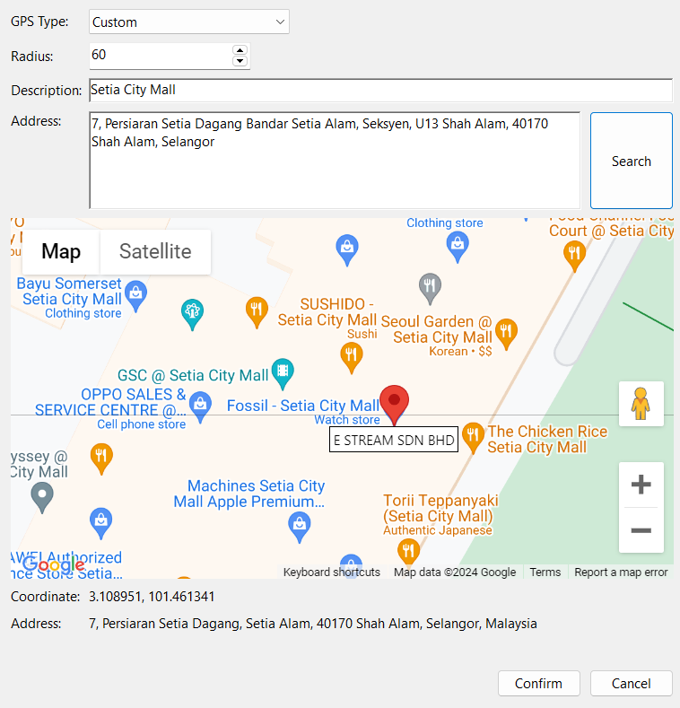

:::tip
User may pin on the map to get a more accurate position
:::

**Step 6:** Process  
    
    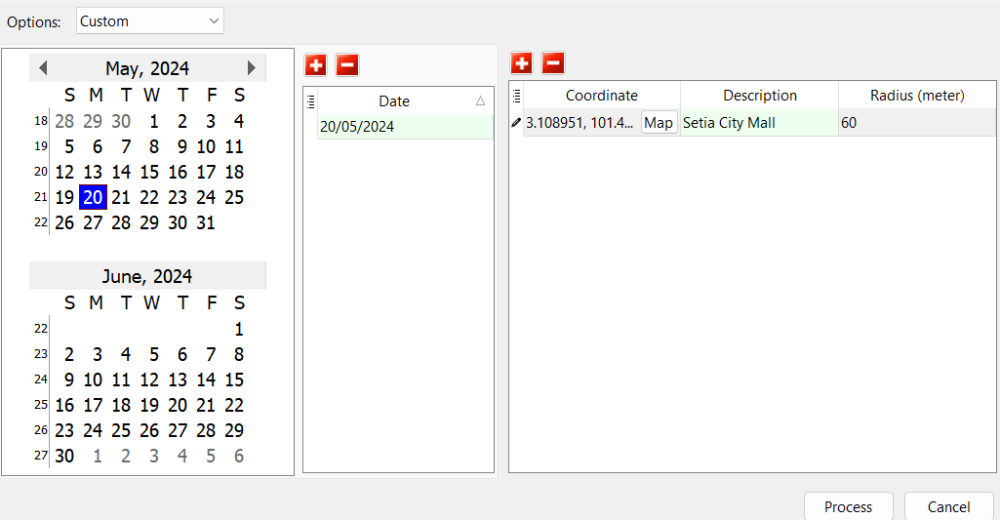

### Copy Work Location from Employee

**Step 1:** Select Employee(s) | Wizard dropdown | Copy From  
**Step 2:** Select date range and employee to copy from | OK  
    
    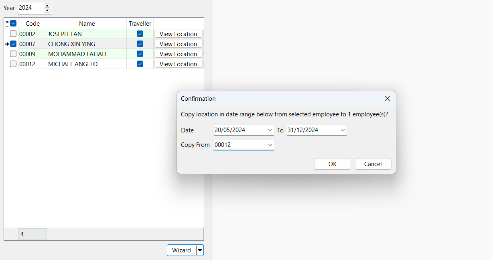

**Explanation:** Copy Employee 00012 locations from 20/5/2024 to 31/12/2024 to Employee 00007

:::info
Date From need to be current date to future dates (past dates are not allowed to copy)
:::

### Clear All Work Locations

**Step 1:** Select Employee(s) | Wizard Dropdown button | Clear All  
    
    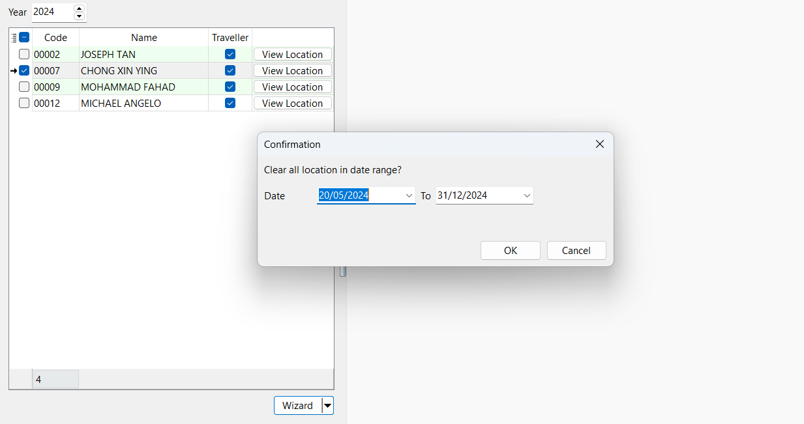

**Step 2:** Select Date Range | OK  
**Explanation:** Delete all locations of Employee 00007 from 20/5/2024 to 31/12/2024  

:::info
Date From need to be current date to future dates (past dates are not allowed to delete)
:::

## Maintain Employee

**Step 1:** Human Resource | Maintain Employee… | Select an Employee / Create New | Personal tab | Enter email  
    
    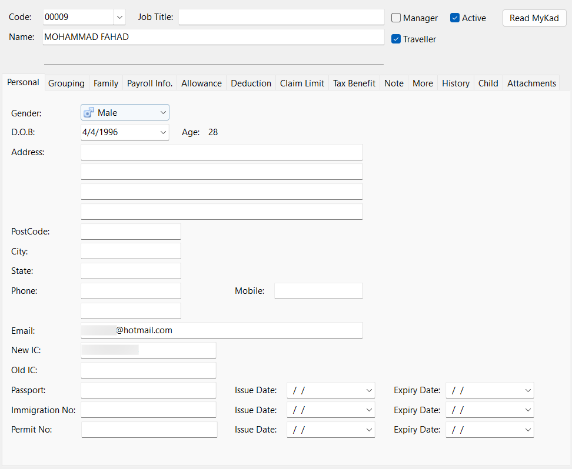

**Step 2:** Grouping | Select a Branch  
**Step 3:** Select a Public Holiday Calendar  
**Step 4:** Select a Work OT  
**Step 5:** Save  
    
    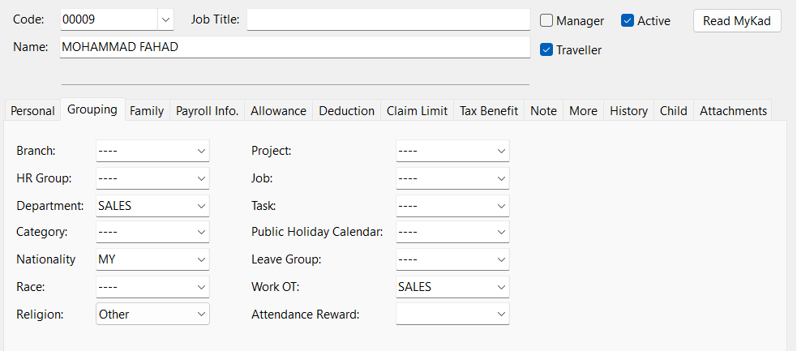

**Optional**  
- Employees who are entitled to Attendance Reward, may select an **'Attendance Reward'**
- Employees who are travellers (Eg. Salesperson / Delivery Person / Doctor), may check the ***'Traveller' checkbox***

## Sync Cloud  

**Step:** Cloud Icon | Sync Cloud… | Sync All  

:::info
Make sure to always **'Sync Cloud'** after all maintenance are done or if there are any changes to the Time Attendance Setup to ensure settings on both Payroll and SQL HRMS app are in sync with one another
:::
