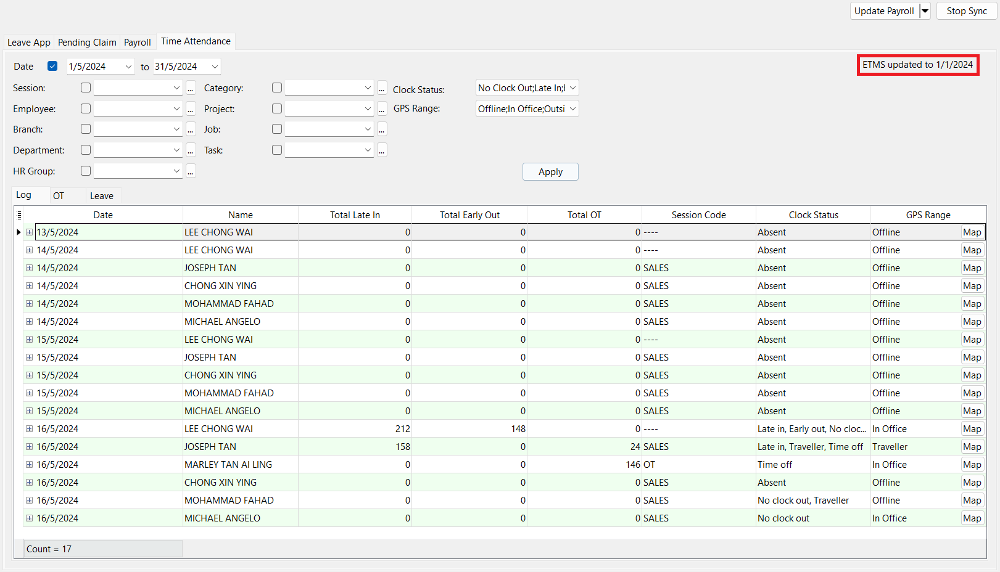
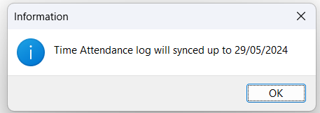
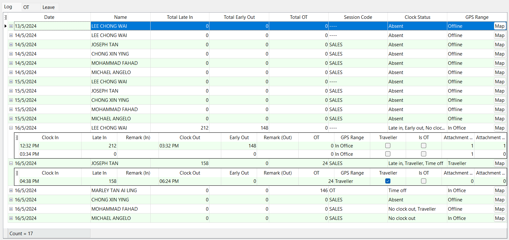
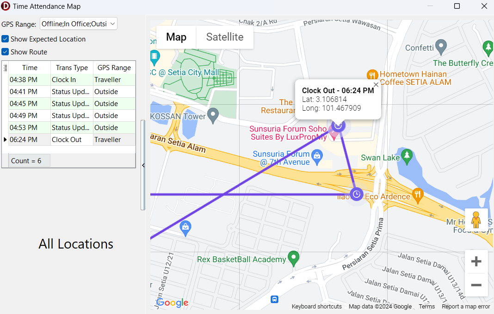
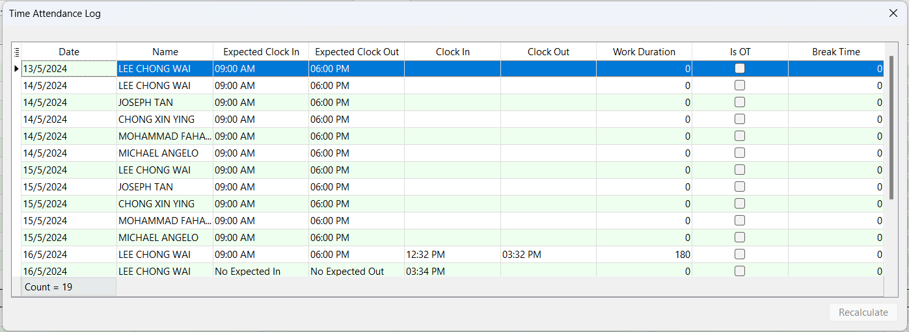
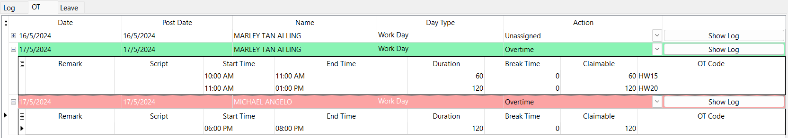
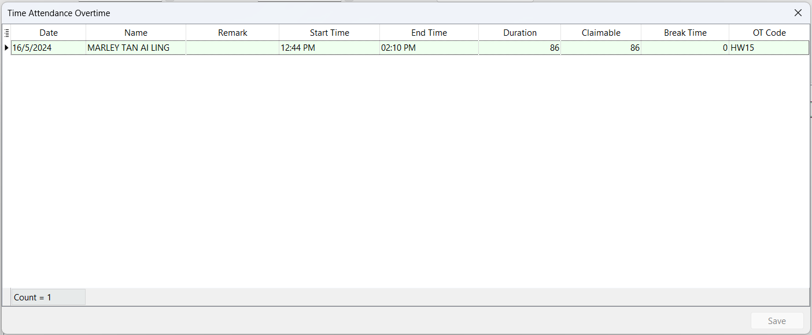
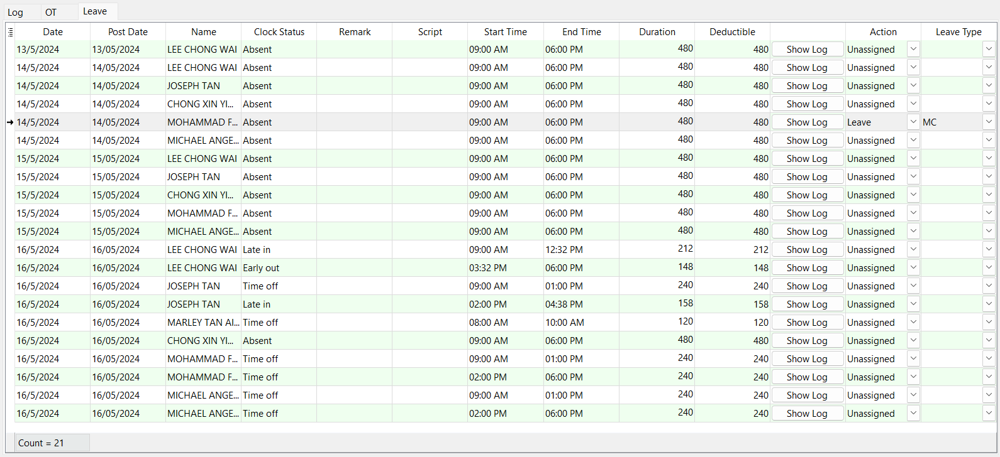

**Step 1:** Cloud Icon | Sync Cloud… | Time Attendance | Sync All  
    
    

**Step 2:** After all necessary adjustments are made | Update Payroll
- Alternatively, user may click on the ***'Update TMS' button*** under ***'Update Payroll' dropdown*** to only update TMS data to server
- After ***'Update Payroll'***, all OT / Leave trans that has been assigned action will no longer appear on the grid. User may view it under [Time Attendance Unassigned Listing report](payroll-report.md#time-attendance-unassigned-listing)

:::info
The **'ETMS updated to dd/mm/yyyy'** is the date of the latest TMS summary processed. Any attendance logs before the updated date will no longer allowed to be adjusted from SQL HRMS app.

If user sync before 9am, Time Attendance Log will only sync up to two days before.  
    
      

| **Scenario** | **Sync Up To** | **Days Before** |
| :----------- | :------------- | :-------------- |  
| Before 9am on 31/05/2024 | 29/05/2024 | 2 days |  
| After 9am on 31/05/2024 | 30/05/2024 | 1 day |  
:::

### Attendance Log Error

This dialog box will only prompt if there are any incomplete log pairs (missing clock in / clock out) that requires attention  
    
      

- **Purple cells:** Missing time which needs to be filled in 
- Editable columns:
    - Clock In
    - Clock Out
    - Is OT
    - Break Time 
- ***'Recalculate' button*** will enabled once changes are made to perform recalculation on the attendance logs

### Log

This tab shows the processed TMS summary with employees' log details after processed  
    
      

#### Location Map

User can click on the ***'Map' button*** in tab to show the employee's log location (Clock In, Clock Out, Status Update) on a map  
    
      

- Map icon identifier:
    | **Icon** | **Description** |
    | :------- | :-------------- |
    |  | Clock In |
    |  | Status Update |
    |  | Clock Out |

#### Edit Mode

**Step:** Right-click on the grid | Edit  
    
    

- Editable columns:
    - Clock In
    - Clock Out
    - Is OT
    - Break Time 
- ***'Recalculate' button*** will enabled once changes are made to perform recalculation on the attendance logs

### OT

    

- Editable columns:
    - Post Date
    - Action:
        - Unassigned
        - Overtime: Record will be posted to Pending Overtime 
        - Cancelled: Record will be ignored
- **Red highlight:** Not all the nested records are assigned with an OT code (won't be posted to pending)
- **Green highlight:** All the nested records are assigned with an OT code
- ***'Show Log' button*** is to show all employee's attendance logs on that date

#### Edit Mode

**Step:** Right-click on the grid | Edit  
    
    

- Editable columns:
    - Remark
    - Claimable
    - Break Time
    - OT Code
- ***'Save' button*** will enabled once changes are made

### Leave

    

- Editable columns: 
    - Post Date
    - Remark
    - Deductible
    - Action:
        - Unassigned
        - Leave: Records will be posted to Leave Application
        - Unpaid Leave: Record will be posted to Leave Application
        - Cancelled: Record will be ignored
    - Leave Type: Value changes based on chosen action
- User need to assign a leave code in order to post it to Leave Application
- ***'Show Log' button:*** Show all employee's logs on that date
