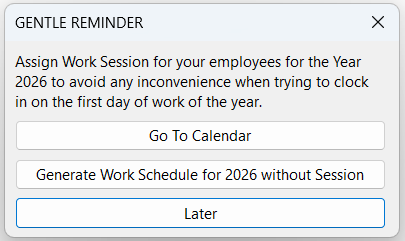

1. Click on the ☁️ > Sync Cloud… > Time Attendance, press "Sync All"

    

2. After all necessary adjustments are made, click "Update Payroll"

    - Alternatively, user may click on the **_'Update TMS' button_** under **_'Update Payroll' dropdown_** to only update TMS data to server
    - After **_'Update Payroll'_**, all OT / Leave trans that has been assigned action will no longer appear on the grid. User may view it under [Time Attendance Unassigned Listing report](payroll-report.md#time-attendance-unassigned-listing)

:::info
The **'ETMS updated to dd/mm/yyyy'** is the date of the latest TMS summary processed. Any attendance logs before the updated date will no longer allowed to be adjusted from SQL HRMS app.

The **Log synced to dd/mm/yyyy hh:nn** is the date time SQL Payroll will sync attendance log to. Any attendance logs before this time (due to manager clock on behalf) will no longer be synced to SQL Payroll

| **Scenario**             | **Sync Up To**   |
| :----------------------- | :--------------- |
| Before 9am on 24/09/2025 | 23/09/2025 23:59 |
| After 9am on 24/09/2025  | 24/09/2025 08:59 |

:::

## Attendance Log Error

This dialog box will only prompt if there are any incomplete log pairs (missing clock in / clock out) that requires attention

    

- The logs are grouped by the date and employee with alternating **green** and **white** highlights
- **Green cells:** Missing time which needs to be filled in
- Editable columns: - Clock In - Clock Out - Is OT - Break Time
- **_'Recalculate' button_** will enabled once changes are made to perform recalculation on the attendance logs

## Log

This tab shows the processed TMS summary with employees' log details after processed

    

### Location Map

User can click on the **_'Map' button_** in tab to show the employee's log location (Clock In, Clock Out, Status Update) on a map

    

- Map icon identifier:

  | **Icon**                                                                  | **Description** |
  | :------------------------------------------------------------------------ | :-------------- |
  |  | Clock In        |
  |  | Status Update   |
  |  | Clock Out       |

### Edit Mode

1. Right-click on the grid, select "Edit"

    

- The logs are grouped by the date and employee with alternating **green** and **white** highlights
- Editable columns: - Clock In - Clock Out - Is OT - Break Time
- **_'Recalculate' button_** will enabled once changes are made to perform recalculation on the attendance logs
- The **_'Work Duration'_** calculated after the log is adjusted is the difference between the **_'Adjusted Clock Out'_** and **_'Adjusted Clock In'_**
  - An accurate **_'Work Duration'_** will be calculated after the **_'Recalculate' button_** is clicked

## OT

    

- Editable columns:
  - Post Date
  - Action:
    - Unassigned
    - Overtime: Record will be posted to Pending Overtime
    - Cancelled: Record will be ignored
- **Red highlight:** Not all the nested records are assigned with an OT code (won't be posted to pending)
- **Green highlight:** All the nested records are assigned with an OT code
- **_'Show Log' button_** is to show all employee's attendance logs on that date

### Edit Mode

1. Right-click on the grid, select "Edit"

    

- Editable columns:
  - Remark
  - Claimable
  - Break Time
  - OT Code
- **_'Save' button_** will enabled once changes are made

## Leave

    

- Editable columns:
  - Post Date
  - Remark
  - Deductible
  - Action:
    - Unassigned
    - Leave: Records will be posted to Leave Application
    - Unpaid Leave: Record will be posted to Leave Application
    - Cancelled: Record will be ignored
  - Leave Type: Value changes based on chosen action
- User need to assign a leave code in order to post it to Leave Application
- **_'Show Log' button:_** Show all employee's logs on that date

## Generate Calendar Reminder

    

- A generate calendar reminder for next year will be prompted starting from **October** each year
- The reminder will be prompt on condition where there is work session assigned on current year
- Options:
  - **Go To Calendar:** User will be directed to [Maintain Calendar](payroll-setup/#maintain-calendar)
  - **Generate Work Schedule without Session:** System will generate a whole year of work days without session
  - **Later:** Nothing will happen and the reminder will prompt again the next time user Sync Cloud
