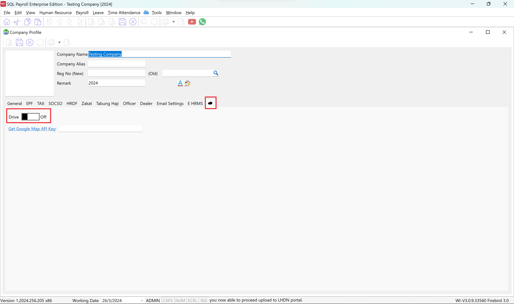
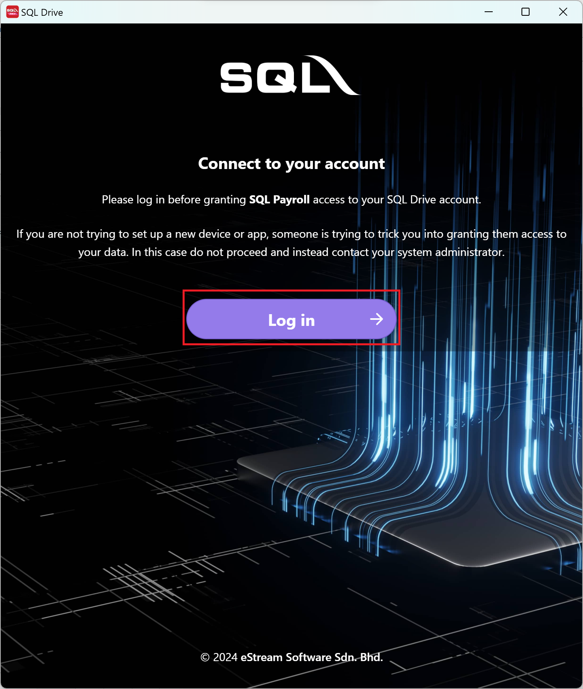
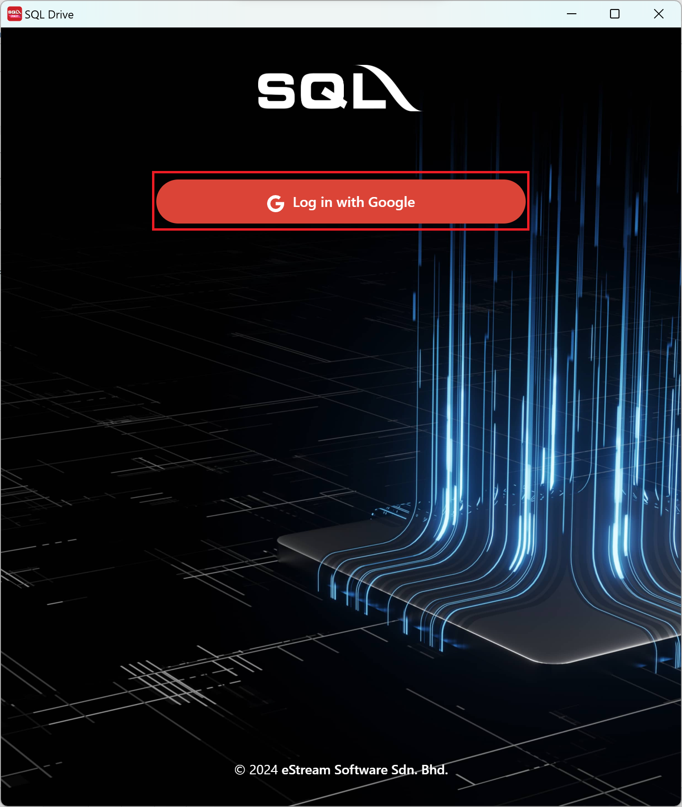
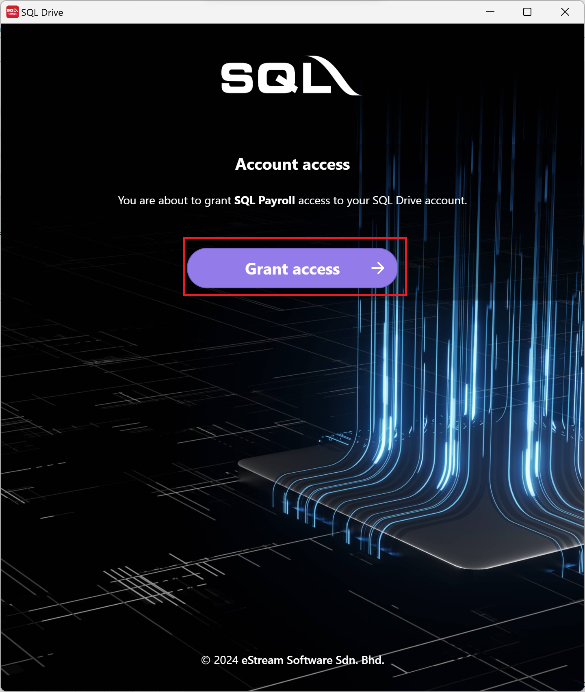
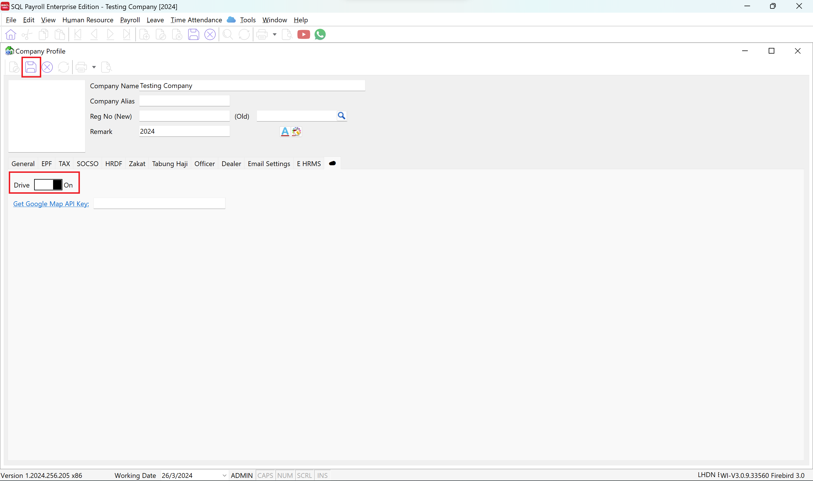

:::note
Before enabling SQL Drive in SQL Payroll, make sure you had contact SQL service agent and register for the service
:::

## Enable SQL Drive

:::info
Make sure you are login into an ADMIN user before proceed with the steps below
:::

1. In SQL Payroll, go to **File > Company Profile**

2. In the company profile, you will see a tabbed view, click on the **cloud icon ☁️ tab**

3. Turn the **Drive** switch on

   

4. After turning on the switch, a new windows will be prompted (refer to below). In this windows, you can login using the google email address you had given to the SQL service agent and register for the service.

5. Click on **Login**

   

6. Click on **Log in with Google**

   

7. After logging in, you will be prompted to grant the access. Click on **Grant Access**

   

8. After granting, you will be redirect back to SQL Payroll, click on the diskette 💾 logo and save your settings

   
