## Introduction

Time Management System (ETMS) is a feature which allows employers to monitor employees performance and greatly reducing hazzle in employees reward such as overtime (OT).

## Prerequisites

Before proceed with the guide below, you will need to have SQL Drive setup. Find out how to setup in the [enable SQL Drive guide](enable-sql-drive)

## 1 General Setup

### 1.1 Maintain Location

1. In SQL Payroll, navigate to **Human Resource** > **Maintain Branch**

2. Click on **Edit**

   

3. Click on **Map**

   

4. Key in the **Company Address**, click **Search** and lastly click **Confirm**

   

5. Fill in the **Radius** you wish to control (in meter), and click **Save**

   :::info
   if you leave the field empty, default value of **60m** will be used
   :::

   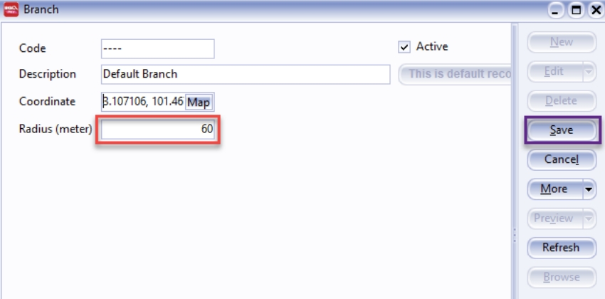

   You can also create new branch if more than one branch

### 1.2 Maintain Public Holiday

1. Navigate to **Leave** > **Maintain Public Holiday** to configure the public holiday of the year

2. Click on **Edit**

   

3. In the tabbed view, click on **P**, select the **date of public holiday** and click **Save**

   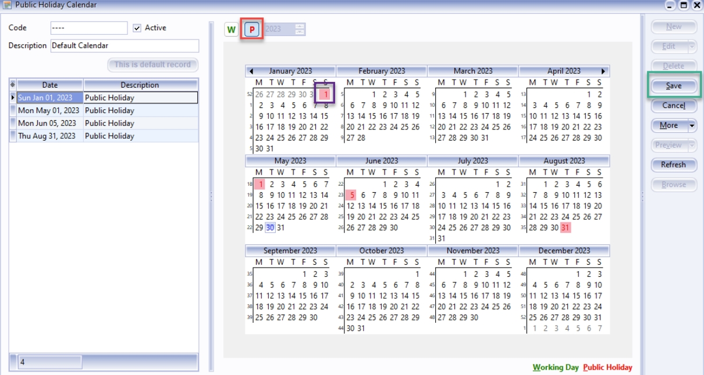

### 1.3 Maintain Employee

1. Navigate to **Human Resource** > **Maintain Employee**

2. Click to highlight the employee you wish to change it's settings, and click **Edit**

   

3. Go to **Personal** tab, key in employee email address

   

4. Next, go to the **Grouping** tab and select Branch

5. Select **Public Holiday Calendar**

6. Select **Work OT**

7. Click **Save**

   :::note
   Tick on Traveller if the employee is Traveller (Eg. Sales Person / Delivery Person / Doctor)
   :::

   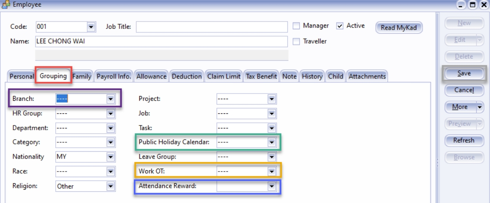

:::tip
In ETMS, we have the **Attendance Reward** feature. If the worker works for more than _2 hours_ of OT per day (OT >= 2 hours), default meal allowance is provided. (This default settings apply to employees who have **attendance allowance only**)
:::

## 2 Time Attendance

### 2.1 Maintain Work Session

1. Navigate to **Time Attendance** > **Maintain Work Session**

2. Click on **Edit**

   

3. Key in time for **Work Start** (09:00 AM) and time for **Work End** (06:00 PM)

   :::info
   **Late In Buffer (min)**: How many minute(s) allow can be late

   **Early Out Buffer (min)**: How many minute(s) allow can be leave early
   :::

   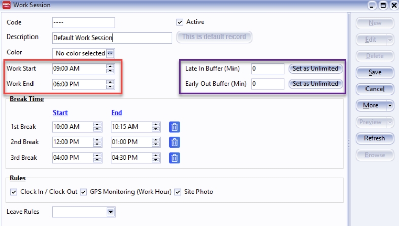

4. Key in **Break Time**

   

   |           | Start    | End      | Description  |
   | --------- | -------- | -------- | ------------ |
   | 1st Break | 10:00 AM | 10:15 AM | Coffee Break |
   | 2nd Break | 12:00 PM | 01:00 PM | Lunch Break  |
   | 3rd Break | 04:00 PM | 04:30 PM | Tea Break    |

5. Select **Rules**

   

   :::info
   **Clock In / Clock Out**: whether user need to clock in / clock out

   **GPS Monitoring (Work Hour)**: User need to turn on location every time they Clock In / Clock Out

   **Site Photo**: User must take photo during Clock In / Clock Out (Doesn't allow photo from album)
   :::

6. Leave Rules

   

   

   :::tip
   For Traveller employee, once apply the **Leave Rule**, **NO NEED** fill in the **Break Time**
   :::

7. Click on **Save** once you have done with all settings

   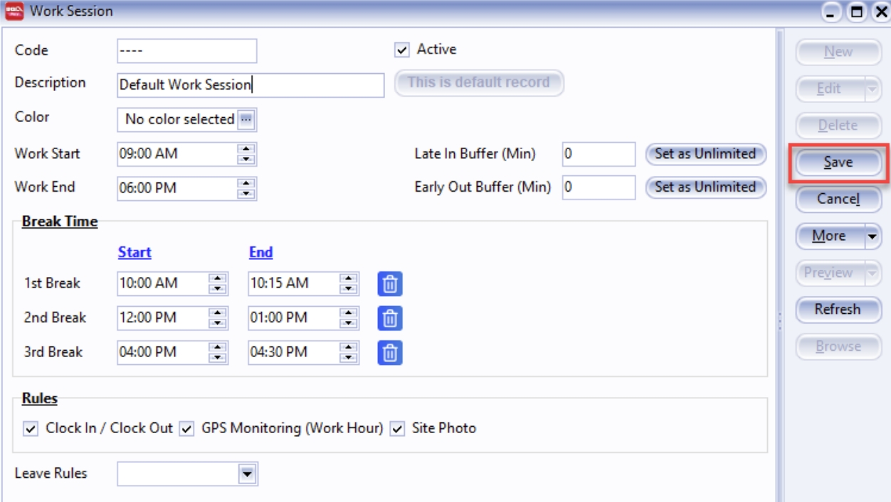

### 2.2 Maintain Work OT

1. Navigate to **Time Attendance** > **Maintain Work OT**

2. Select a Work OT rule, and click **Edit**

   

3. Key in **Day Type**, **OT Period**, **Work Session**, **OT Rule**

   

4. Select **OT Rule** (Refer to [OT rules](#221-ot-rules) for more details)

5. Click on **OK** once done setting

6. Click on **Save** once done all setting

   

#### 2.2.1 OT Rules

:::note Example
**Rest day** = Saturday with rate 1.5

**Rest day (Special Rate)** = Sunday with rate 2.0
:::

1. Table below explains the OT rules
   | Day Type | OT Period | Description |
   | --------------------------- | ----------- | ----------------------------------------- |
   | Work Day | Before Work | Before 9:00 AM |
   | Work Day | After Work | After 6:00 PM |
   | Work Day | Break Time | 12:00 PM – 01:00 PM |
   | **Rest Day** | All Day | Entire day for Rest Day |
   | Public Holiday | All Day | Entire day for Public Holiday |
   | **Rest Day (Special Rate)** | All Day | Entire day for Rest Day with Special Rate |

2. There are two types of OT rules:

   - Clock Time
   - Tier

3. Example of **Clock Time**

   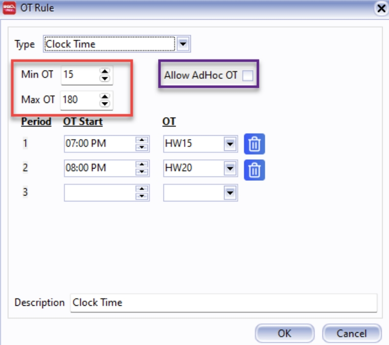

   | Field              | Description                                               |
   | ------------------ | --------------------------------------------------------- |
   | **Min OT**         | Allow to claim OT at least 15 minutes                     |
   | **Max OT**         | Allow to OT up to 180 minutes (3 Hours)                   |
   | **Allow AdHoc OT** | Between 6:00 PM – 7:00 PM (Allow to start OT immediately) |

   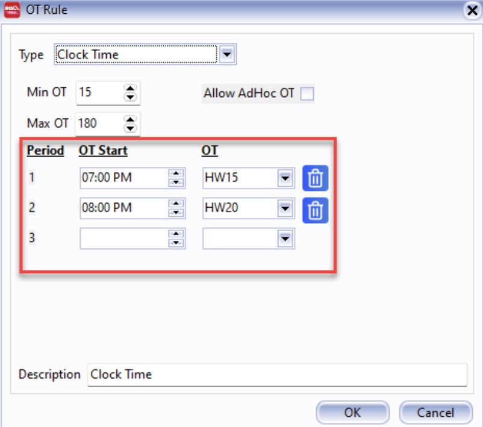

   | Period | OT Start |  OT  | Description                                  |
   | :----: | :------: | :--: | -------------------------------------------- |
   |   1    | 07:00 PM | HW15 | 07:00 PM - 08:00 PM, OT rate is 1.5          |
   |   2    | 08:00 PM | HW20 | Starting at 08:00 PM onwards, OT rate is 2.0 |

   :::info Example
   If OT start after 08:30PM, OT rate is 2.0 and can claim OT up to 3 Hours (until 11:30 PM)
   :::

4. Example of **Tier**

   

   | Field              | Description                                               |
   | ------------------ | --------------------------------------------------------- |
   | **OT Start**       | Time allow to start OT                                    |
   | **Min OT**         | Allow to claim OT at least 15 minutes                     |
   | **Allow AdHoc OT** | Between 6:00 PM – 7:00 PM (Allow to start OT immediately) |

   

   | Tier | Max OT |  OT  | Description                                                            |
   | :--: | :----: | :--: | ---------------------------------------------------------------------- |
   |  1   |   30   | HW15 | OT up to 30 minutes, OT rate is 1.5 (Eg. 07:00 PM – 07:30 PM)          |
   |  2   |   30   | HW20 | The next OT up to 30 minutes, OT rate is 2.0 (Eg. 07:30 PM – 08:00 PM) |
   |  3   |   60   | HW30 | Finish Tier 1 & Tier 2, OT rate is 3.0 (Eg. 08:00 PM – 09:00 PM)       |

### 2.3 Maintain Calendar

1. Wizard Calendar

   1. Navigate to **Time Attendance** > **Maintain Calendar**

   2. **Select** the employees you wish to apply the wizard calendar and click on the **Wizard** button

      

   3. Click on **Rest Day**. In the **Make every** dropdown, select every _day_ you wish to specify as **Rest Day or Rest Day (Special Rate)**

   4. Click on **Next**

      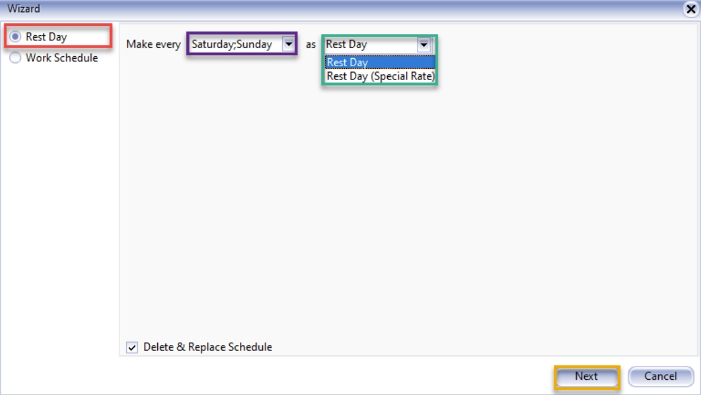

   5. Select **Session** and select **Schedule**

   :::warning
   You will not be able to set a past date
   :::

   

   | Schedule         | Description                                       |
   | ---------------- | ------------------------------------------------- |
   | By Months        | Assign on every month, in every week and each day |
   | By Days of Month | Assign on every month and each days of month      |
   | By Weeks         | Assign on week of year and each days of month     |
   | Custom           | Assign date by date                               |

2. View Calendar

   1. Navigate to **Time Attendance** > **Maintain Calendar**

   2. Click on **View Schedule**, it should show all the **calendar and day type**

      

3. Copy Calendar from Employee

   1. Navigate to **Time Attendance** > **Maintain Calendar**

   2. **Tick** employee you wish to replicate calendar, and click on the dropdown 🔽 besides the **Wizard** button, select **Copy From**

      

   3. Specify the **Date Range**, select **Copy From** which employee and finally press **OK**

      

4. Clear Calendar

   :::note
   Not able to clear past date with work session (Rest day will still clear)
   :::

   1. Navigate to **Time Attendance** > **Maintain Calendar**

   2. **Select** the employees you wish to clear all calendar and click on the dropdown 🔽 besides the **Wizard** button, select **Clear All**

      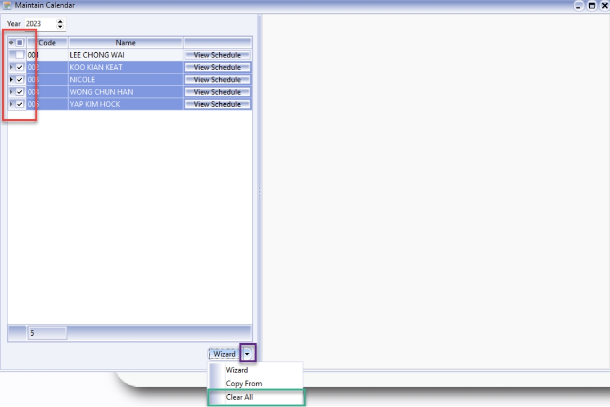

   3. Select the **date range** to clear all calendar and press **OK**

      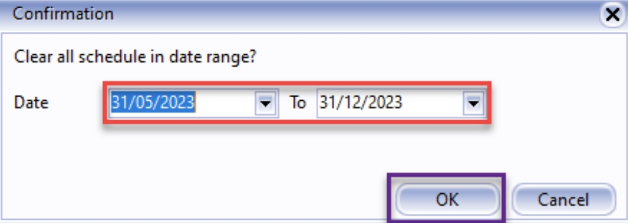

   4. Click on **View Schedule** to view the changes, all the **Rest Day** will be cleared

      

### 2.4 Maintain Traveller Location

1. Wizard Traveller Location

   :::info
   Repeat the guide if Traveller Clock In / Clock Out in more than one location on different day
   :::

   1. Navigate to **Time Attendance** > **Maintain Traveller Location**

   2. **Select** employee you want to do wizard location and click on the **Wizard** button

      

   3. Select the option

      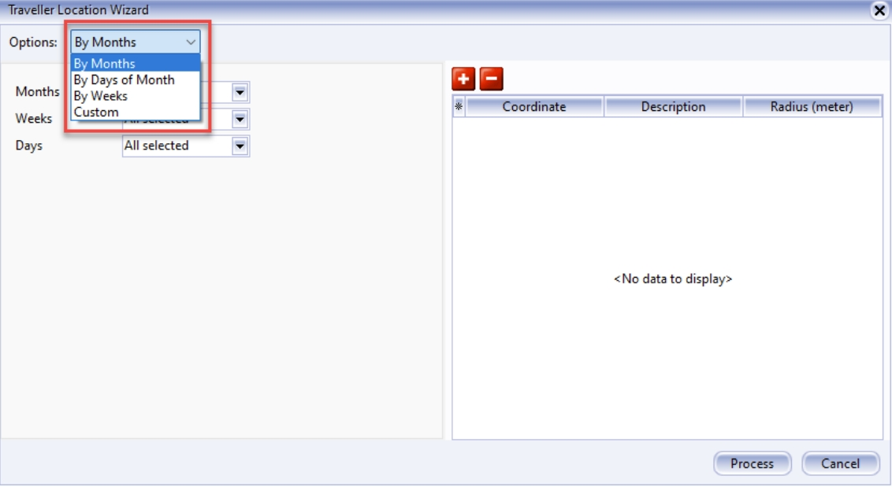

      | Schedule         | Description                                       |
      | ---------------- | ------------------------------------------------- |
      | By Months        | Assign on every month, in every week and each day |
      | By Days of Month | Assign on every month and each days of month      |
      | By Weeks         | Assign on week of year and each days of month     |
      | Custom           | Assign date by date                               |

   4. Select Months, Weeks, and Days, click on the ➕ button and select **Map**

      

   5. Select your desired **GPS Type**. There are two **GPS Type**:

      - **Branch**: This type is specifically for enabling Clock In / Clock out for travellers

      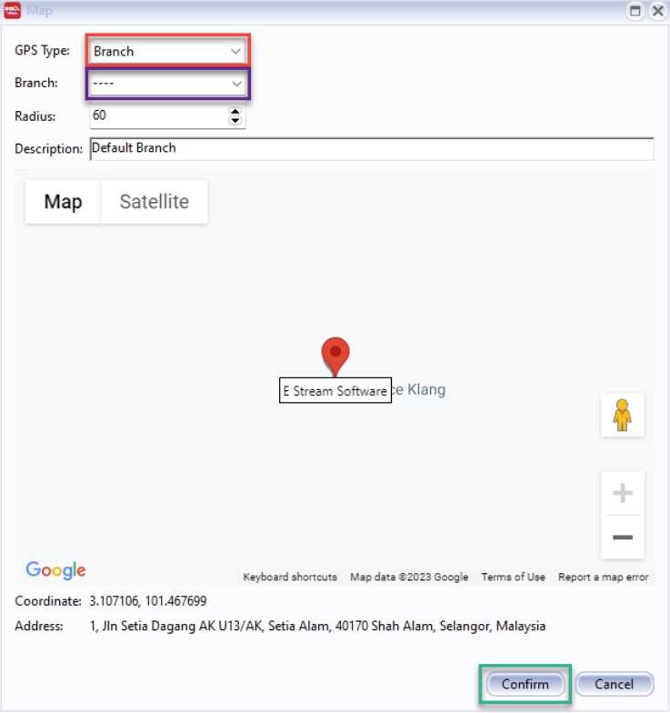

      - **Custom**: For custom, key in the **Address**, click **Search** to look for the location and lastly press the **Confirm** button

      

   6. After that, click **Process** to set the rule

      

   7. You can add multiple locations if your employee is allowed to Clock In / Clock out in different places

      

2. View Traveller Location

   1. Navigate to **Time Attendance** > **Maintain Traveller Location**

   2. Click on **View Location** to show all the **Location to Clock In / Clock Out**

   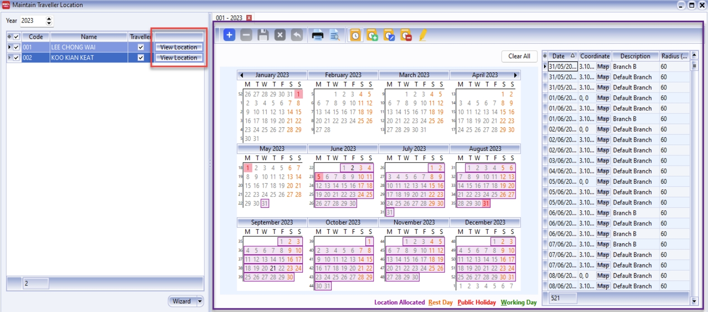

3. Copy Location from Traveller Employee

   1. Navigate to **Time Attendance** > **Maintain Traveller Employee**

   2. **Select** the employees you wish to replicate the location and click on the dropdown 🔽 besides the **Wizard** button, select **Copy From**

      

   3. Specify the **Date Range** and select which employee to copy from, and press **OK**

      

4. Clear Location

   :::info
   Take note you will not be able to clear location past date
   :::

   1. Navigate to **Time Attendance** > **Maintain Calendar**

   2. **Select** the employees you wish to clear all the location and click on the dropdown 🔽 besides the **Wizard** button, select **Clear All**

      

   3. Specify the **date range** to clear all calendar and press **OK**

      

   4. To see the updates, click on **View Location** and you will be able to see all the **Location** records have been clear

      

## 3 Cloud (Time Attendance)

### 3.1 Sync Cloud

1. Sync

   1. Navigate to **Cloud ☁️** > **Sync Cloud**

   2. Press **Sync All**

   3. Next, go to **Time Attendance** tabbed view

      

   4. Check the bottom left tray, the status should shows **Sync Complete**

      

2. Log

   1. Navigate to **Cloud** > **Sync Cloud**

   2. Next, go to **Time Attendance** in the tabbed view

   3. In the **Log** tab, you will see history of employee clock in / clock out status

      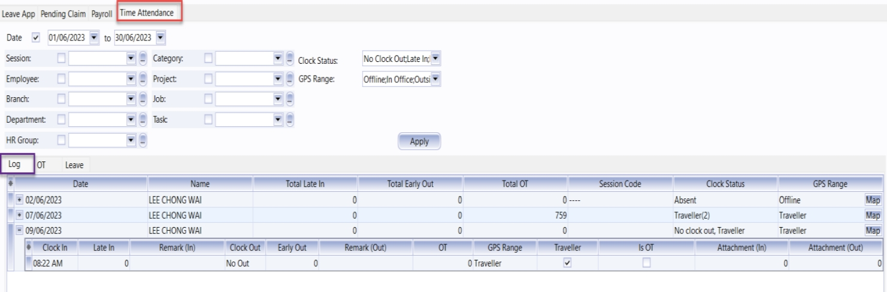

3. OT

   1. Navigate to **Cloud** > **Sync Cloud**

   2. Next, go to **Time Attendance**, the **OT** tab, and click on the **Action** dropdown

      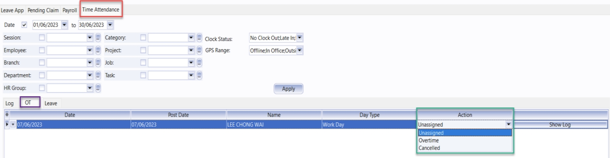

   3. The table below explains different action you can modify for the employee OT:

      | Actions    | Description                         |
      | ---------- | ----------------------------------- |
      | Unassigned | Not yet allocated any action        |
      | Overtime   | This working period is assign to OT |
      | Cancelled  | Cancelled for this working session  |

   4. When set the action to **Overtime**, it might be highlighted as Green 🟢 or Red 🔴

   5. If it appears as Green 🟢, it will be posted to _Pending OT_

      

   6. If it appears as Red 🔴, it **WILL NOT** be posted to pending OT, and action will be automatically switched to "Unassigned" due to **missing OT code**

      

   7. To resolve the Red 🔴 case, choose OT Code by right clicking on the record, and select **Edit**

   8. Choose the **OT Code** for the employee and click **Save**

      

   9. Besides, you can also see logs of employee who had OT by clicking on **Show Log**

      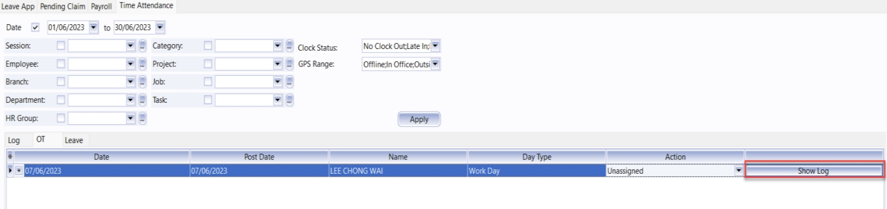

      

4. Leave

   1. Navigate to **Cloud** > **Sync Cloud**

   2. Select **Leave** in the tabbed view

   3. In the **Leave** tab, you can configure the **Action** and **Leave Type**. There are a variety of actions + leave combinations to control the leave, refer to table below:

      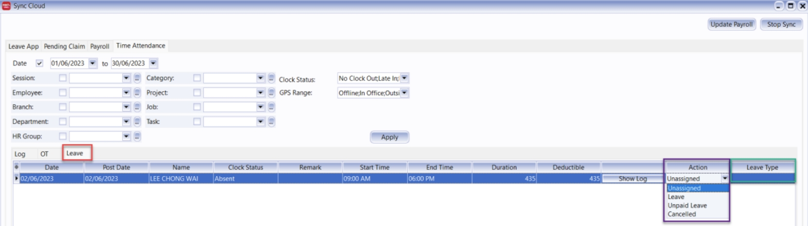

      | Actions      | Leave Type | Description                                       |
      | ------------ | ---------- | ------------------------------------------------- |
      | Unassigned   | -          | Not yet allocated any actions                     |
      | Leave        | AL, MC     | Will be deducted as Annual Leave or Medical Leave |
      | Unpaid Leave | UL         | Will be deducted as Unpaid Leave                  |
      | Cancelled    | -          | Cancelled for this Leave                          |

### 3.2 Time Attendance Log

:::info NOTE
Only will prompt out for employee who did not Clock Out, HR need assign Clock Out Time manually.
:::

1. Enter **Clock Out** time

2. Tick if **IsOT** (optional)

3. Enter **Break Time** (optional)

   

4. **Save**

   

### 3.3 Attendance Reward

:::info
By default, meal allowance is set to RM20, you can refer service consultant to change the settings
:::

1. Navigate to **Time Attendance** > **Print Time Attendance Summary**

2. Make sure to **TICK ALL** under **Clock Status**

   

3. **Apply** and click on **Attendance Reward**

   

4. Press on **Save**

   

5. After save, the reward will appear under open pending payroll (you can navigate to **Payroll** > **Open Pending Payroll** > **Allowance** to view it)

   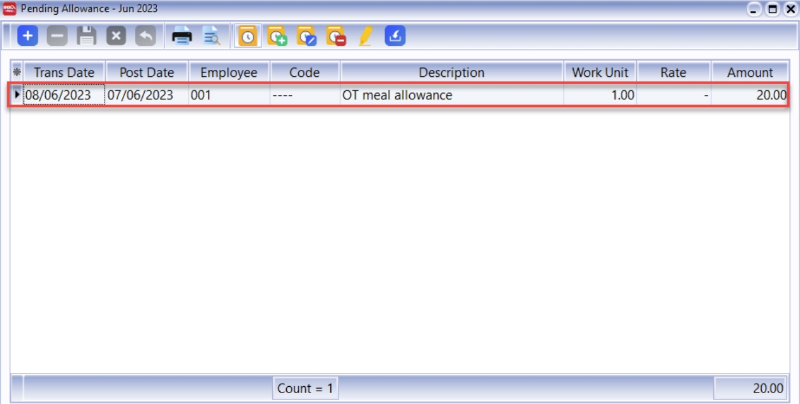

## 4 Application SQL HRMS

### 4.1 Installation For iPhone User

:::note
Minimum IOS version: **IOS 14 and above**
:::

1. Click on App Store

   

2. Click on **Search** (bottom right hand side)

   

3. Key in “**SQL HRMS**” in search bar

   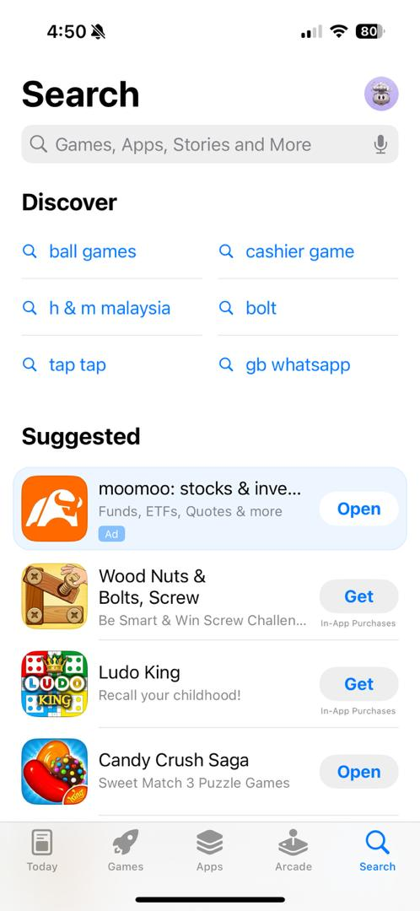

4. Click on **GET**

   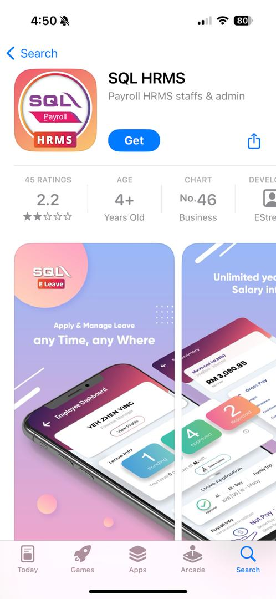

5. Done

### 4.2 Installation for Android User

:::note

- Minimum android version: **Android 8.1 and above**

- Huawei phones were banned from using Google services in 2019. Therefore, since SQL HRMS utilizes Google technology, certain models of Huawei phones may not be able to enjoy our app

:::

1. Click on App Store

   

2. Key in “**SQL HRMS**” in search bar | Enter

3. Click on **Install**

   

### 4.3 Login to the Application

1. Open the mobile application, key in your registered email and click **Next**

   

2. You will receive OTP in your email, go to your mailbox to grab the code

   :::info
   If you didn't receive the mail, kindly check the spam box. The OTP email might have been falsely classfied as spam by mail classifier. If not in spam box, click **Resend** to receive a new OTP mail
   :::

3. **Enter the OTP Code** and click **Verify**

   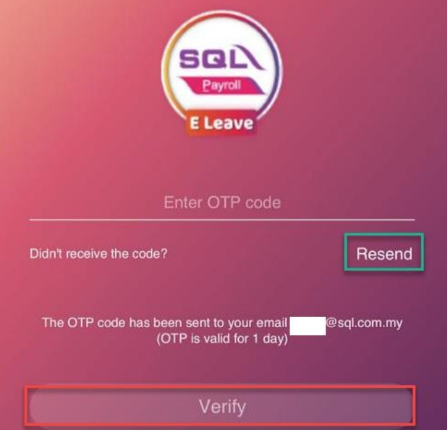

### 4.4 Location Setup For iPhone User

1. Turn on Location Services

   1. Click on **Setting**

      

   2. Click on **Privacy & Security**

      

   3. Click on **Location Services**

      

   4. Turn on **Location Services** (Make sure is green color)

      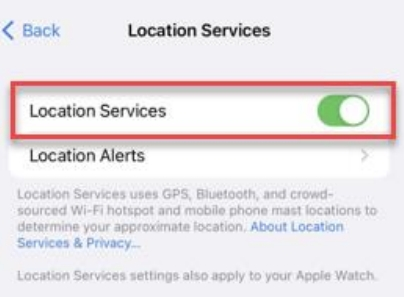

   5. Scroll down and choose **SQL HRMS**

      

   6. Choose **Always** & **Precise Location** make sure is **ON**

      

### 4.5 Location Setup for Android User

1. Turn on Location Services

   1. Click on Setting

      

   2. Click on **Location**

      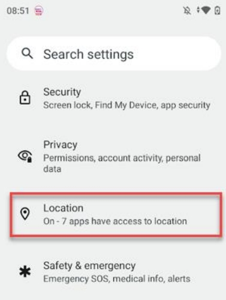

   3. Turn on **Use Location**

      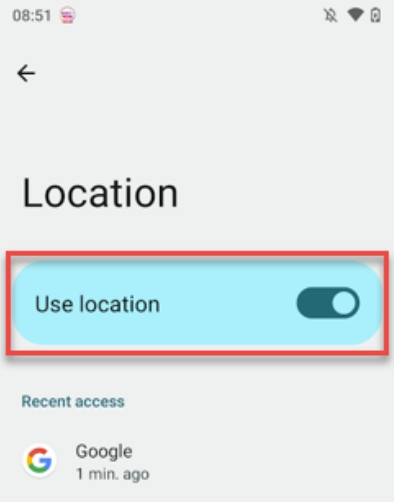

   4. Click on **SQL HRMS**

      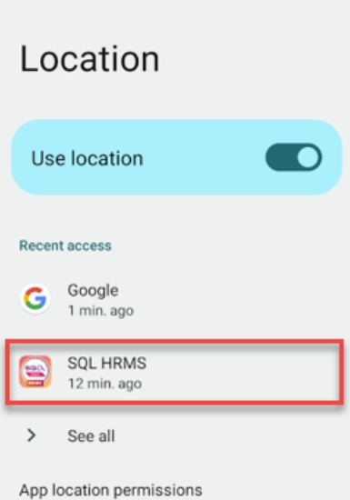

   5. Choose **Allow all the time** & **Precise Location** make sure is **ON**

      | 1. Allow all the time                                                                  | 2. On the Precise Location                                                           |
      | -------------------------------------------------------------------------------------- | ------------------------------------------------------------------------------------ |
      | 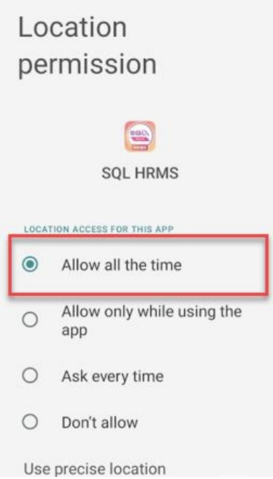 |  |

## 4.6 Clock In

1. Click **Clock In**

   

2. When you have reach your work location, you should see the status changed to **Location matched**. Take a photo by clicking on **Take Photo** and press **Clock In**

   

3. From the screen, you can check your current location by clicking on **View Work Location**

4. If the location does not match, the app will show a message **Please Clock In At XXX (Location set)**

### 4.7 Clock Out

1. Click **Clock Out**

   

2. Whe you are in your work location, you shoul see the status is **Location Matched**. Take a photo by clicking on  **Take Photo** and press **Clock Out**

3. Click **Claim OT** when you did OT. Key In Total OT Break Time when you OT, system will deduct the break time when calculate OT

   

### 4.8 Attendance Log

1. View the duration of work for this period working days

   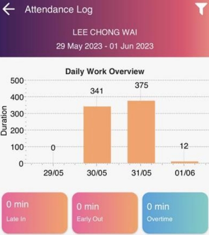

2. Click **Location Updates** to view time and location of clock in & clock out

   

### 4.9 Team Attendance

1. Status will show all staff attendance status

   - View All to view status in detail

   - Attendance Log to view employee clock in & clock out status

2. Click each Status can view details of that status

   

   

3. Summary of all status (Employee name will be show)

   

### 4.10 OT Entitlement

:::info
Can view the OT Entitlement set by company
:::

### 4.11 My Calendar

1. View Work Session using Calendar
2. View Working Location for each day

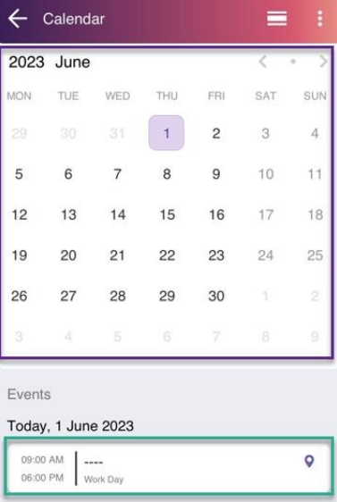
