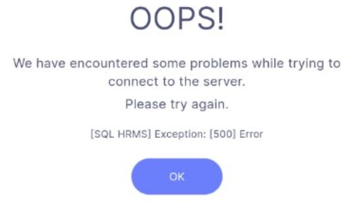

<!-- markdownlint-disable-next-line MD041 -->
## Connectivity & Login

### 1. Error: “OOPS! We have encountered some problems while trying to connect to the server. Please try again.”

Verify branch settings in SQL Payroll:

- **Radius** is blank → SQL Payroll → **Human Resource → Maintain Branch** → enter a radius value.
- **Branch description** is empty → SQL Payroll → **Human Resource → Maintain Branch** → fill in the description.

### 2. Error: `[SQL HRMS] Exception: [404] User Name 'xxxx' not found in Payroll`

Confirm these items before logging in:

- You’re using the correct email address.
- If the email was just added in **Maintain Employee**, run **Sync Cloud** so HRMS picks it up.
- The employer email field in **Maintain Employee** is populated.

---

## Device Requirements

### 3. What are the minimum mobile OS versions for SQL HRMS?

- **Android:** 5.0 (Lollipop) or newer.
- **iOS:** 12 or newer.

---

## Payroll & Sync Settings

### 4. Error: `Cannot cast Object into String` during Sync Cloud

This error occurs when a leave type or claim code description is blank.

**Fix it in SQL Payroll:**

- **Claims:** Payroll → **Maintenance → Maintain Claim** → ensure every claim code has a description.
- **Leave:** Payroll → **Leave → Maintain Leave Type** → ensure every leave type has a description.
