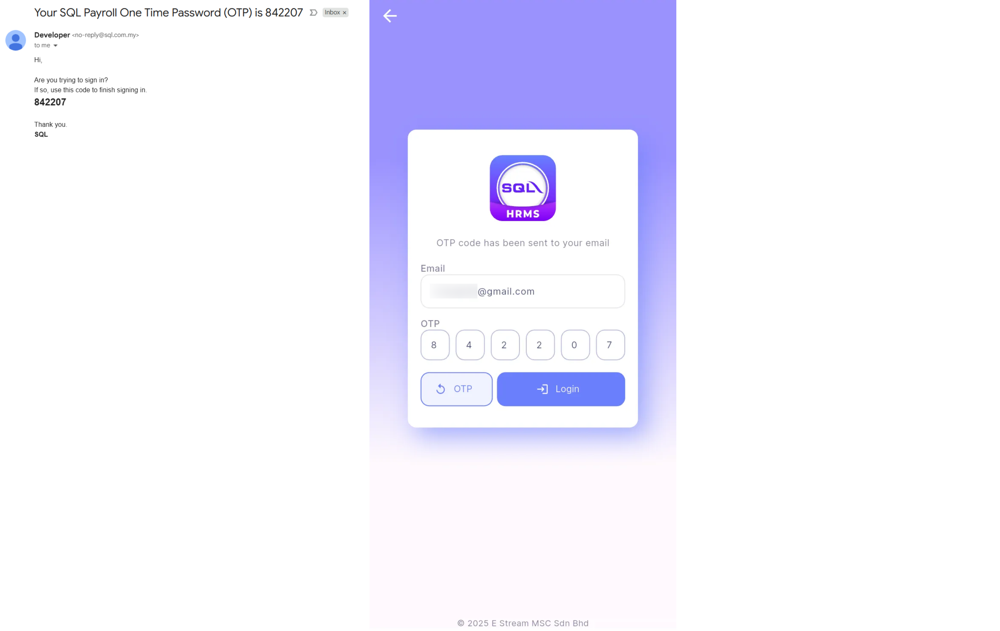

## Login

**Step 1:** Enter email | Next  
    
    

**Step 2:** Enter OTP sent to your email | Login  
    
    

## Try Live Demo

User may try out all the modules (E-TMS, E-Leave, E-Claim, E-Payroll) as manager

**Step 1:** Try Live Demo  
    
     

**Step 2:** Testing Company (Demo Data)
    
     
    
- Logout icon (top right): Logout from SQL HRMS app
