## SQL Drive

:::info[Prerequisites]
May contact SQL support to register email address for SQL Drive.

Make sure you are logging into an ADMIN user before proceed with the steps below.
:::

1. Navigate to File > Company Profile..., click on the ☁️.
   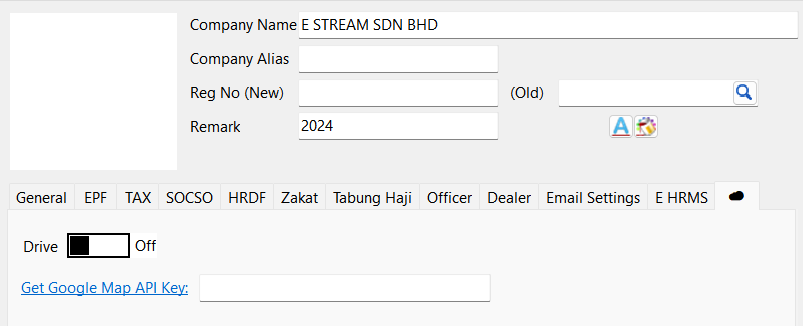

2. Switch on Drive.
   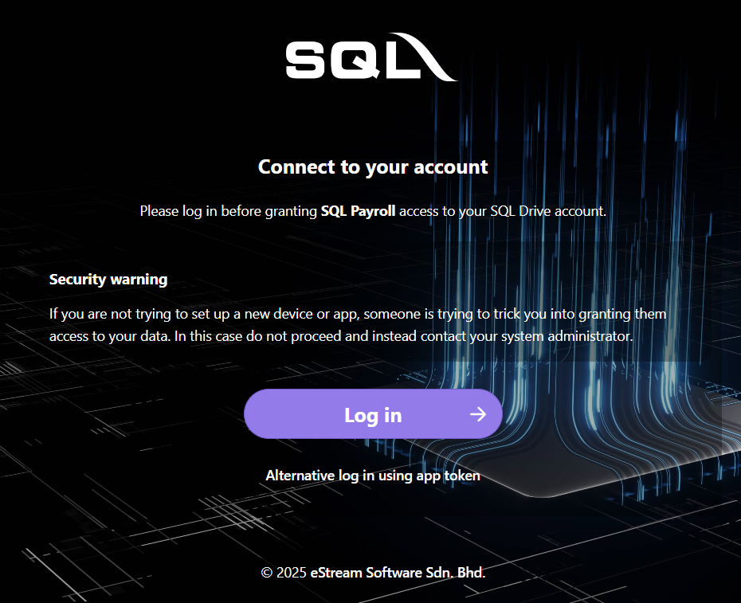

3. Click on "Log in" > Log in with Google. Enter your Gmail account + password and press on "Grant access".
   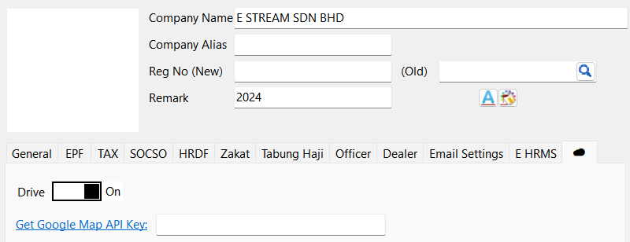

4. Save.

## SMTP

Before entering the SMTP settings, the user needs to create an app password using his company email address. This app password will be used for authentication when sending email using external program. If user do not have a company address, user can choose to get the app password using a Gmail or a Microsoft account.

1. Navigate to Company Profile > General tab.
2. Enter email that will be used to generate app password.
   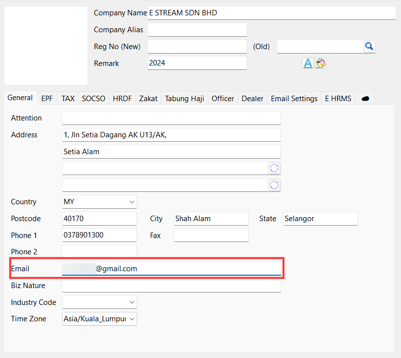

3. Go to Email Settings tab and fill in the required fields

    | Field       | Value                                                           |
    | ----------- | --------------------------------------------------------------- |
    | Host        | Google: `smtp.gmail.com`   Microsoft: `smtp.office365.com` |
    | Port        | 587                                                             |
    | User        | Email used to generate the app password                         |
    | Password    | The 16-character password generated in the email setup          |
    | Sender Name | Name of the sender                                              |

4. Send a test email to check if the config is right.

- User will receive an email under the email address used to generate the password upon successful

  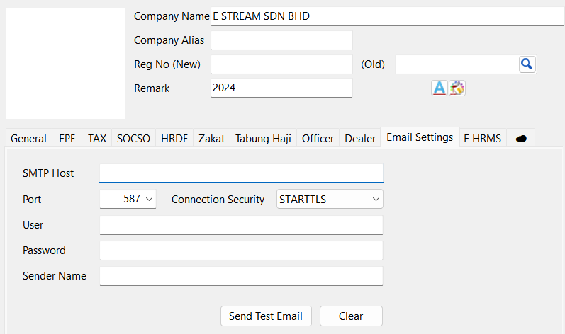

## Email Setup

### Google Account

1. Login to Google account
2. Turn on two-step verification
  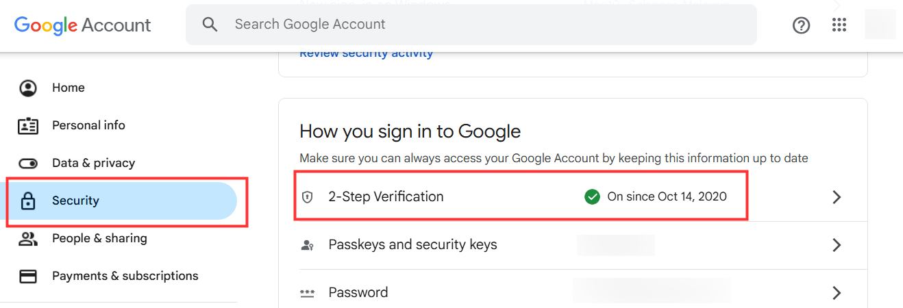

3. In the search bar, enter **_'app passwords'_** and choose **_'App passwords'_** under **_'Security'_**
  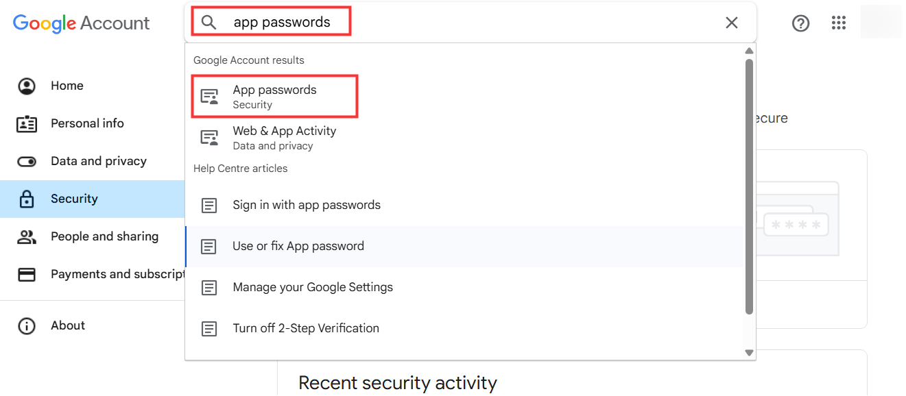

4. Enter a name for the App and click the **_'Create'_** button
  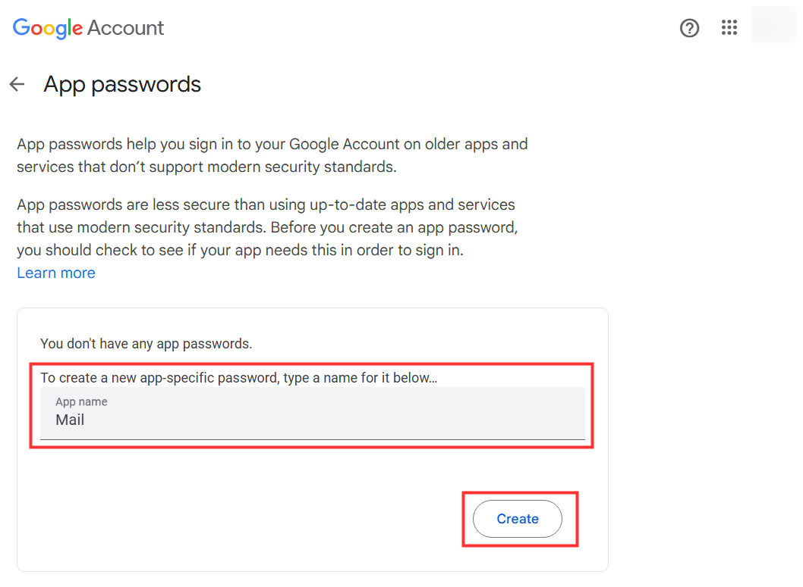

5. A 16-charactor password will be generated and follow the instructions under the **_'How to use it'_** section
  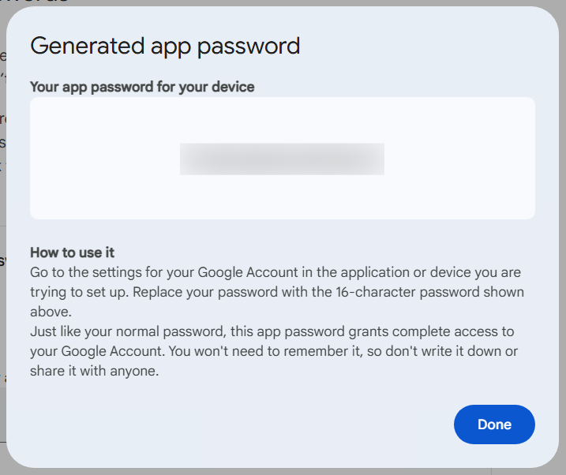

### Microsoft Account

1. Login to user Microsoft account
2. Direct to **_'Security'_** tab and click on **_'Manage how I sign in'_**
  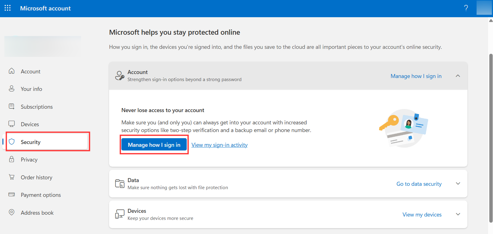

3. Turn on **_'Two-step verification'_**
  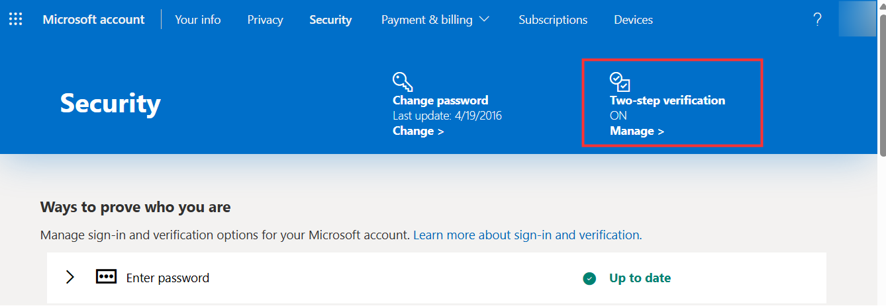

4. Still in the **_'Security'_** page, scroll down to **_'App passwords'_** and click on **_'Create a new app password'_**
  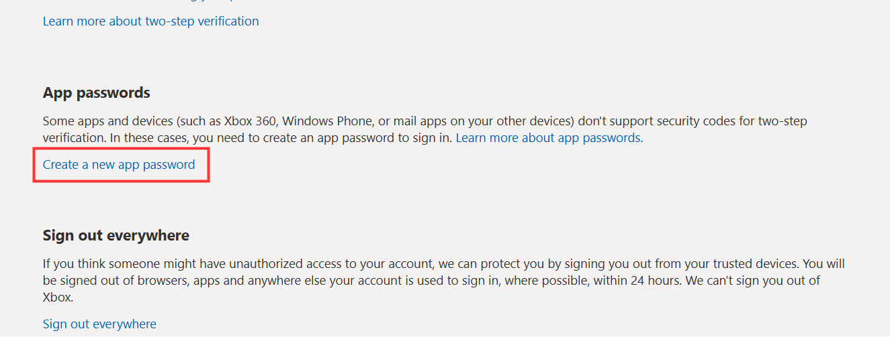

5. A 16-charactor password is generated
