## Location

### Android
**From SQL HRMS app**

**Step 1:** Turn on ***Location service***  

    

**Step 2:** Select ***'While using the app'***  

    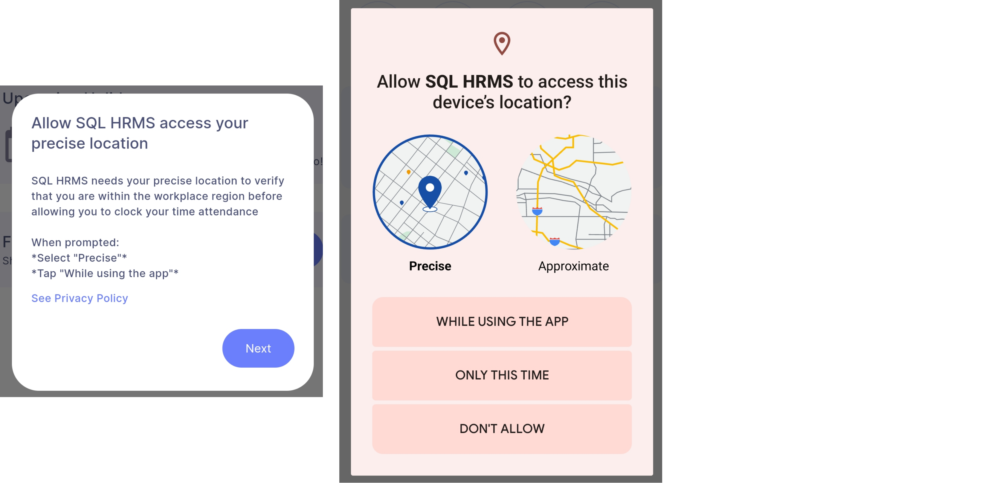

**Step 3:** Select ***'Update settings'*** and select ***'Allow all the time'*** | Return to SQL HRMS   

    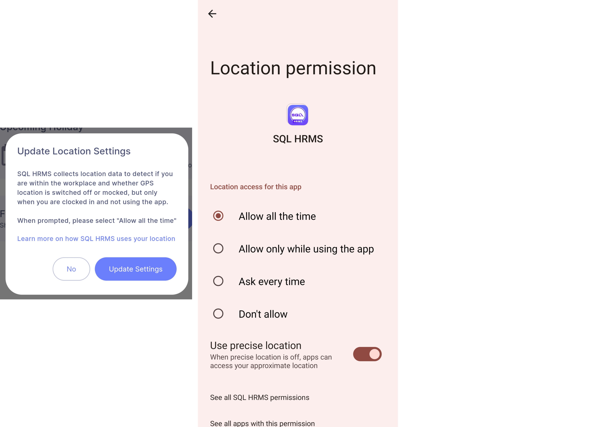

**From Device Settings**  

**Step:** App info | App permissions | Location | Select ***'Allow all the time'***  

    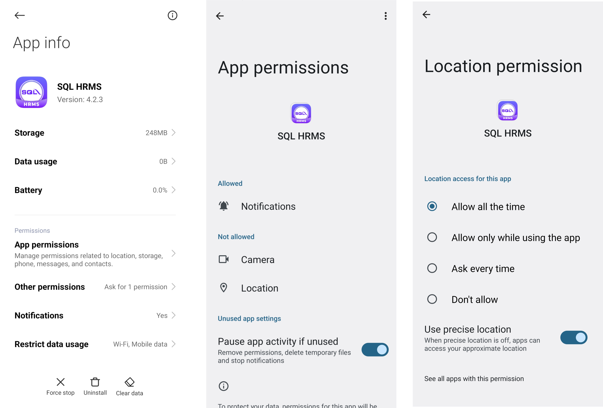

### iOS
**From SQL HRMS app**

**Step 1:** Privacy & Security | Location Service | Toggle ***'Location Services'*** on | Return to SQL HRMS   

    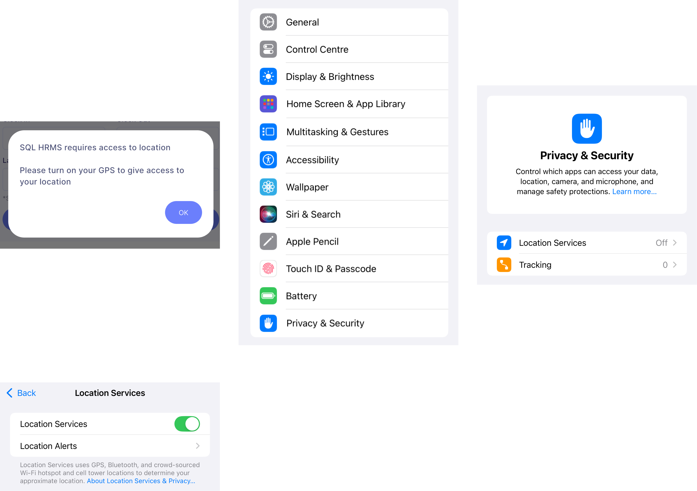

**Step 2:** Select ***'Allow While Using App'***  

    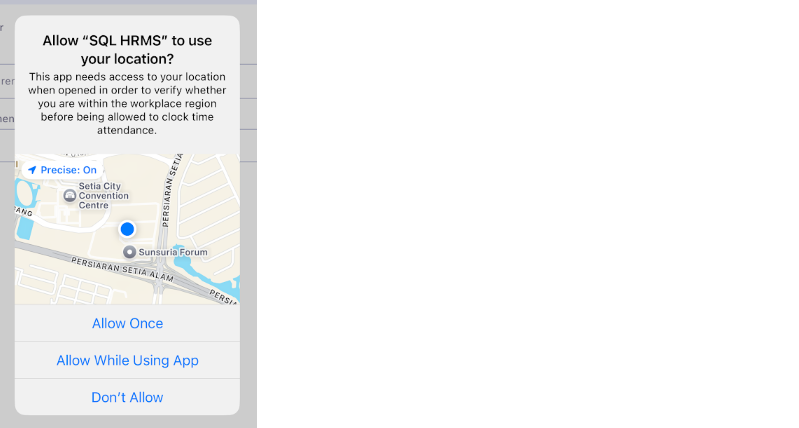

**Step 3:** Select ***'Change to Always Allow'*** 

    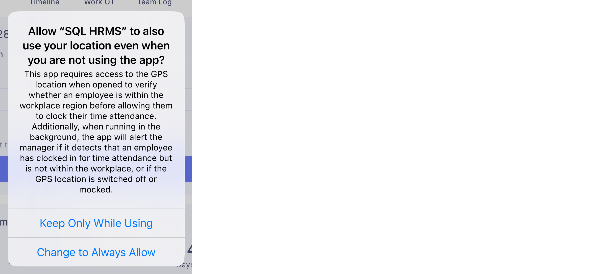

**From Device Settings**  

**Step 1:** Settings | Privacy & Security | Location Service | Toggle ***'Location Services'*** on  

    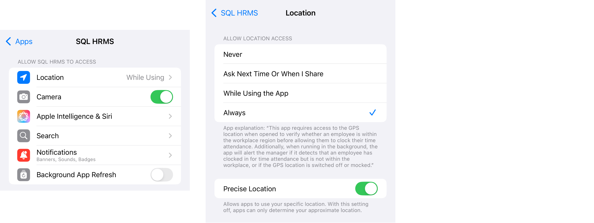

**Step 2:** Settings | Search for ***'SQL HRMS'*** | Location | Select ***'Always'***  

    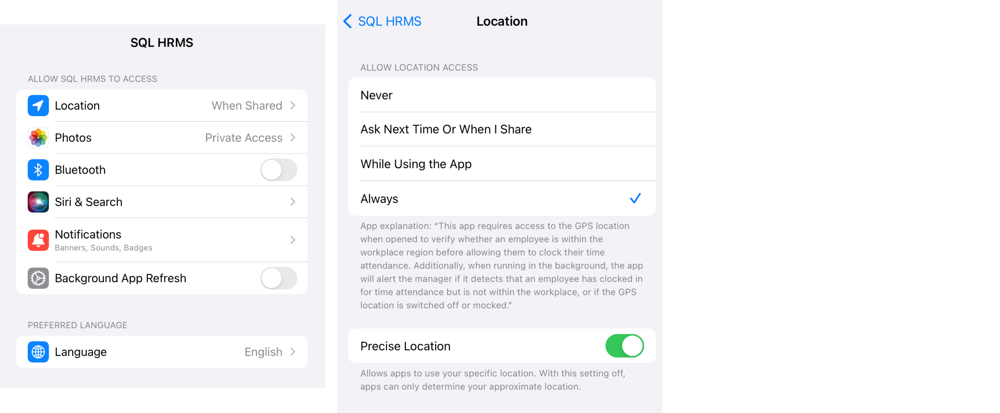

**Content & Privacy Restrictions**  

**Step 1:** Settings | Screen Time | Content & Privacy Restrictions  

    

:::info
If you have disabled this feature previously, you can skip all of the following steps
:::

**Step 2:** Enter your Screen Time Password if you have previously set one  

**Step 3:** Search for ***'Location Services'*** | Select ***'Allow Changes'*** and toggle ***'Location Services'*** on 

    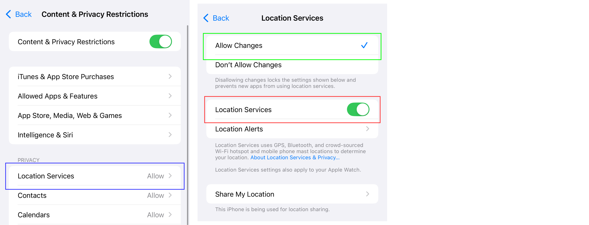  

## Notification

### Android

**From SQL HRMS app**  

**Step:** Select ***'Allow'***  

    

**From Device Settings**  

**Step:** App info | App permissions | Notifications | Select ***'Show notifications'***

    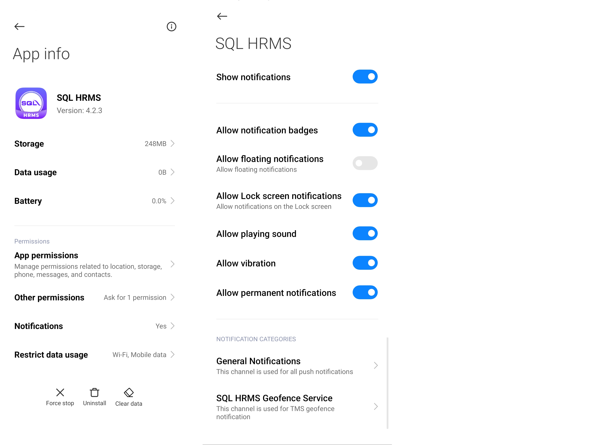

### iOS

**From SQL HRMS app**  

**Step:** Select ***'Allow'***  

    

**From Device Settings**  

**Step:** Settings | Search for ***'SQL HRMS'*** | Notifications | Toggle ***'Allow Notifications'*** on

      

## Camera

### Android

**From SQL HRMS app**  

**Step:** Select ***'While using the app'***  

    

**From Device Settings**  

**Step:** App info | App permissions | Camera | Select ***'Allow only while using the app'***

    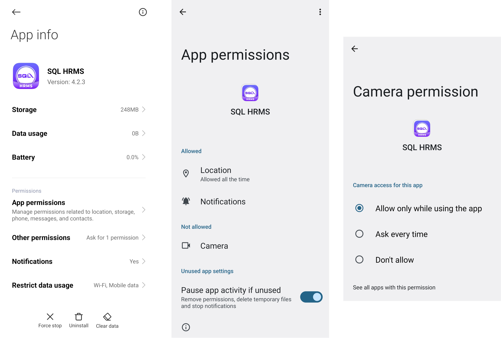

### iOS

**From SQL HRMS app**  

**Step:** Select ***'Allow'***  

    

**From Device Settings**  

**Step:** Settings | Search for ***'SQL HRMS'*** | Camera | Toggle ***'Camera'*** on  

      

## Photo Library  

### iOS

**From SQL HRMS app**  

**Step:** Select ***'Allow Full Access'***  

    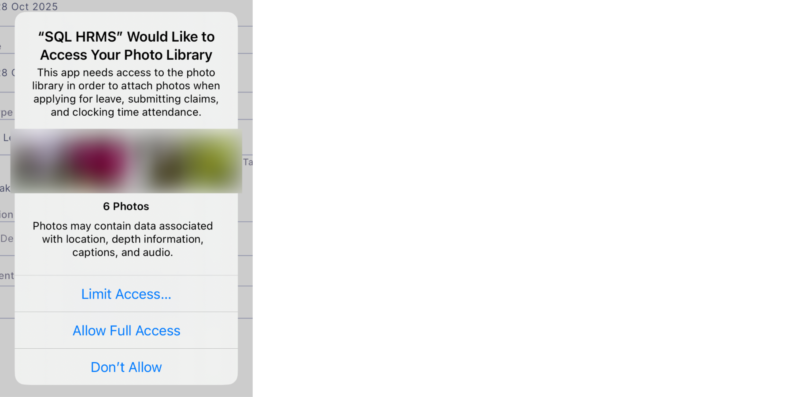  

**From Device Settings**  

**Step 1:** Settings | Search for ***'SQL HRMS'*** | Photos | Select ***'Full Access'***  

      

**Step 2:** Select ***'Allow Full Access'***  

    

## Nearby Devices / Bluetooth

### Android  

**From SQL HRMS app**  

:::info
For **Android 11 and below**, may skip to Step 2  
:::

**Step 1:** Select ***'Allow'***   

    

**Step 2:** Turn on ***Bluetooth service***  

    

**From Device Settings**  

:::info
Only for **Android 12 and above**  
:::

**Step:** App Info | App permissions | Nearby devices | Select ***'Allow'***  

    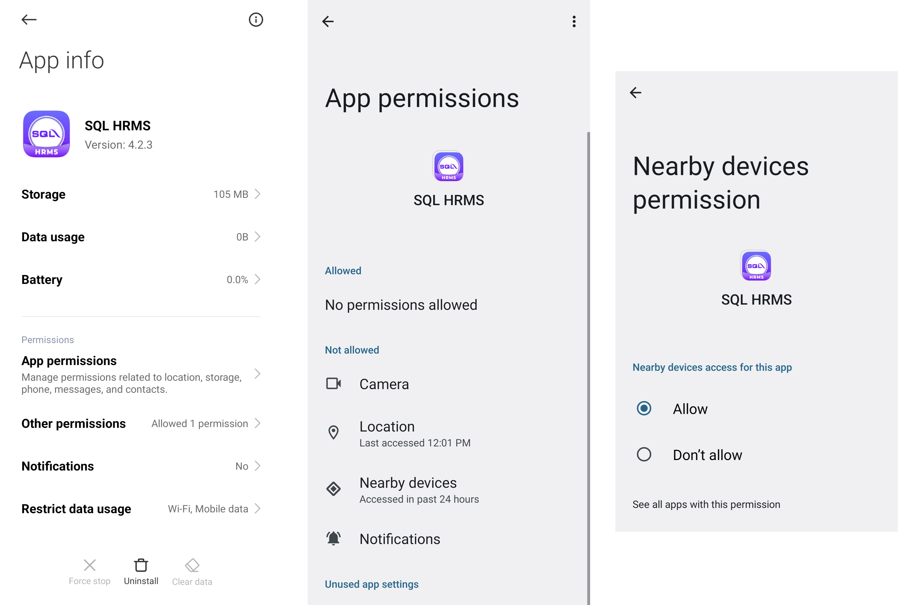  

### iOS

**From SQL HRMS app**  

**Step 1:** Select ***'Allow'***  

    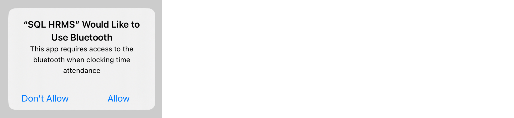  

**Step 2:** Select ***'Settings'*** | Toggle ***'Bluetooth'*** on | Return to SQL HRMS   

      

**From Device Settings**  

**Step 1:** Settings | Search for ***'SQL HRMS'*** | Toggle ***'Bluetooth'*** on  

      

**Step 2:** Settings | Bluetooth | Toggle ***'Bluetooth'*** on  

      