:::info
For full functionality in using the SQ HRMS mobile app, we recommend to have **E Leave** and **E Claim** setup, find out more below:

- [E Leave](e-leave)
- [E Claim](e-claim)

:::

## 1. Login Page

1. Enter user company email address

   

2. Wait to receive an email that include an One-Time Password (OTP)

   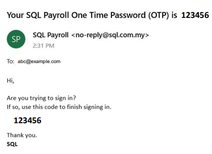

3. Enter the OTP

   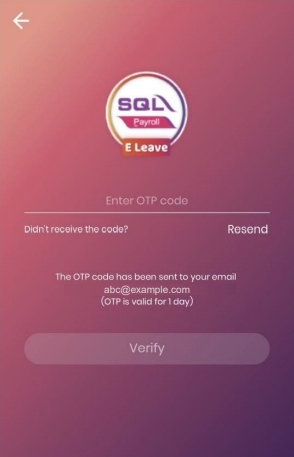

4. Ready to use the application after verification

## 2. Main Page

The Main Page display the company that the employee is enrolled in.

### 2.1 Header Section

### 2.2 Content Section

1. This button allows user to view selected company details

2. This button directs user to the employee dashboard which will be discussed under section 3.0

3. This button allows user to view the list of manager in the company

## 3. Employee Dashboard (Leave Info)

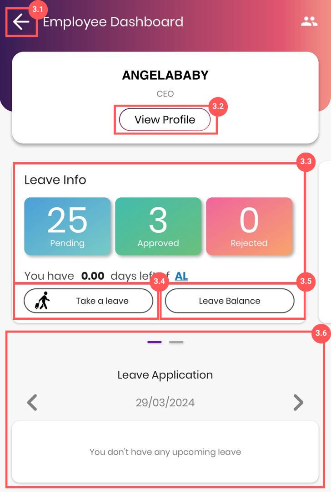

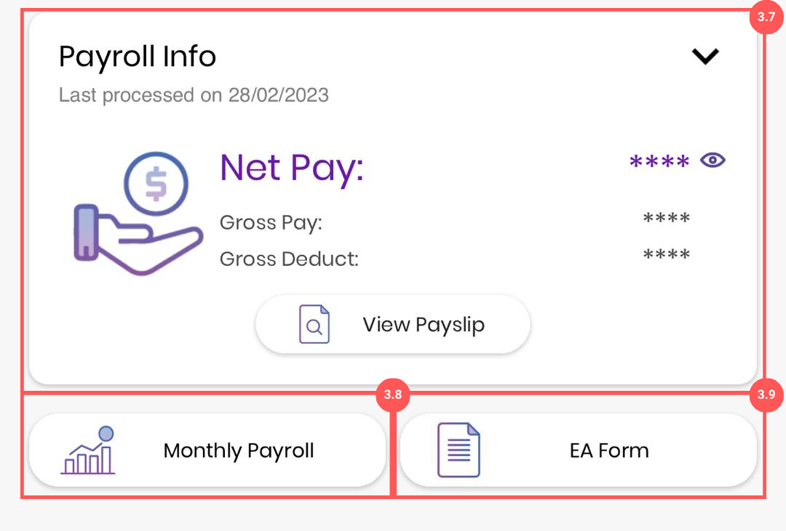

### 3.1 Back Button

This button allows you to back to the Main Page

### 3.2 View Profile

1. User can view their profile in the company payroll system based on the groupings in

   - [General, Grouping, Family, Payroll Info]

   - Note: User are **not allowed** to **edit** or **modify** the details from the mobile application

   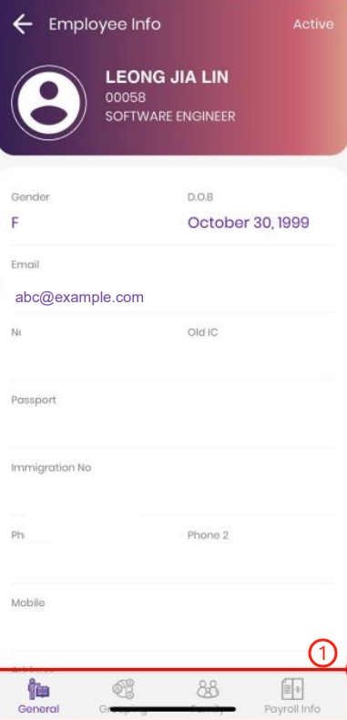

### 3.3 Leave Info

User can view the summary of his leave from the employee dashboard and he can view the details of his leave upon clicking on the leave info dashboard.

- User can view the approved, rejected and pending leave details from this page

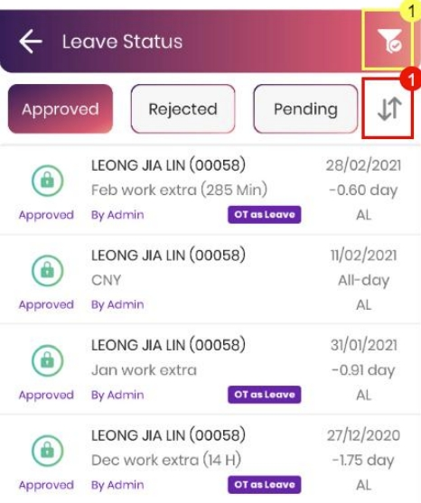

- Filter button (**Highlighted in Yellow**) : This menu allows user to **filter** the leave details

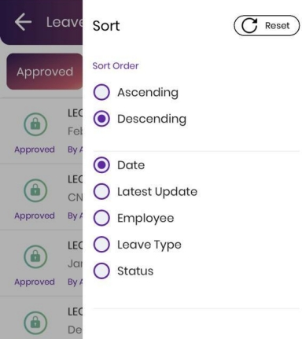

- Sort button (**Highlighted in Red**) : This menu allows user to **sort** the leave details

### 3.4 Take Leave

This button allows user to create a new leave application after filling in the details and submit the application by clicking the ‘SUBMIT’ button

- User can choose set the date time, leave type and add on description when applying the leave

### 3.5 Leave Balance

This button allows user to view his leave balance details by year and filter menu on right top allows user to filter the details based on date and department

| View                                                                         | Filter                                                                           |
| ---------------------------------------------------------------------------- | -------------------------------------------------------------------------------- |
|  |  |

### 3.6 Leave details

Users are allowed to view the past and upcoming leaves applied

### 3.7 Payroll Info

Users can view the latest processed payroll info

### 3.8 Monthly Payroll

Users are allowed to view the net amount of salary obtained for each month

### 3.9 EA Form

Users are allowed to view his EA Form

## 4. Employee Dashboard (Claim Info)

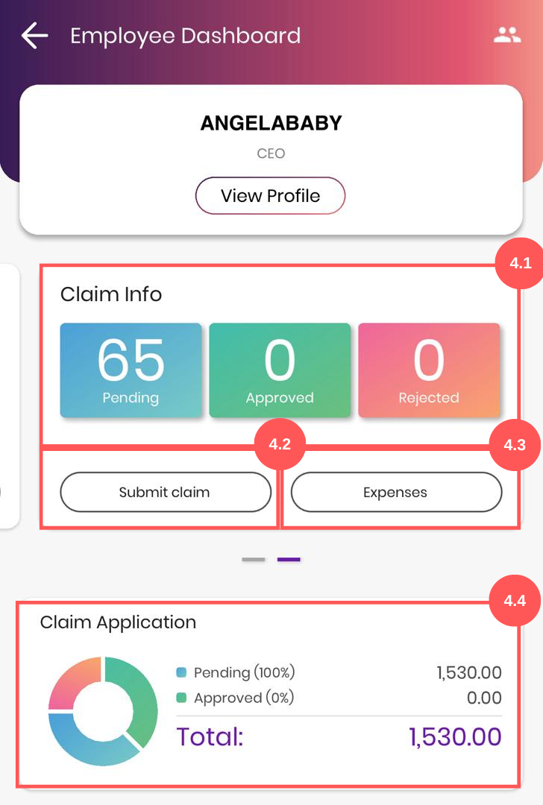

### 4.1 Claim Info

User can view all the approved, pending and rejected claim when clicked on the claim info dashboard

- Filter button (**Section 1**) : User can filter the leave details by date, expenses type and the claim status

- Sort button (**Section 1**) : User are allowed to sort the leave details

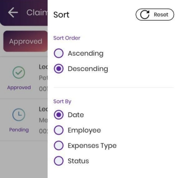

### 4.2 Submit Claim

User are allowed to create a new claim submission by clicking the ‘**Submit claim**’ button

- User are allowed to upload images and attach it to the claim submission as reference

| Screenshot 1                                                     | Screenshot 2                                                                                         |
| ---------------------------------------------------------------- | ---------------------------------------------------------------------------------------------------- |
| 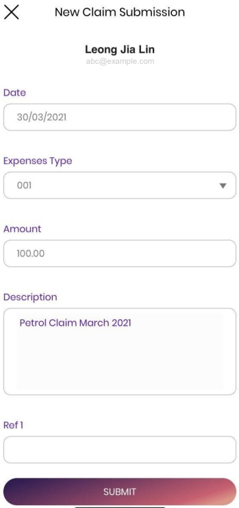 | 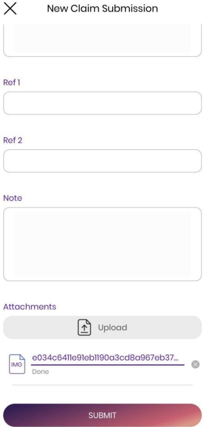 |

:::note

Users are required to setup E Claim Share in SQL Payroll in order to allow their employee to upload images/documents

:::

### 4.3 Expenses

User can view the details of expenses used by month and by year

### 4.4 Claim Application

User can view the summary and total amount of the claim in the form of pie chart
