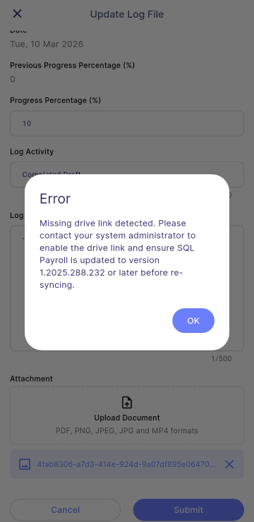

## Payroll & Sync Settings

### Error: Missing drive link detected. Please contact your system administrator to enable the drive link and ensure SQL Payroll is updated to version 1.2025.288.232 or later before re-syncing

This error occurs when no Drive link is present to upload attachments or images.

**Fix it in SQL Payroll:**

- Check if drive link is present in SQL Payroll. May refer [**Drive Setup**](/integration/hrms/payroll-setup#sql-drive)