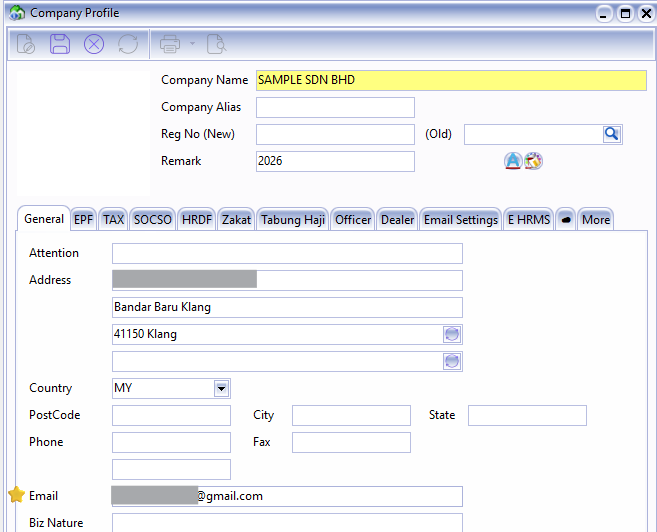
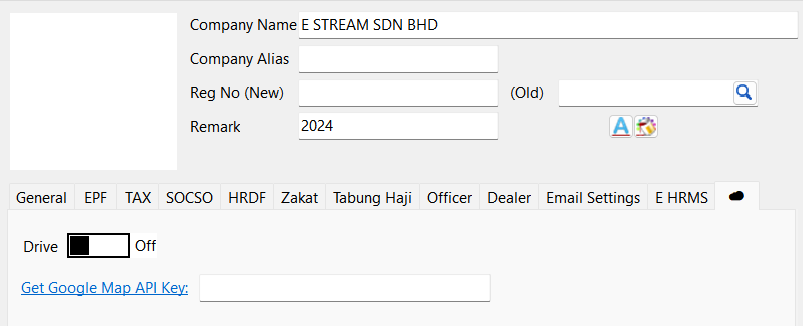
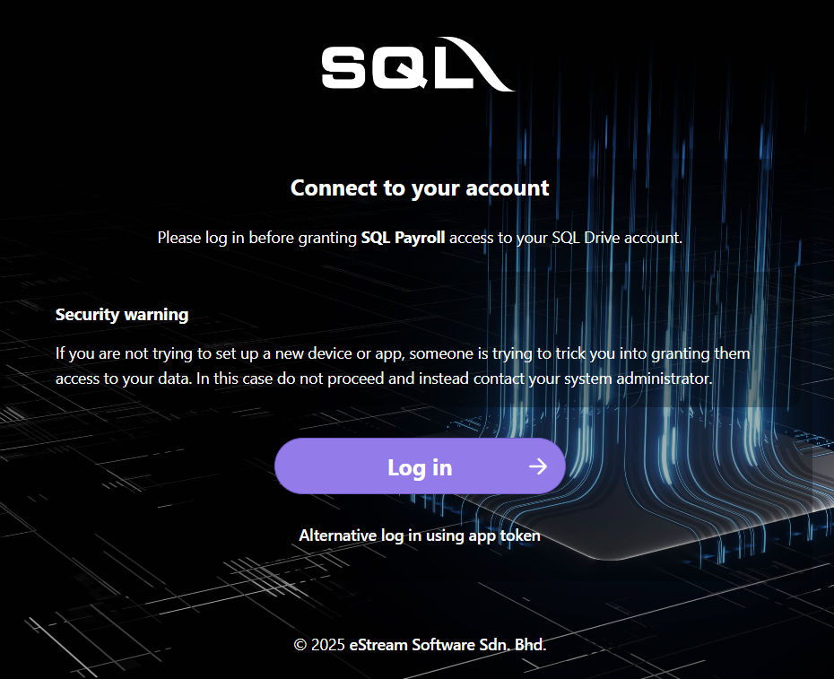
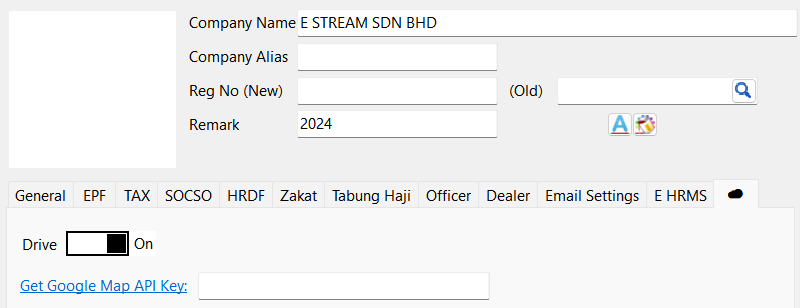
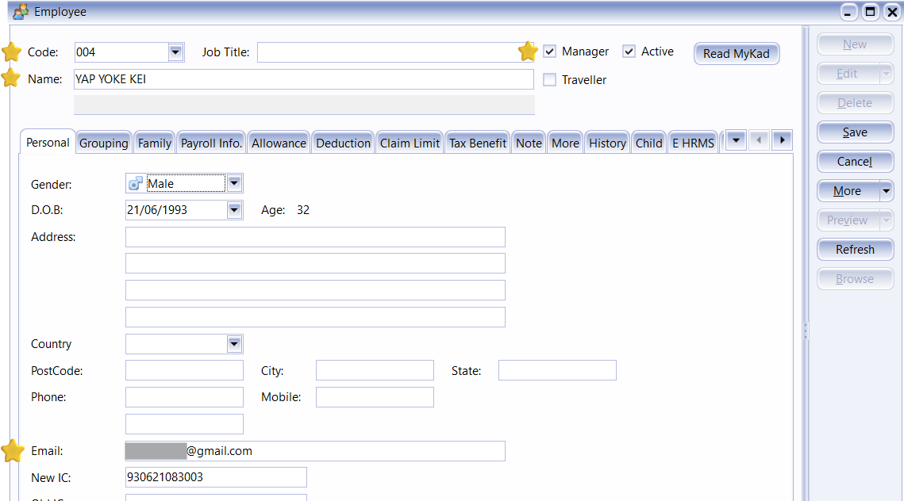
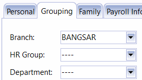
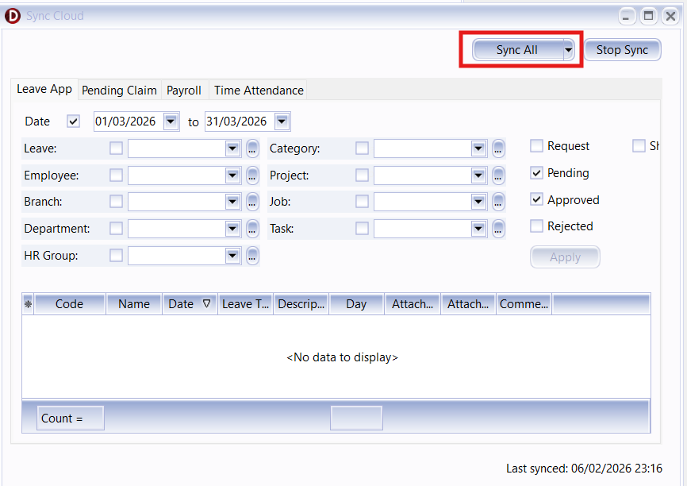

## SQL Payroll Company

1. Navigate to Files > Company Profile and enter company details
2. Important Fields :
    - Company Name
    - Email (for getting OTP)

## SQL Drive

If you wish to upload images or attachments in Gift module or Assignment module you will require this step. If no may skip to the next step.

:::info[Prerequisites]
May contact SQL support to register email address for SQL Drive.

Make sure you are logging into an ADMIN user before proceed with the steps below.
:::

1. Navigate to File > Company Profile..., click on the ☁️.
   

2. Switch on Drive.
   

3. Click on "Log in" > Log in with Google. Enter your Gmail account + password and press on "Grant access".
   

4. Save.

## SQL Payroll Employees

1. Navigate to Human Resource > Maintain Employee
2. Create New Employees or go to existing employees
3. Important Fields:
    - Employee Code
    - Name
    - Manager Tag (This will determine their role in SQL Vision)
    - Active Tag
    - Email (For each employee to login to their account)

    
4. Optional Fields:
    - Group > Branch / HR Group / Department may be used to categorise employee

    

## Sync to SQL Vision

This step will automatically sync all data to SQL Vision. If in future have any changes e.g. employee info, may perform this step again.

1. ☁️ > Sync Cloud..
2. Click Sync All
    

:::info Login

After completing the setup, you can proceed to log in to the employee account as usual.

:::