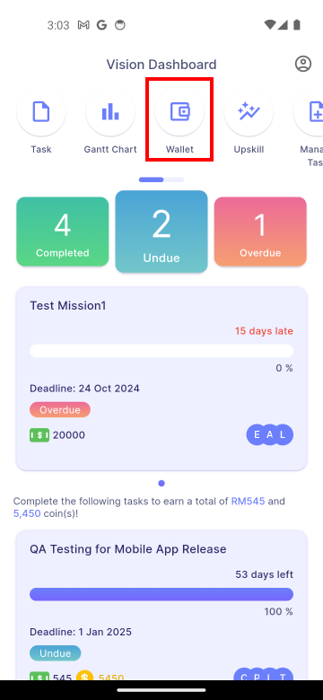

# Introduction

The Gifts feature, accessible through **Main Dashboard > Wallet > Gifts**, allows managers to create digital gifts that all users can redeem using coins earned from completing missions.

|||
|:--------------------------------|:--------------------------------|
