# Manager View

:::info[Note]

These features are only available to **manager**.  

:::

## Gift Creation

:::info[Note]
After manager creates a gift, users will receive notification regarding the new gift.
:::

1. To add a new gift, managers can go to **More icon> Add Gift**.

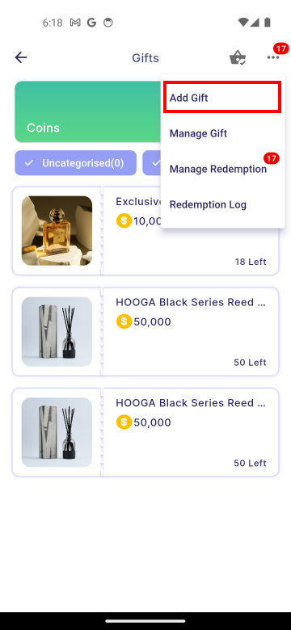

2. Gift Redemption Details

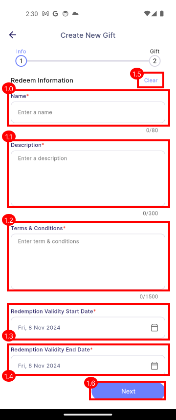

| Properties                   | Description                                                                        | Note     |
|:-----------------------------|:-----------------------------------------------------------------------------------|:--------:|
| **Name** | The name of the gift.                                                                               | Required |
| **Description** | A detailed description of the gift.                                                          | Required |
| **Terms & Conditions** | To specify the rules, requirements, guidelines, and limitations that the user must agree to in order to redeem the gift.                                                                                                               | Required |
| **Redemption Validity Start Date** | The first date when the gift can be redeemed.                            | Required |
| **Redemption Validity End Date** | The last date when the gift can be redeemed.                                | Required |
| **Clear** | Clears all content on the current page.                                                            |    -     |
| **Next** |  Navigates to the previous page.                                                             |    -     |

3. Gift Redemption Criteria

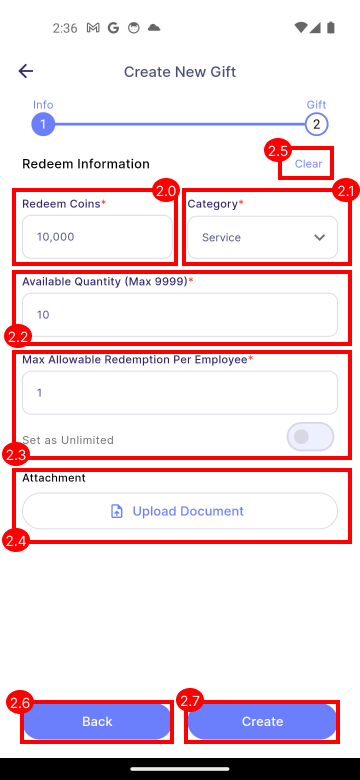

| Properties                   | Description                                                                        | Note     |
|:-----------------------------|:-----------------------------------------------------------------------------------|:--------:|
| **Redeem Coins** | To specify the amount of coins required to redeem the gift.                                | Required |
| **Category** | To select a category to classify the gift, such as Uncategorised, Food & Beverages, Shopping, Service, Entertainment, Digital Goods, or Travel Accommodation.                                                                                            | Required |
| **Available Quantity** | To specify the total number of units of the gift that are available for redemption.             | Required |
| **Max Allowable Redemption Per Employee** | To specify the maximum number of times a user can redeem the gift.| Required |
| **Attactment** | To upload an image associated with the gift, such as a product photo or promotional graphic, through the mobile's camera or gallery.                                                | - |
| **Clear** | Clears all content on the current page.                                                            |    -     |
| **Back** | Navigates to the previous page.                                                                    |    -     |
| **Create** |  To submit and create the new gift entry after filling in all required details.                   |    -     |

## Gift Update

1. Choose Gift - To update a gift, the manager can go to **More icon > Manage Gift** and select the gift want to be update.

|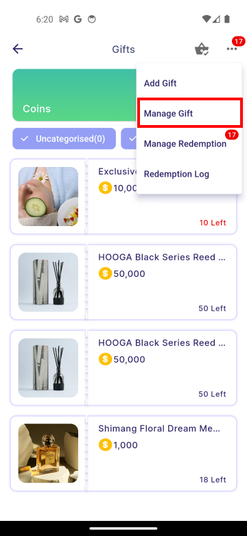|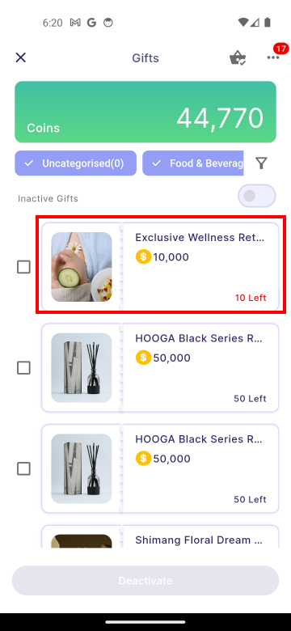                 |
|:------------------------------------|:-----------------------------------------------------|

2. Update Gift Details - In step 2 of edit mode, the user can update the gift's status using the **"Set as Active"** field.

:::info[Note]

The **Active** status can only be set if the Redemption Validity End Date is **on or after** the the current date.

:::

|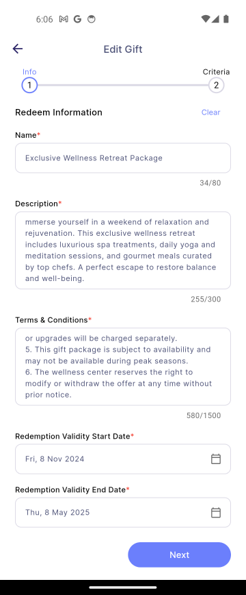|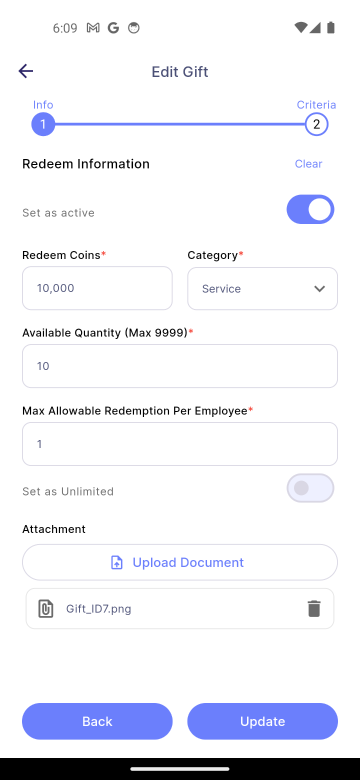                   |
|:------------------------------------|:-----------------------------------------------------|

## Gift Issue

### Choose Gift Issuance Request

The gift can only be issued after the user has redeemed it. To issue a gift, the manager can go to **More icon > Manage Redemption** and select a gift issuance request.

|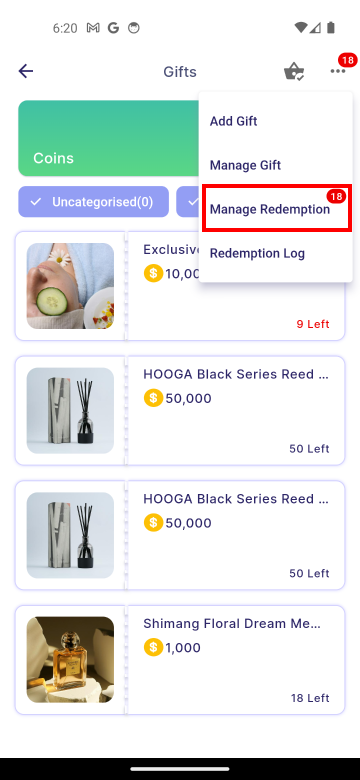|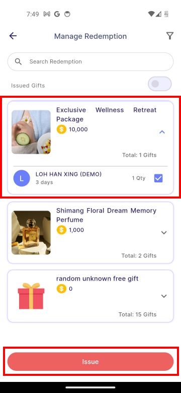          |
|:------------------------------------|:-----------------------------------------------------|

### Confirm Issuance

After clicking **Issue**, select **Confirm** to complete issuing the gift.

|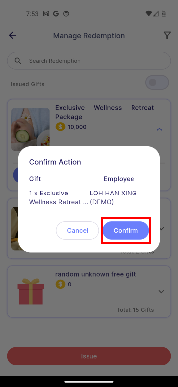|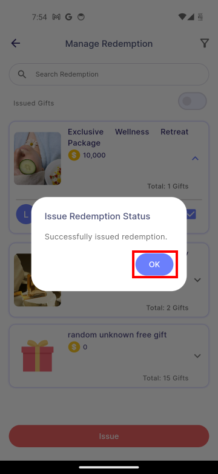              |
|:------------------------------------|:-----------------------------------------------------|

### Check Issuance

To check completed issuances, **toggle on Issued Gift**s to display the latest issued gift.

|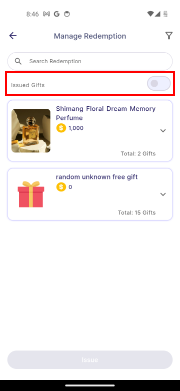|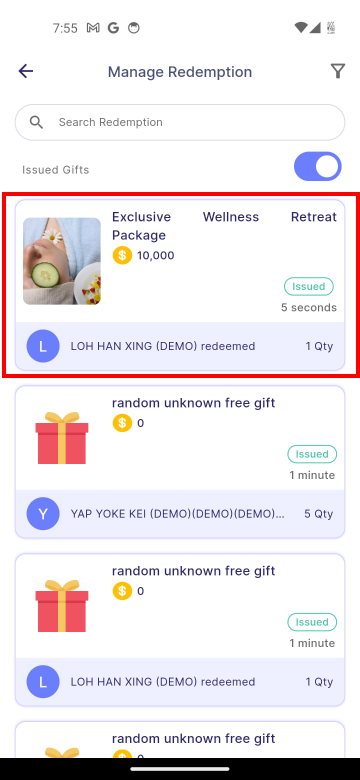                  |
|:------------------------------------|:-----------------------------------------------------|

## Manage Gift

### Gift Status

|Active Gifts|Inactive Gifts |
|:--------------------------------|:---------------------------------|
|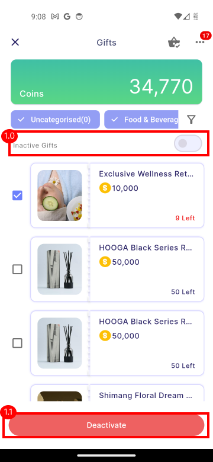|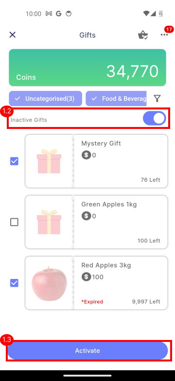|

|Propertise|Description|
|:--------------------------------|:--------------------------------|
|**Inactive Gifts Switch - Toggle Off**|Displays all active gifts.|
|**Deactivate**|Deactivate all currently selected active gifts|
|**Inactive Gifts Switch - Toggle On**|Displays all inactive gifts.|
|**Active**|Activate all currently selected inactive gifts|

### Expired Gift

The activation will **fail** if the gift has expired. To activate the gift, the manager must [**update**](#gift-update) its **Redemption Validity End Date**.

|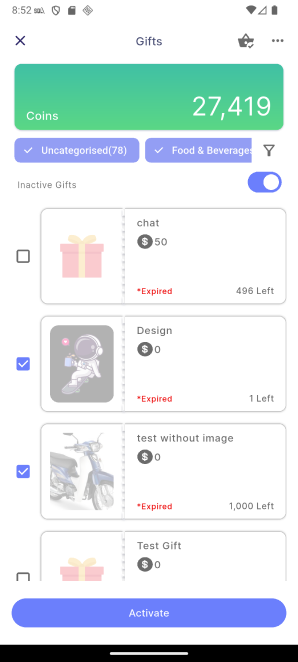|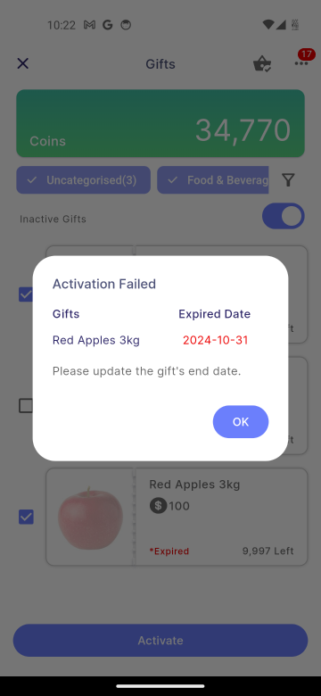                  |
|:------------------------------------|:-----------------------------------------------------|
