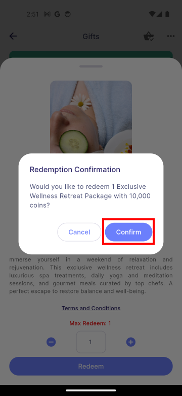

# User

:::info[Note]

These feature are available to both **manager** and **employee**.  

:::

## Gift Redeem
### 1. Gift Filter Type

|Gift Category Filter Chip|Filter Drawer|
|:--------------------------------|:--------------------------------|
|||

|Propertise|Description|
|:--------------------------------|:--------------------------------|
|**1.0 Gift Category Filter Chip**|Displays all gifts that match any of the chosen categorie.|
|**1.1 Clear**| Deselect all the selected filter option.|
|**1.2 Shop By Price Filter**|Display gifts that match any of the chosen specific price ranges.|
|**1.3 Sort by Featured**|Display the gifts bassed on popularity in descending order.|
|**1.4 Sort by Newest**|Display the most recently added gifts in descending order.|
|**1.5 Sort by Price: High-to-Low**|Display gifts from expensive to cheap.|
|**1.6 Sort by Price: Low-to-High**|Display gifts from cheap to expensive.|
|**1.7 Reset**|Select all the filter options again.|

### 2. Choose gift
Choose a gift, and a bottom bar will appear.
:::info[Note]

Once the gift has expired, it will no longer be displayed for redemption. The manager will need to [**update**](../gift/manager.md#2-update-gift-details) the redemption validity end date to reactivate the gift for future redemptions. 

:::

|||
|:--------------------------------|:--------------------------------|

|Propertise|Description|
|:--------------------------------|:--------------------------------|
|**1.0 Validity Duration**|The period during which the gift can be redeemed. The gift will not be available for redemption before or after this period.|
|**1.1 Terms and Conditions**|A clickable text that directs users to the page outlining the rules, requirements, guidelines, and limitations they must agree to in order to redeem the gift.|
|**1.2 Max Redeem**|The maximum quantity of a gift that a user is allowed to redeem. |
|**1.3 Quantity Input Field**|A field that allow users to enter the desired quantity to redeem .It can be adjusted by either entering an amount in the text field or using the plus and minus buttons.|
|**1.4 Redeem**|A button to add the selected gift to the gift cart.|

### 3. Confirm Redemption
After clicking **Redeem**, select **Confirm** to confirm. If the redemption is successful, a success dialog will appear automatically.

|||
|:-----------------------------------|:-----------------------------------|

### 4. View Redemption
To view redeemed gifts, users can go to **Cart icon> MyRedemption**. If a gift shows as **0/1 issued**, it means that **one redemption has been made**, but it **has not yet been issued**.

:::info[Note]

Users will need to wait for approval or issuance from the manager before the gift can be used.

:::

|||
|:-----------------------------------|:-----------------------------------|

## Redemption Log
Redemption log lets users view a history of redeemed rewards, showing who redeemed each reward and when it was redeemed.

To view the redemption log, users can go to **More icon> Redemption Log**.

|||
|:-----------------------------------|:-----------------------------------|
