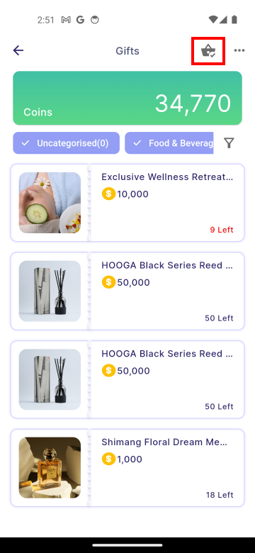
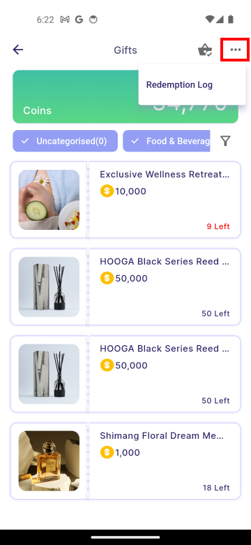

# User View

:::info[Note]

These feature are available to both **manager** and **employee**.  

:::

## Gift Redemption

**1. Gift Filter Type**

|Gift Category Filter Chip|Filter Drawer|
|:--------------------------------|:--------------------------------|
|||

|Properties|Description|
|:--------------------------------|:--------------------------------|
|**Gift Category Filter Chip**|Displays all gifts that match any of the selected categories.|
|**Clear**| Deselect all the selected filter option.|
|**Shop By Price Filter**|Display gifts that match any of the selected specific price ranges.|
|**Sort by Featured**|Display the gifts bassed on popularity in descending order.|
|**Sort by Newest**|Display the most recently added gifts in descending order.|
|**Sort by Price: High-to-Low**|Display gifts from most expensive to least expensive.|
|**Sort by Price: Low-to-High**|Display gifts from to least expensive to most expensive.|
|**Reset**|Select all the filter options again.|

**2. Select Gift**: After choosing a gift, a bottom bar will appear.

:::info[Note]

Once the gift has expired, it will no longer be displayed for redemption. The manager will need to [**update**](../gift/manager.md#gift-update) the redemption validity end date to reactivate the gift for future redemptions. 

:::

|||
|:--------------------------------|:--------------------------------|

|Properties|Description|
|:--------------------------------|:--------------------------------|
|**Validity Duration**|The period during which the gift can be redeemed. The gift will not be available for redemption before or after this period.|
|**Terms and Conditions**|A clickable text that directs users to the page outlining the rules, requirements, guidelines, and limitations they must agree to in order to redeem the gift.|
|**Max Redeem**|The maximum quantity of a gift that a user is allowed to redeem. |
|**Quantity Input Field**|A field that allows users to enter the desired quantity to redeem. It can be adjusted by either entering a value in the text field or using the plus and minus buttons.|
|**Redeem**|A button to add the selected gift to the gift cart.|

**3. Confirm Redemption**: After tapping **Redeem**, select **Confirm** to redeem the gift. If the redemption is successful, a success dialog will appear automatically.

|||
|:-----------------------------------|:-----------------------------------|

**4. View Redemption**: To view redeemed gifts, users can go to **Cart icon > My Redemption**. If a gift displays **0/1 issued**, it means one redemption has been made but **has not yet been issued**.

:::info[Note]

Users must wait for manager approval or issuance before the gift can be used.

:::

|||
|:-----------------------------------|:-----------------------------------|

## Redemption Log
The redemption log allows users to view the history of redeemed rewards, including who redeemed each reward and when it was redeemed.

To view the redemption log, users can go to **More icon> Redemption Log**.

|||
|:-----------------------------------|:-----------------------------------|
