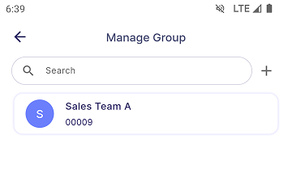
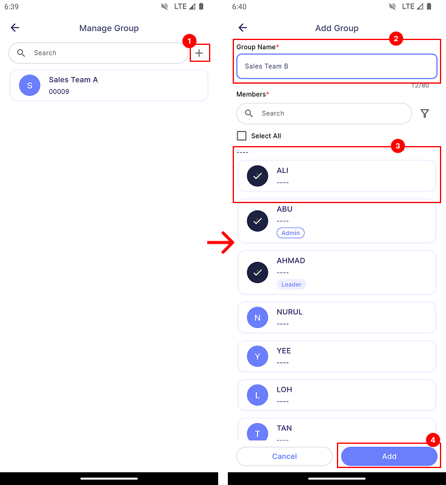
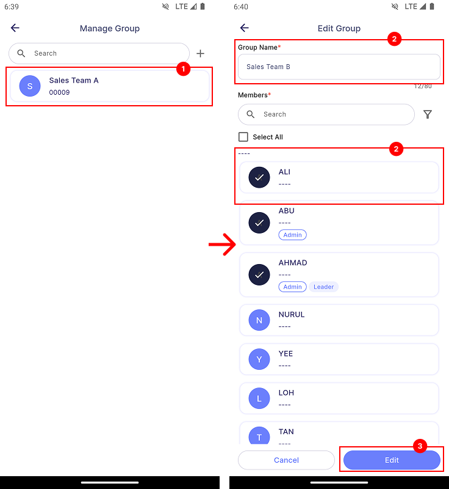
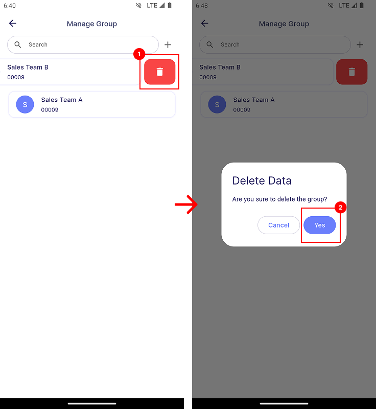
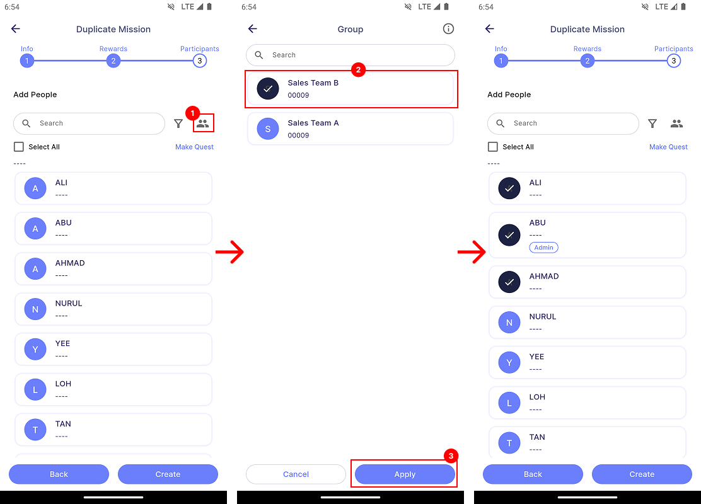

# Group

:::info[Note]

This feature is only available to **manager**.

:::

## Introduction

**Group** is a feature that allows manager to do grouping in advance. These groups can then be applied when creating a Target, Assignment or Upskill without requiring manager to select the members individually.

## Manage Group

Manager can view all the created groups in **Main Dashboard | Manage Group**. In this page, manager can **search**, **add**, **edit** and **delete** group.

### Add Group

1. Tap **Add** to create a new group.
2. Enter **Group Name**.
3. Select **Group Members** and their **Roles**.
4. Tap **Save** to save the group.

### Edit Group

1. Tap on the **group card** that you want to edit. You'll see the previously saved Group Name, Group Members, and their Roles.
3. Edit by changing either the **Group Name**, **Group Members**, or their **Roles**.
4. Tap **Save** to save the changes.

### Delete Group

1. Swipe **Left** on the group card that you want to delete. Tap **Delete**.
2. Confirm by tapping **Yes**.

## Apply Group

Group can be applied when creating a [**Target**](task/manager_view/task_creation/target#step-3---add-members), [**Assignment (Step 3)**](task/manager_view/task_creation/assignment#step-3---add-members) or an [**Upskill (Step 4)**](upskill/manager_view/upskill-creation#step-4---participants-information).

1. Tap **Group** icon.
2. Select the group that you want to apply. You can select multiple groups.
3. Tap **Apply**. You will see the selected groups members appear in the list.

:::info[Note 1]

When multiple groups are selected, the Roles of duplicated Group Members will be applied according to the **last selected group**.

Example:

- **Group A:** Member A (No Role)
- **Group B:** Member A (Admin)

1. **Selecting A then B** → Member A becomes **Admin**.
2. **Selecting B then A** → Member A becomes **No Role**."

:::

:::info[Note 2]

When a group is applied to an **assignment, upskill, or individual target**, the **Team Leader** role of any member in that group will be **automatically removed**.

:::