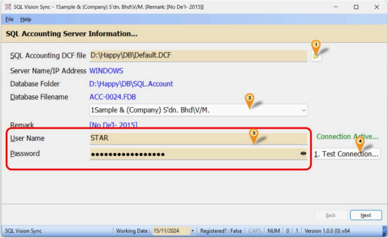
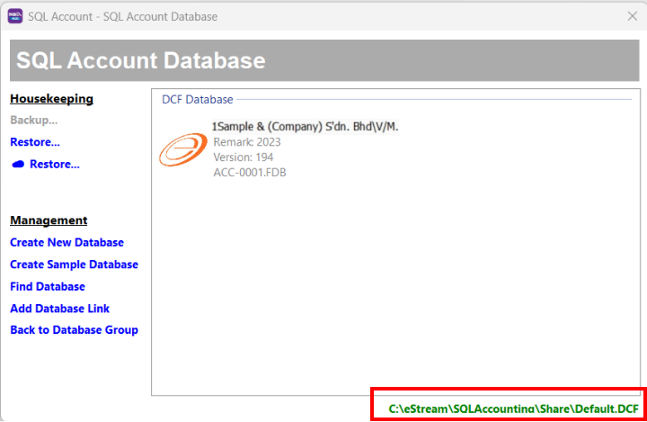
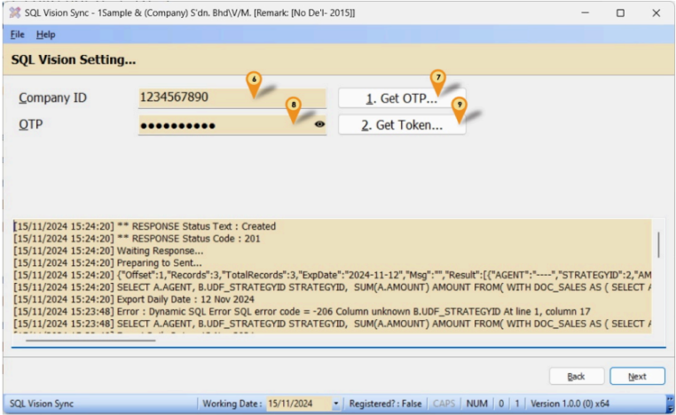
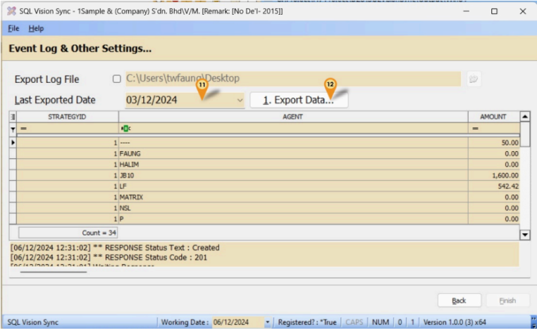
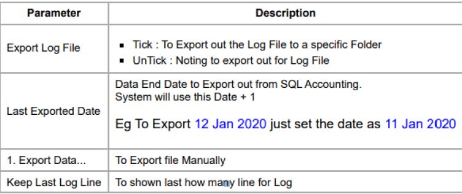
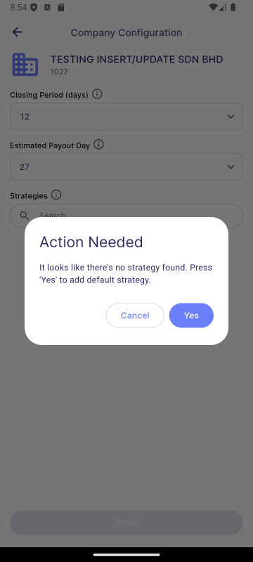
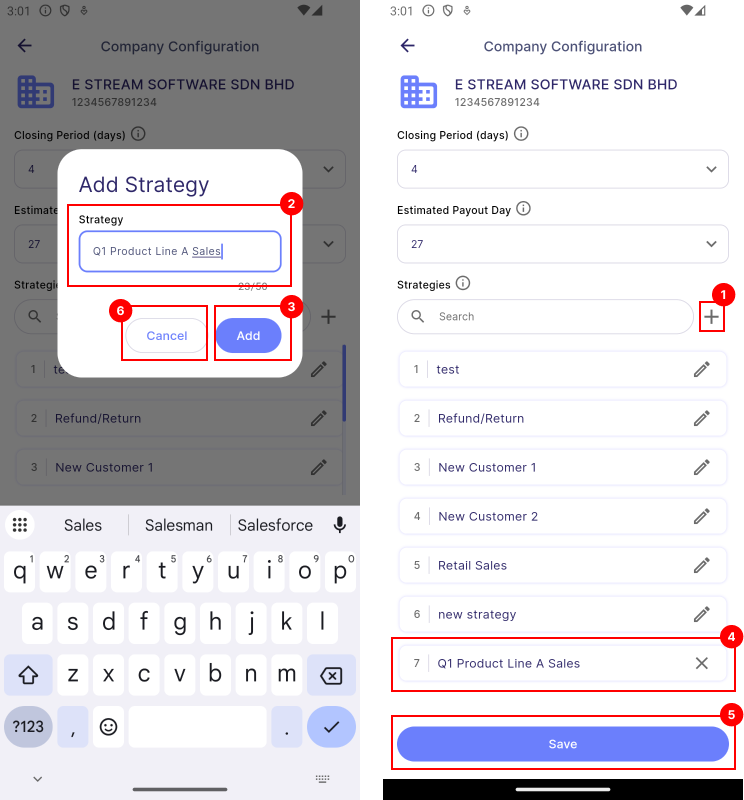
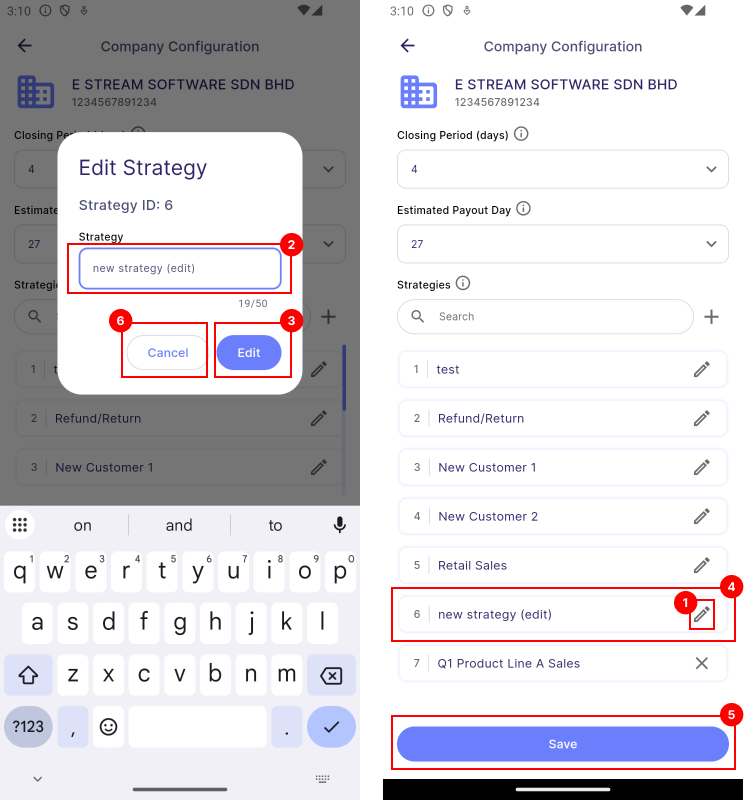

# Linking to SQL Account

## Introduction

SQL Vision are linked to SQL Account to get the amount of sales target achieved by employees.

## Requirement

- SQL Vision Sync
- SQL Account
- SQL Vision
- Internet Access

## Setup

1. **Run SQLVisionSync-Setup.exe**

2. Click **Next | Next | Next | Install**

3. Click **Finish**

## Connect SQL Account and SQL Vision with SQL Vision Sync 

1. Insert the SQL accounting DFC file into the corresponding field of SQL Vision Sync. You can find the SQL account DFC file in the path specified within the SQL Account Database of the SQL Accounting Software.
 

2. Open the dropdown and select the database from the dropdown list. 

3. Insert the user name and password fields with the SQL Accounting Software user name and password. 

4. Click **Test Connection**.
:::info[Hint]

The SQL Accounting Software must be open and logged in during the connection process.

:::

5. Click **Next** to continue the following steps.

6. Insert the company ID. 
7. Click **Get OTP** .
8. Insert the OTP Get from the step 7 into the OTP field. 
9. Click **Get Token**.
10. Click **Next** to continue the following steps.

11. Select the last export date 
12. Click **Export Data**.
13. Once the data is exported, the SQL Vision mobile app will sync and display the data retrieved from the SQL Accounting Software.

:::info[Parameter for SQL Vision Sync]

:::

## Strategy

The **Strategy** is a formula that helps managers and the application categorize specific targets for each mission. This setup allows the application to accurately retrieve the target amounts associated with a mission from the SQL Account system. 

To view the strategy, go to **Main Dashboard | Side Bar | Company Configuration**

:::tip Example Scenario

Suppose you’re managing a Sales Department and want to track Q1 sales targets:

1. For the mission **"Achieve Q1 Sales Target"**, assign the **"Invoice Based Strategy"** strategy.

2. With this setup, managers can update sales progress daily in SQL Vision by using SQL Vision Sync tool by mapping to the right Strategy ID. Managers can view the updated progress daily in SQL Vision.

:::

### Pre-defined Strategy

By default, SQL Vision automatically adds two pre-defined strategies to a newly created company, as shown in the image below:

If the system encounters an error and fails to create the pre-defined strategies, you can manually add them by navigating to the Company Configuration section. When this issue occurs, the application will display a dialog box prompting you to add the default strategies manually, as shown in the image below:

### Creating Strategy

To add a new strategy, follow these steps:

1. Click the **add icon** to create a new strategy.
2. Enter the strategy name.
3. Click the **Add** button.
4. Strategy added can be preview. Click **X** to remove it.
5. Click **Save** to apply changes.
6. Click **Cancel** to discard the changes.

### Editing Strategy

To edit an existing strategy, follow these steps:

1. Click on the strategy you want like to edit.
2. Edit the strategy name.
3. Click the **Edit** button.
4. Click **Save** to apply changes.
5. Click **Cancel** to discard the changes.

