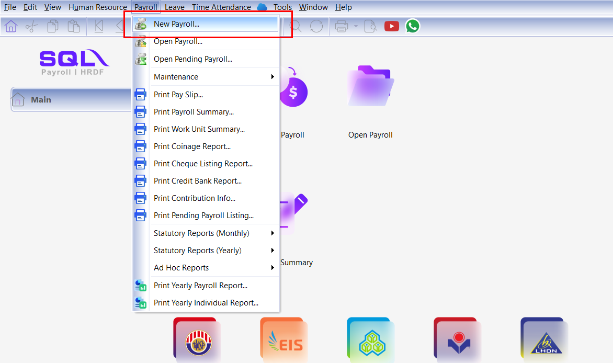
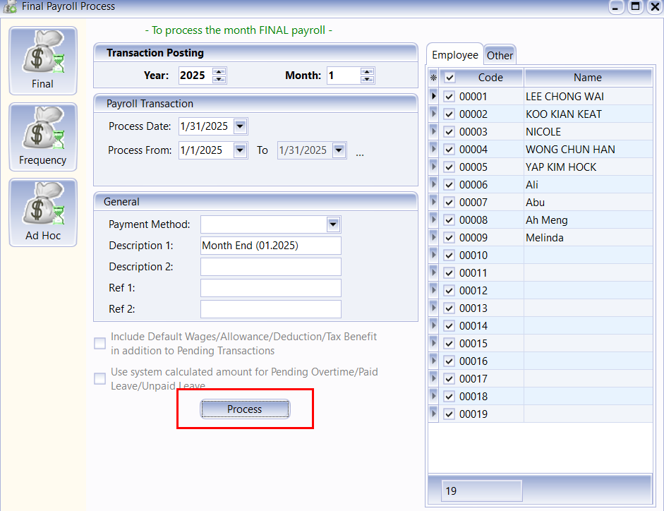
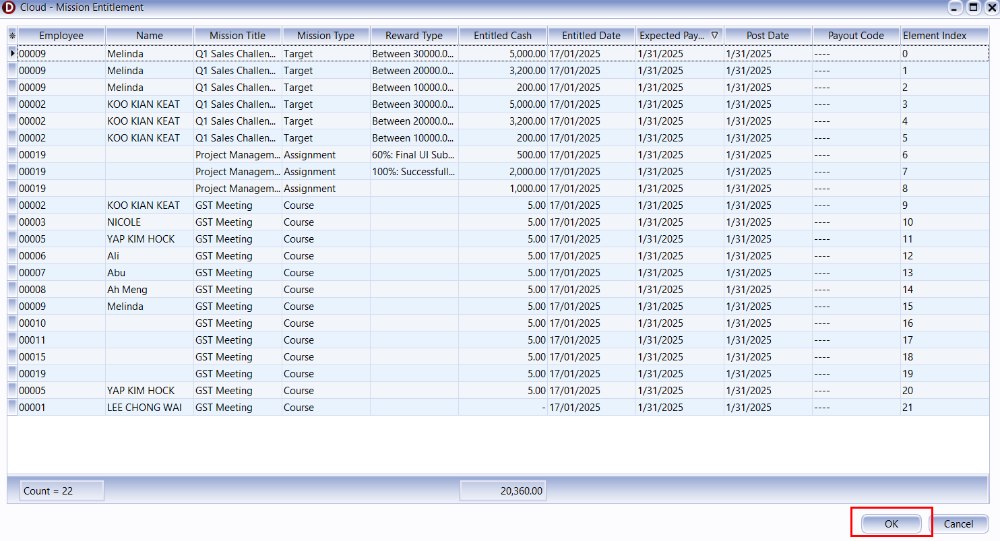
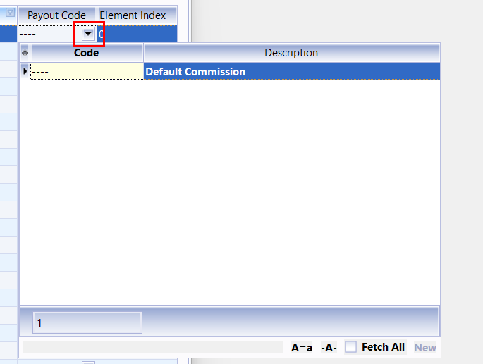

# Linking to SQL Payroll

## Introduction

SQL Vision are linked with SQL Payroll to process all cash rewards earned by employees.

## Requirement

- SQL Payroll
- SQL Vision
- Internet Access

## Sync SQL Vision Data

1. Click **Payroll** | **New Payroll**.

2. By default, the software will select the current month and all employees for processing. Confirm the configuration and click **Process**.

3. A list of employees with their entitled cash will be displayed for confirmation. Press **OK** to complete the process.

:::info[note]

All rewards will be classified as **Commission** by default. You can change the payment method by updating the **Payout Code**.

:::

:::warning[Warning]

- You are **allowed** to process the reward for specific employees if the expected payout month is **within or before** the payroll process month.  
- If you **choose not to process** particular reward, update the expected payout date for the employee in SQL Vision through **[Wallet | Manage Payout](wallet.md#1---manage-payoutentitlement-page)**.

:::
