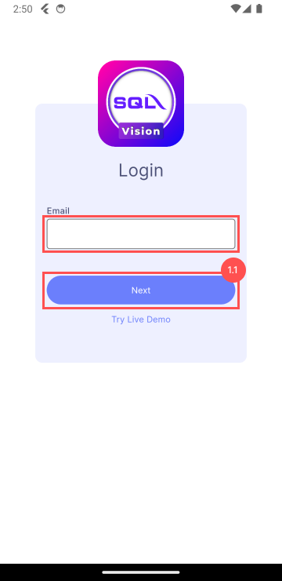
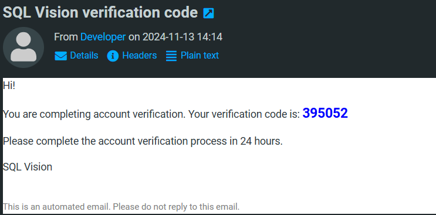
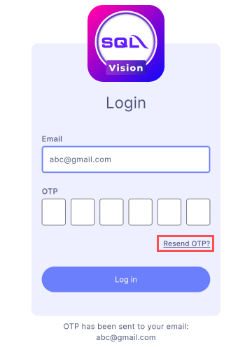
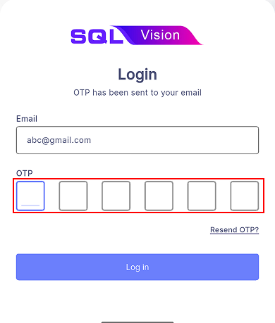

# Login

1. Enter the user company email address

2. Submit email

    1. Press **Next**
    2. Wait to receive an email that include an One-Time Password(OTP)

    

3. **Resend OTP** allows user to request again an One-Time Password(OTP) 

4. Verification
    1. Enter the received OTP
    2. Press **Log In** to submit the OTP for verification
    3. After verification, the user is ready to start using the application

    
